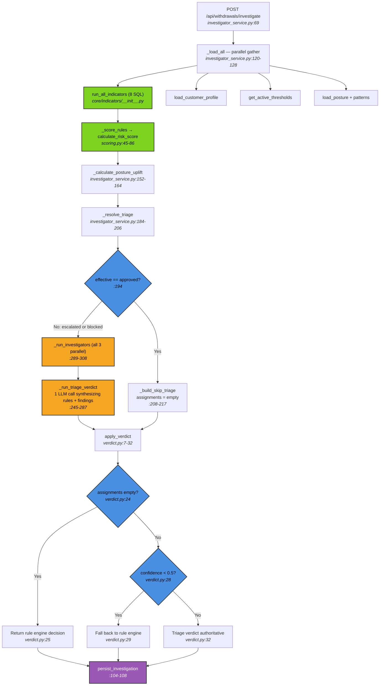
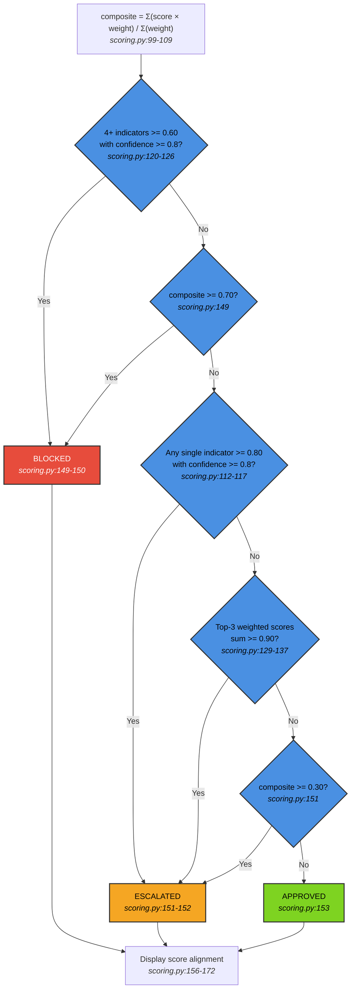
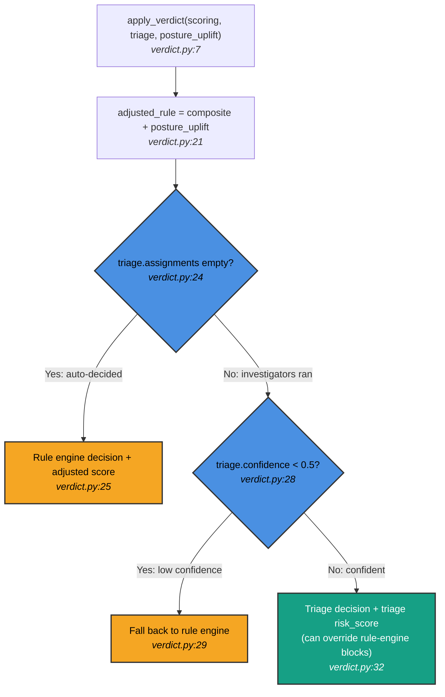
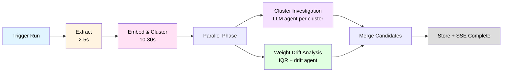
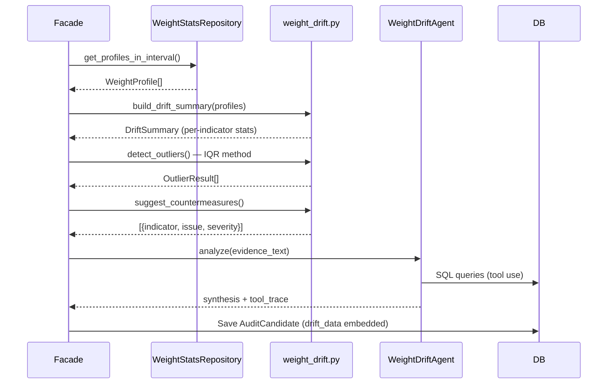
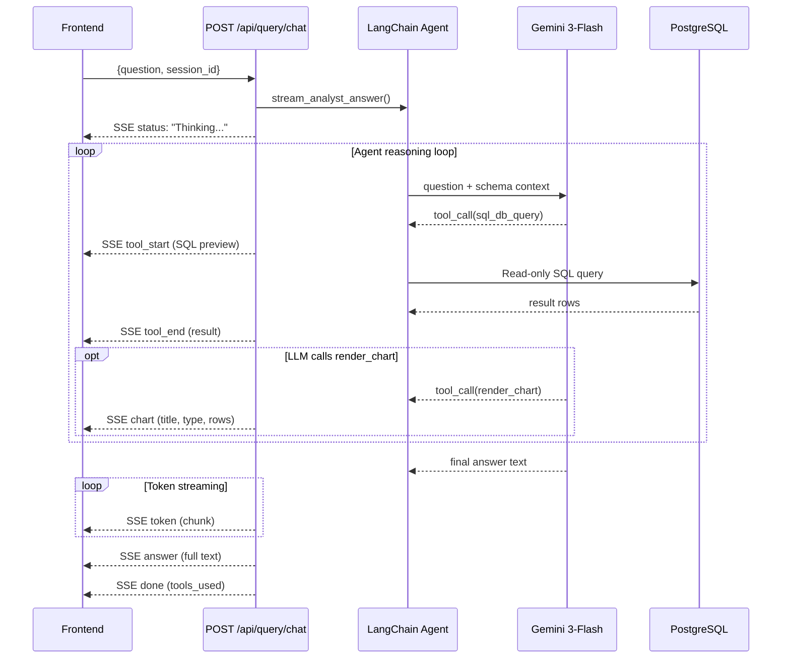
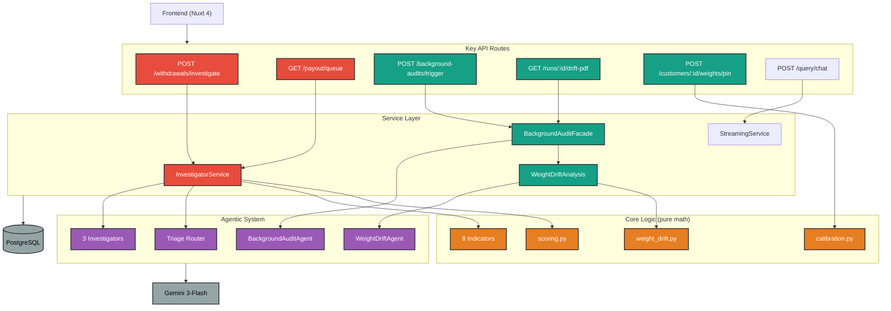

# Nexa - AI-Powered Payments Approval & Fraud Intelligence

Built for the Deriv Hackathon. An intelligent fraud detection system that evaluates every withdrawal through 8 parallel rule indicators, escalating ambiguous cases to LLM-powered investigators for officer review.

## Architecture

```
nexa/
├── fe/          # Nuxt 4 + Tailwind CSS dashboard
└── be/          # FastAPI + LangChain + Gemini backend
```

## Tech Stack

| Layer | Technology |
|-------|-----------|
| Frontend | Nuxt 4, TypeScript, Tailwind CSS |
| Backend | FastAPI, LangChain, Gemini |
| Database | PostgreSQL 16 (asyncpg, SQLAlchemy 2.0) |
| Vector DB | ChromaDB |
| Migrations | Alembic |

## Quick Start

### Backend

```bash
cd be
uv sync                          # Install dependencies
docker compose up -d              # Start PostgreSQL + ChromaDB
python -m scripts.seed_data       # Seed test data
uvicorn app.main:app --reload     # Start API server
```

### Frontend

```bash
cd fe
npm install
npm run dev                       # Start dev server
```

## Fraud Detection Pipeline

### End-to-End Flow



### Rule Engine State Machine



### Verdict Guardrails (post-investigation)



**Key change**: The old guardrail that prevented triage from overriding rule-engine blocks was removed. Triage agents with SQL evidence can now de-escalate a `blocked` to `approved` if they find no corroborative evidence (confidence >= 0.5).

---

## Background Audit Pipeline



---

## Weight Drift Analysis



**Drift math** (`app/core/weight_drift.py`):
- **Outlier detection**: IQR-based (Q1 - 1.5*IQR, Q3 + 1.5*IQR)
- **Trend detection**: Linear slope — rising (>0.05), falling (<-0.05), stable
- **Countermeasures**: Flag multipliers >2.0 (overweight), <0.5 (underweight), std >0.5 (volatile)

---

## Analyst Chat (SSE Streaming)



**Key details**:
- **Server-side memory**: `InMemorySaver` checkpointer keyed by `session_id` — no history sent from frontend
- **Tools**: `sql_db_query` (read-only via middleware) + `render_chart` (bar/line/pie)
- **SSE events**: `status` → `tool_start/tool_end` → `chart` → `token` → `answer` → `done`
- **Error recovery**: Partial answer emitted before error event; client can display what was collected

---

## Component Overview



---

## API Endpoints

| Method | Path | Description |
|--------|------|-------------|
| POST | `/api/withdrawals/investigate` | Main fraud pipeline |
| GET | `/api/payout/queue` | Officer review queue |
| POST | `/api/payout/decision` | Officer decision |
| POST | `/api/query/chat` | Analyst chat (natural language) |
| POST | `/api/cards/lockdown` | Fraud ring card lockdown |
| POST | `/api/background-audits/trigger` | Trigger background audit run |
| GET | `/api/background-audits/runs/{run_id}/drift-pdf` | Download weight drift PDF report |
| POST | `/api/customers/{id}/weights/pin` | Pin/unpin an indicator weight |

## Performance

| Traffic | Latency | LLM Calls |
|---------|---------|-----------|
| Clean (56%) | 0.14s | 0 |
| Suspicious (44%) | 12.1s | 2-3 |
| Blended | ~2.8s | - |
| Background Audit | 75-220s | 3-10 |
