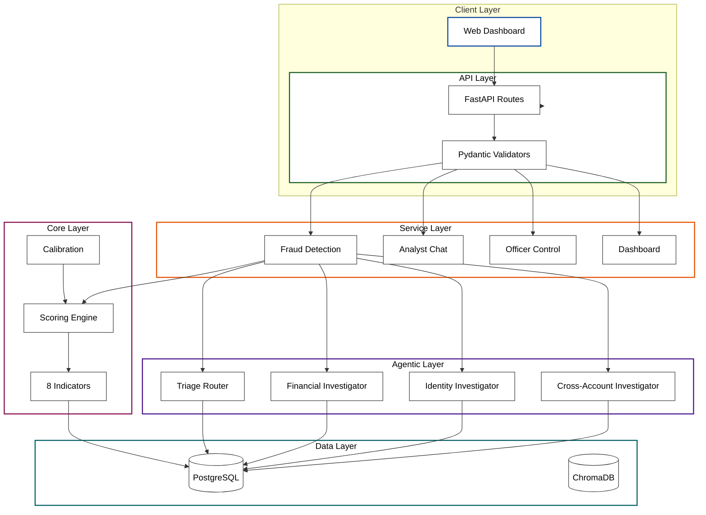
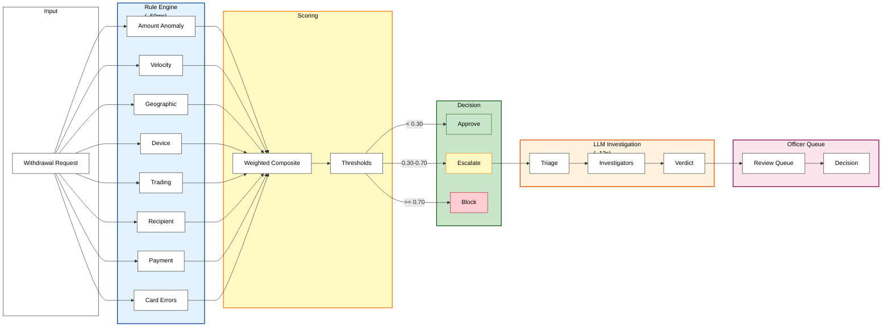
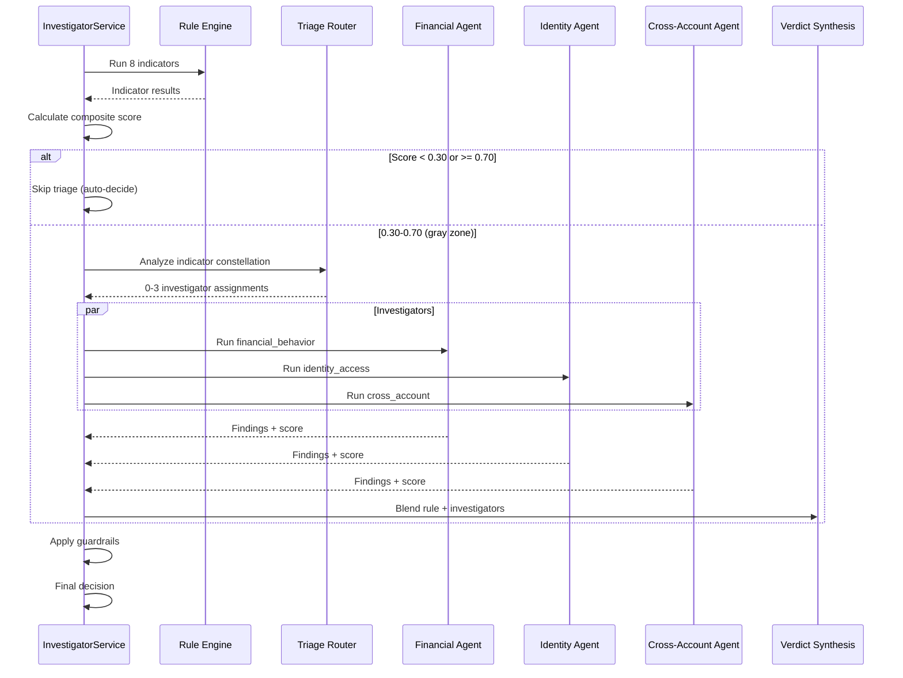
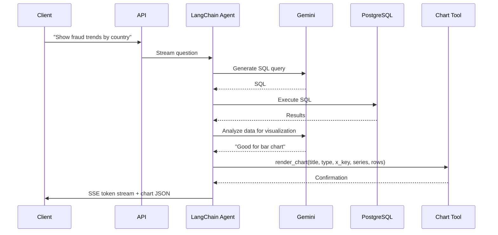
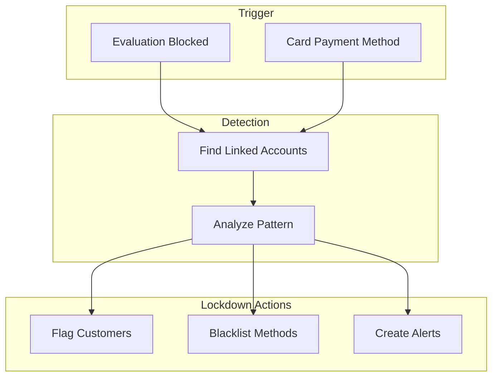

# Deriv Fraud Detection System

AI-powered payment fraud detection for the Deriv trading platform. Every withdrawal passes through 8 parallel rule indicators; ambiguous cases escalate to LLM-powered investigators where officers make final decisions.

---

## System Architecture



---

## Fraud Detection Pipeline



---

## 8 Parallel Rule Indicators

The rule engine executes 8 independent SQL-based fraud indicators in parallel (~50ms total). Each indicator returns a deterministic risk score (0.0–1.0) with evidence and reasoning.

### Indicator Weights

Higher weight = stronger influence on final decision:

| Indicator | Weight | Rationale |
|----------|--------|------------|
| `trading_behavior` | **1.5** | Highest — deposit-and-run is strongest fraud signal on a trading platform |
| `device_fingerprint` | **1.3** | Cross-account sharing indicates organized fraud/mule networks |
| `card_errors` | **1.2** | Card testing pattern (classic fraud) |
| `amount_anomaly` | 1.0 | Statistical outlier detection |
| `velocity` | 1.0 | Rapid fund extraction detection |
| `geographic` | 1.0 | VPN + country mismatch + travel velocity |
| `payment_method` | 1.0 | Method age + verification + blacklist |
| `recipient` | 1.0 | Name mismatch + cross-account usage |

---

### 1. Amount Anomaly (`amount_anomaly.py`)

Statistical outlier detection using Z-score vs customer's historical withdrawal average.

| Condition | Score | Why |
|-----------|-------|-----|
| No history | 0.30 | Can't assess, moderate caution |
| z ≤ 1.0 (within 1σ) | 0.00 | Normal range |
| z ≤ 2.0 (1–2σ) | 0.25 | Slightly elevated |
| z ≤ 3.0 (2–3σ) | 0.40 | Unusual, <2.3% probability |
| z > 3.0 | min(0.75, 0.40 + (z-3)×0.08) | Extreme outlier, scales with cap |

---

### 2. Velocity (`velocity.py`)

Detects rapid fund extraction by comparing withdrawal counts in time windows against customer baseline.

**Two-stage scoring**:

| Stage | Condition | Score |
|-------|-----------|-------|
| Warn | 1h≥4, 24h≥7, or 7d≥12 | 0.25 |
| Warn + spike | Warn + 2.5x baseline | 0.40 |
| Critical | 1h≥6, 24h≥10, or 7d≥18 | 0.50 |
| Critical + 4x spike | Critical + 4x+ baseline | 0.65 |

**Key insight**: Capped at 0.65 to stay in review zone unless corroborated.

---

### 3. Geographic (`geographic.py`)

Location signals with **travel history dampening** to avoid penalizing legitimate travelers.

| Signal | Base Score | Dampened? |
|--------|-----------|-----------|
| VPN detected | +0.05 | No |
| Country mismatch (IP vs registered) | +0.15 | Yes |
| ≥4 distinct countries in 7d | +0.20 | Yes |
| ≥2 distinct countries in 7d | +0.05 | Yes |

**Dampening factor**: Based on historical distinct countries (1→1.0, 2→0.7, 3→0.5, 4→0.4, 5+→0.3)

---

### 4. Device Fingerprint (`device_fingerprint.py`)

Device trust and cross-account sharing detection.

| Signal | Score |
|--------|-------|
| Shared across ≥3 accounts | +0.70 |
| Shared across 2 accounts | +0.40 |
| Device not trusted | +0.25 |
| Age < 1 day (brand new) | +0.25 |
| Age < 7 days (recent) | +0.15 |

**Weight: 1.3** — Highest after trading_behavior. Cross-account device sharing is the strongest organized fraud signal.

---

### 5. Trading Behavior (`trading_behavior.py`)

Detects "deposit and run" — depositing without trading before withdrawing.

| Signal | Score |
|--------|-------|
| Zero trades | +0.60 |
| < 3 trades | +0.35 |
| < 5 trades | +0.15 |
| Withdrawal/deposit ratio ≥ 0.9 | +0.40 |
| Withdrawal/deposit ratio ≥ 0.7 | +0.25 |

**Weight: 1.5** (highest) — On a **derivatives trading platform**, no trading activity with large withdrawals is the strongest fraud pattern.

---

### 6. Recipient (`recipient.py`)

Recipient trust and cross-account patterns.

| Signal | Score |
|--------|-------|
| Name mismatch (customer ≠ recipient) | +0.30 |
| Recipient used by ≥3 accounts | +0.40 |
| Recipient used by 2 accounts | +0.20 |
| First-time recipient | +0.20 |

---

### 7. Payment Method (`payment_method.py`)

Payment method trustworthiness and churn.

| Signal | Score |
|--------|-------|
| Blacklisted | +0.50 |
| Not verified | +0.20 |
| Age < 7 days | +0.30 |
| Age < 30 days | +0.10 |
| ≥3 methods added in 30d | +0.20 |

---

### 8. Card Errors (`card_errors.py`)

Payment failures and method switching (card testing detection).

| Signal | Score |
|--------|-------|
| ≥5 failed transactions in 30d | +0.50 |
| ≥2 failed transactions in 30d | +0.20 |
| ≥4 distinct methods in 30d | +0.40 |
| ≥3 distinct methods in 30d | +0.20 |

---

## Scoring Thresholds

| Threshold | Value | Effect |
|-----------|-------|--------|
| `APPROVE_THRESHOLD` | 0.30 | Composite score < 0.30 → auto-approve (skip triage) |
| `BLOCK_THRESHOLD` | 0.70 | Composite score >= 0.70 → auto-block (skip triage) |
| `HARD_ESCALATION` | 0.80 | Any single indicator >= 0.80 → force escalation |
| `MULTI_CRITICAL` | 4×0.60 | 4+ indicators >= 0.60 → force block |

---

## Triage & Investigator Flow



---

## Analyst Chat Flow

Natural language fraud analytics with SQL generation and optional chart visualization.



**Tools Available to Agent:**
1. **SQL Execution** — Generate and run SQL queries against PostgreSQL
2. **Chart Renderer** — Create bar, line, or pie charts from query results

**Chart Tool** (`app/agentic_system/tools/chart_tool.py`):
- `title`: Chart title (max 60 chars)
- `chart_type`: "bar", "line", or "pie"
- `x_key`: Column for x-axis labels
- `series`: List of metrics for y-axis
- `rows`: Query result data

The agent decides when visualization adds value and calls `render_chart()` automatically after SQL results.

---

## Card Lockdown (Fraud Ring Detection)



---

## Features

| Feature | Description |
|---------|-------------|
| **Dual Pipelines** | Rule engine + optional LLM investigators |
| **8 Indicators** | Parallel SQL-based fraud signals |
| **Triage Router** | LLM assigns targeted investigators |
| **3 Investigators** | Financial behavior, identity access, cross-account |
| **Blended Scoring** | 50% rule + 50% investigator consensus |
| **Analyst Chat** | Natural language queries via SSE |
| **Card Lockdown** | Fraud ring detection |
| **Adaptive Weights** | Per-customer calibration from feedback |

---

## Performance

| Traffic Type | Latency | LLM Calls |
|-------------|---------|-----------|
| Clean (56%) | **0.14s** | 0 |
| Suspicious (44%) | **12.1s** | 2-3 |
| Blended | **~2.8s** | — |

---

## Quick Start

```bash
# Start infrastructure
docker compose up -d

# Seed test data
python -m scripts.seed_data

# Run benchmark
python scripts/benchmark_investigate.py
```

---

## API Endpoints

| Method | Path | Description |
|--------|------|-------------|
| POST | `/api/withdrawals/investigate` | Main fraud pipeline |
| GET | `/api/payout/queue` | Officer queue |
| POST | `/api/payout/decision` | Officer decision |
| POST | `/api/query/chat` | Analyst chat |
| POST | `/api/cards/lockdown` | Card lockdown |

---

## Tech Stack

| Layer | Technology |
|-------|-----------|
| API | FastAPI + uvicorn |
| Agents | LangChain + Gemini 3-Flash |
| Database | PostgreSQL 16 (asyncpg) |
| Vector DB | ChromaDB |
| ORM | SQLAlchemy 2.0 |
| Frontend | Vue 3 + TypeScript |
