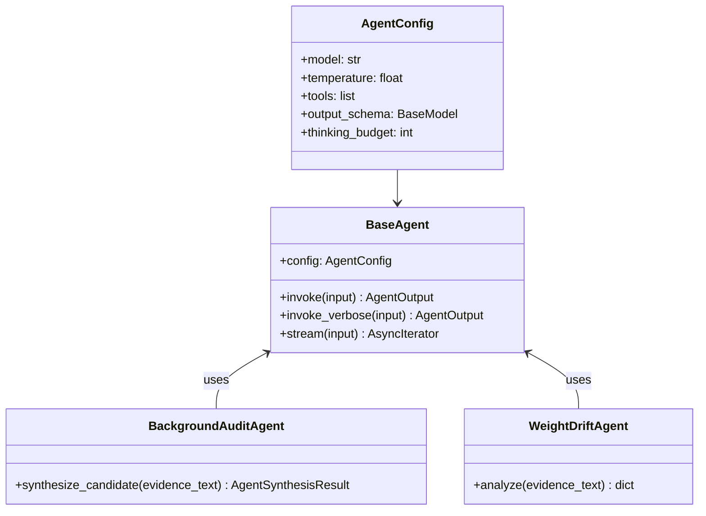
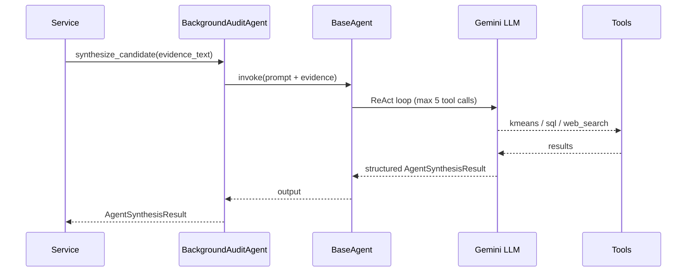

# Agentic System

AI-powered fraud investigation using LangChain agents with Google Gemini.

## Components

| File | Role |
|------|------|
| `base_agent.py` | `BaseAgent` + `AgentConfig` — LangChain wrapper |
| `agents/background_audit_agent.py` | Autonomous fraud pattern investigator |
| `agents/weight_drift_agent.py` | Weight distribution anomaly investigator |
| `tools/chart_tool.py` | LLM-callable chart renderer (bar/line/pie) |
| `tools/kmeans_tool.py` | K-means clustering on cached embeddings |
| `tools/web_search_tool.py` | Tavily web search |
| `tools/sql/toolkit.py` | Read-only SQL toolkit |
| `tools/sql/read_only_middleware.py` | Blocks INSERT/UPDATE/DELETE |
| `tools/sql/schema_builder.py` | DB schema introspection for LLM |
| `prompts/background_audit.py` | Audit investigation prompt (5-tool budget) |
| `prompts/triage.py` | Verdict synthesis prompt |
| `prompts/weight_drift.py` | Drift analysis prompt |
| `prompts/investigators/` | financial_behavior, identity_access, cross_account |
| `schemas/background_audit.py` | `AgentSynthesisResult` |
| `schemas/triage.py` | `TriageResult` |
| `schemas/indicators.py` | `InvestigatorResult` |

## Architecture



## Execution Flow



## Safety

- `read_only_middleware.py` is injected into every SQL agent — blocks all write operations at middleware level.
- Tool budget capped at 5 calls per audit investigation.

---

## Design Decisions

### 1. Composition over Inheritance in `BaseAgent`

Specialized agents **own** a `BaseAgent` — they don't subclass it.

```python
# BackgroundAuditAgent owns BaseAgent via composition
class BackgroundAuditAgent:
    def __init__(self):
        self._agent = BaseAgent(AgentConfig(...))

    async def synthesize_candidate(self, evidence_text: str) -> AgentSynthesisResult:
        return await self._agent.invoke(evidence_text)
```

**Why:** Subclassing would couple specialized agents to `BaseAgent`'s internals. Composition lets each agent configure its own `AgentConfig` (different model, tools, prompt, output schema) without touching the base class. New agent types add zero friction.

---

### 2. `AgentConfig` is a Frozen Dataclass

`AgentConfig` is `@dataclass(frozen=True)` — immutable after creation.

**Why:** Agents are long-lived objects (often singletons). Mutable config would allow accidental state drift between invocations. Frozen dataclass enforces that an agent's identity is fixed at construction time, making behavior predictable and thread-safe.

---

### 3. Read-Only SQL Middleware Auto-Injected

`BaseAgent._build_agent()` detects SQL tools by name and **automatically prepends** `read_only_sql` middleware — even if the caller forgets.

```python
# base_agent.py:82-84
if self._has_sql_tools() and read_only_sql not in middleware:
    middleware.insert(0, read_only_sql)
```

**Why:** Defense-in-depth. The LLM can hallucinate destructive SQL. Relying on prompt instructions alone ("only use SELECT") is insufficient — the middleware intercepts at the tool call level before any query reaches the DB. It returns a structured `ToolMessage` error so the LLM can self-correct rather than crashing.

**What it blocks:** `INSERT`, `UPDATE`, `DELETE`, `DROP`, `ALTER`, `TRUNCATE`, `CREATE`, `GRANT`, `REVOKE`, `EXEC` — matched case-insensitively via compiled regex.

---

### 4. SQL Toolkit Scoped to Fraud Tables Only

`toolkit.py` scopes `SQLDatabase` to `FRAUD_DB_TABLES` — 12 specific tables. All other tables are invisible to the LLM.

```python
# toolkit.py:15-28
FRAUD_DB_TABLES: list[str] = [
    "customers", "withdrawals", "transactions", ...
]
db = SQLDatabase.from_uri(db_uri, include_tables=FRAUD_DB_TABLES, sample_rows_in_table_info=0)
```

**Why:** Least-privilege access. The agent has no awareness of internal audit tables, admin credentials, or config tables it has no business querying. `sample_rows_in_table_info=0` also prevents live PII from leaking into the LLM context via schema inspection.

---

### 5. Schema/Checker Tools Skipped at Runtime

`get_query_tools()` strips `sql_db_list_tables`, `sql_db_schema`, and `sql_db_query_checker` from the toolkit — only `sql_db_query` is exposed to the agent.

**Why:** The schema is already injected via `schema_builder.py` into the system prompt — re-fetching it at runtime wastes a tool call. `sql_db_query_checker` adds an extra LLM round-trip (another Gemini call to validate the SQL) which increases latency and burns through the 5-tool budget.

---

### 6. Tool Budget via `max_iterations`

The 5-tool-call limit is enforced via `AgentConfig.max_iterations`, which maps to LangGraph's `recursion_limit = max_iterations * 2 + 1`.

**Why:** Without a hard cap, a ReAct loop can spin indefinitely on ambiguous evidence. The `* 2 + 1` formula accounts for the fact that each tool call generates two graph nodes (call + response), plus one for the final answer node.

---

### 7. `invoke_verbose` for Observability

`BaseAgent.invoke_verbose()` returns both the result and a tool call trace — pairing each tool invocation with its result preview (truncated to 200 chars).

**Why:** Investigations need auditability. The trace lets services log exactly which tools were called, with what args, and what they returned — without requiring LangSmith or external tracing infrastructure.
