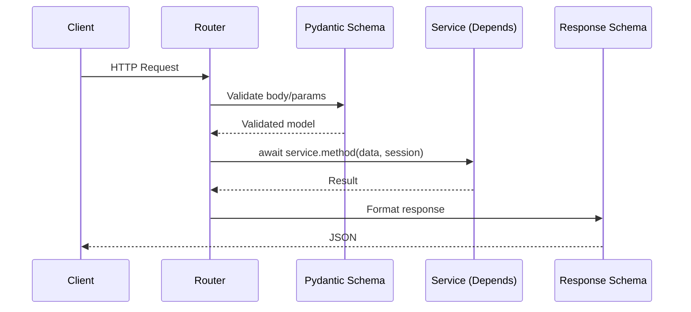

# API Layer

FastAPI routers organized by domain. Zero business logic — validation, routing, response formatting only.

## Route Map

| Domain | Prefix | File | Key Endpoints |
|--------|--------|------|---------------|
| Fraud | `/withdrawals` | `routes/fraud/investigate.py` | `POST /investigate` |
| Fraud | `/payout` | `routes/fraud/payout.py` | `GET /queue`, `POST /decision`, `POST /batch-decision` |
| Fraud | `/withdrawal` | `routes/fraud/withdrawal_submit.py` | `POST /submit` |
| Control | `/control` | `routes/control/customer_weights.py` | `GET /{id}/weights`, `POST /{id}/weights/reset` |
| Control | `/control` | `routes/control/alerts.py` | Alert CRUD |
| Control | `/control` | `routes/control/admins.py` | Admin management |
| PreFraud | `/background-audits` | `routes/prefraud/background_audits.py` | `POST /trigger`, `GET /runs/{id}/stream` (SSE) |
| PreFraud | `/prefraud` | `routes/prefraud/prefraud.py` | Posture queries |
| Analytics | `/dashboard` | `routes/analytics/dashboard.py` | `GET /stats`, `GET /decision-trend` |
| Analytics | `/analytics` | `routes/analytics/transactions.py` | Transaction history |
| Customer | `/customers` | `routes/customer/customers.py` | Customer lookup |
| Settings | `/settings` | `routes/settings/settings.py` | Threshold config |
| System | `/health` | `routes/system/health.py` | Health check |

## Schemas Structure

```
schemas/
├── common.py              # Shared error/response models
├── fraud/
│   ├── fraud_check.py     # FraudCheckResponse
│   ├── investigate.py     # InvestigateRequest/Response
│   ├── investigator.py    # InvestigatorResponse
│   ├── payout.py          # DecisionRequest, BatchDecisionRequest
│   ├── queue.py           # QueueItem
│   └── withdrawal_submit.py
├── control/
│   ├── customer_weights.py
│   └── alert.py
├── prefraud/
│   ├── background_audit.py
│   ├── pattern.py
│   └── posture.py
├── analytics/
│   ├── feedback.py
│   ├── query.py
│   └── transaction_history.py
└── settings/
    └── threshold_config.py
```

## Request Flow



## Key Design Rules

- All services injected via `Depends()` — never instantiated inside route handlers
- Fire-and-forget side effects use `asyncio.create_task()` (feedback loop, posture recompute)
- SSE routes (`/runs/{id}/stream`) use `EventSourceResponse` for real-time progress
- Batch decision endpoint processes multiple withdrawal decisions in one call

---

## Design Decisions

### 1. Routers Split by Domain, Not by HTTP Method

Each domain owns its own router file with a single `APIRouter` instance. There is no monolithic `router.py`.

```
routes/
├── fraud/       → investigate.py, payout.py, withdrawal_submit.py
├── control/     → customer_weights.py, alerts.py, admins.py
├── prefraud/    → background_audits.py, prefraud.py, patterns.py
├── analytics/   → dashboard.py, transactions.py
├── customer/    → customers.py
├── settings/    → settings.py
└── system/      → health.py
```

**Why:** A single router file becomes a merge conflict magnet and a violation of Single Responsibility. Domain-split routers mean a change to fraud endpoints never touches analytics code. Each file is independently readable, testable, and ownable.

---

### 2. API Never Imports from `core/`

The API layer's dependency boundary is **services only**. It must not import from `app.core.*` directly.

`investigate.py` currently crosses this boundary:

```python
# routes/fraud/investigate.py:15 — violation
from app.core.scoring import ScoringResult
```

`ScoringResult` is a core domain type being reconstructed inside the route handler. The correct pattern is for the service to return a typed response the router can use directly — the router should never need to know about `ScoringResult`, thresholds, or score alignment math.

**Rule:** If a route handler imports from `app.core`, that logic belongs in the service layer.

---

### 3. Services Resolved from `app.state`, Not Instantiated Per-Request

Long-lived services (holding DB connection factories, LLM clients, agent instances) are attached to `app.state` at startup and resolved in a `_get_service()` dependency — not constructed inside route handlers.

```python
# routes/fraud/investigate.py:35-45
def _get_service(request: Request) -> InvestigatorService:
    svc = getattr(request.app.state, "investigator_service", None)
    if svc is None:
        svc = InvestigatorService(AsyncSessionLocal, sync_uri)
        request.app.state.investigator_service = svc
    return svc
```

**Why:** `InvestigatorService` owns LLM agent instances and a session factory. Constructing it per-request would re-initialize Gemini clients, rebuild LangChain agents, and thrash the connection pool on every call. App-state singletons are constructed once and reused.

**Contrast:** Stateless services (repositories, simple CRUD) use `Depends(get_session)` directly since they have no expensive initialization cost.

---

### 4. Route Handlers Are Thin Orchestrators

The ideal route handler does exactly three things: call the service, handle errors, return a typed response. `background_audits.py` is the clearest example of this pattern:

```python
# routes/prefraud/background_audits.py:33-39
@router.post("/trigger", response_model=TriggerRunResponse)
async def trigger_run(body: TriggerRunRequest, request: Request) -> TriggerRunResponse:
    facade = _get_facade(request)
    run_id = await facade.trigger_run(body.lookback_days, body.run_mode)
    return TriggerRunResponse(run_id=run_id)
```

No conditionals, no data transformation, no business logic — just delegation.

`investigate.py` is a counterexample: it reconstructs `ScoringResult`, calls `_align_score_with_decision()`, builds triage detail, and creates fraud alerts — all inside the route handler. This logic belongs in the service or a dedicated response builder.

---

### 5. Fire-and-Forget via `asyncio.create_task()`

Side effects that should not delay the HTTP response (feedback loop, posture recompute) are dispatched as background tasks:

```python
# routes/fraud/payout.py:47
asyncio.create_task(svc.process_decision(...))
```

```python
# routes/fraud/investigate.py:131
trigger_recompute(posture_svc, customer_uuid, "event:withdrawal_request")
```

**Why:** The officer's decision response must be instant. Recalibrating weights or recomputing posture can take hundreds of milliseconds — these run after the response is already sent. The task is fire-and-forget: if it fails, it logs a warning but never bubbles up to the client.

---

### 6. SSE Streaming Without a Framework

The background audit progress stream is plain `StreamingResponse` with an async generator — no SSE library required:

```python
# routes/prefraud/background_audits.py:63-94
async def event_generator():
    while True:
        if await request.is_disconnected(): break
        event = await asyncio.wait_for(queue.get(), timeout=30.0)
        yield f"event: {event.type}\ndata: {event.model_dump_json()}\n\n"
```

**Why:** SSE is just chunked HTTP text with a specific format. A 30-second keepalive ping prevents proxy timeouts. The `facade.attach_progress()` / `facade.detach_progress()` pattern isolates queue lifecycle from the HTTP layer — the facade manages the queue, the router only reads from it.

---

### 7. Schemas as the Only API Contract

All request and response types are Pydantic models in `schemas/`. Route handlers never return raw dicts from the service — they always go through a typed `response_model`.

**Why:** `response_model` on the decorator enforces that the service output is serializable to the declared schema, and strips any extra fields. It's the API contract enforced at runtime, not by trust. It also enables automatic OpenAPI documentation.
