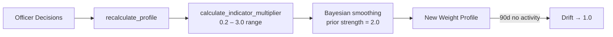
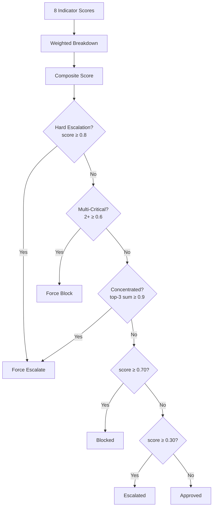
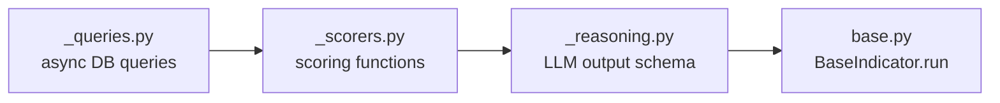

# Core

Pure computation layer — no DB access, no HTTP calls.

## Modules

| File | Purpose | Key Exports |
|------|---------|-------------|
| `scoring.py` | Risk scoring + decision engine | `calculate_risk_score()` |
| `calibration.py` | Per-customer weight calibration | `recalculate_profile()`, `calculate_blend_weights()` |
| `weight_context.py` | LLM prompt context for weights | `build_weight_context()` |
| `weight_drift.py` | Statistical drift detection | `build_drift_summary()`, `suggest_countermeasures()` |
| `pattern_fingerprint.py` | Fraud pattern signatures | `extract_fingerprint()` |
| `indicators/base.py` | Indicator base class | `BaseIndicator` |
| `indicators/_scorers.py` | Indicator scoring logic | per-indicator scorers |
| `indicators/_queries.py` | Data queries for indicators | async query functions |
| `indicators/_reasoning.py` | LLM output schemas | `IndicatorReasoning` |
| `background_audit/dataset_prep.py` | Audit dataset preparation | |
| `background_audit/pattern_analysis.py` | Pattern analysis algorithms | |
| `background_audit/pattern_card.py` | Pattern card generation | |
| `background_audit/candidate_metrics.py` | Candidate scoring metrics | |
| `background_audit/signature_matching.py` | Pattern signature matching | |
| `background_audit/merge_logic.py` | Cluster merge logic | |
| `background_audit/text_normalization.py` | Text normalization utilities | |

## Scoring Engine (`scoring.py`)

### Decision Thresholds

| Threshold | Value | Trigger |
|-----------|-------|---------|
| `APPROVE_THRESHOLD` | 0.30 | score < 0.30 → auto-approve |
| `BLOCK_THRESHOLD` | 0.70 | score > 0.70 → auto-block |
| `HARD_ESCALATION` | 0.80 | single indicator confidence ≥ 0.8 → escalate |
| `MULTI_CRITICAL` | 0.6 | 2+ indicators confidence ≥ 0.8 → block |
| `CONCENTRATED` | 0.90 | top-3 weighted sum ≥ 0.90 → escalate |

### Indicator Base Weights

| Indicator | Weight |
|-----------|--------|
| `trading_behavior` | 1.5 |
| `device_fingerprint` | 1.3 |
| `card_errors` | 1.2 |
| `geographic` | 1.0 |
| `amount_anomaly` | 1.0 |
| `velocity` | 1.0 |
| `payment_method` | 1.0 |
| `recipient` | 1.0 |

**Formula:** `composite = Σ(score × weight) / Σ(weights)`

## Calibration Engine (`calibration.py`)



- **Min samples:** 3 decisions required before recalculating
- **Blend ratio:** `calculate_blend_weights()` → 40–80% rule vs investigator weight
- **Decay:** weights drift toward 1.0 after 90 days without officer decisions

## Scoring Decision Flow



## Indicator Pipeline



---

## Design Decisions

### 1. Core Is Pure Business Logic — No I/O

Every function in `core/` is a pure computation: given inputs, return outputs. No DB sessions, no HTTP calls, no LLM invocations.

```python
# scoring.py:45-86 — pure function, deterministic, testable in isolation
def calculate_risk_score(
    results: list[IndicatorResult],
    weights: dict[str, float] | None = None,
    approve_threshold: float = APPROVE_THRESHOLD,
    block_threshold: float = BLOCK_THRESHOLD,
) -> ScoringResult:
```

```python
# calibration.py:91-128 — pure function, no session, no async
def recalculate_profile(
    decisions: list[dict[str, Any]],
    current_profile: dict[str, dict[str, Any]] | None = None,
) -> dict[str, dict[str, Any]]:
```

**Why:** Pure functions are the only layer that can be tested without a DB, mocked LLM, or running server. All fraud math — scoring, calibration, drift, fingerprinting — lives here because it's the most critical and most testable logic in the system.

---

### 2. `ScoringResult` Is a Frozen Dataclass

```python
# scoring.py:35-43
@dataclass(frozen=True)
class ScoringResult:
    decision: Decision
    composite_score: float
    weighted_breakdown: dict[str, float] = field(default_factory=dict)
    reasoning: str = ""
```

**Why:** `ScoringResult` flows from `core/` → `services/` → `api/`. Frozen ensures no layer can mutate it in transit. The scoring decision must be stable once computed — no accidental field reassignment downstream.

---

### 3. Decision Overrides Before Threshold Check

The decision isn't simply `composite >= threshold`. Three override rules fire first, each catching patterns that diluted averages miss:

```python
# scoring.py:140-153
def _determine_decision(...) -> Decision:
    if composite >= block_threshold or has_multi_critical:   # multi-signal fraud ring
        return "blocked"
    if composite >= approve_threshold or has_critical or has_concentrated:  # single critical OR converging moderate
        return "escalated"
    return "approved"
```

| Override | File:Line | Catches |
|----------|-----------|---------|
| `_check_hard_escalation` | `scoring.py:112` | One indicator with very high confidence |
| `_check_multi_critical` | `scoring.py:120` | 4+ indicators all firing simultaneously |
| `_check_concentrated_risk` | `scoring.py:129` | 2-3 moderate signals whose weighted sum converges |

**Why concentrated risk exists:** A withdrawal with 3 indicators at 0.55 each averages to 0.55 composite — below the block threshold. But top-3 weighted sum = 1.65, catching a pattern that threshold math alone misses.

---

### 4. Score Alignment After Override

When an override bumps the decision (e.g. composite=0.28 but blocked by multi-critical), the displayed score is aligned upward so it doesn't look contradictory:

```python
# scoring.py:156-172
def _align_score_with_decision(composite, decision, ...) -> float:
    if decision == "blocked":
        return max(composite, block_threshold)   # never show < 70% for a block
    if decision == "escalated":
        return max(composite, approve_threshold)
    return composite
```

**Why:** A score of 28% next to a "Blocked" decision breaks officer trust. The score should reflect severity. This is a UX correctness rule, not a math change — the underlying composite is still passed separately to the investigator pipeline.

---

### 5. Bayesian Smoothing Prevents Wild Multiplier Swings

Raw precision from 3 decisions is noisy. `_smoothed_precision()` applies Laplace smoothing with a configurable prior:

```python
# calibration.py:225-230
def _smoothed_precision(correct: float, total: float) -> float:
    numerator = correct + (PRIOR_CENTER * PRIOR_STRENGTH)   # 0.5 * 2.0
    denominator = total + PRIOR_STRENGTH                     # + 2.0
    return _clamp(numerator / denominator, 0.0, 1.0)
```

**Example:** 3/3 correct fires → raw precision = 1.0, smoothed = (3 + 1.0) / (3 + 2.0) = **0.80** → multiplier = 1.42x (not 3.0x).

**Why:** Without smoothing, a single correct decision on a new customer would immediately 3x a weight. The prior strength of 2.0 acts as two virtual "neutral" observations, requiring more real data before extreme values are trusted.

---

### 6. Event Weighting — Not All Decisions Are Equal

Each indicator fire in `_count_indicator_stats()` isn't counted as 1.0 — it's weighted by signal strength and officer certainty:

```python
# calibration.py:252-258
def _event_weight(score_strength: float, officer_certainty: float) -> float:
    weight = (
        BASE_EVENT_WEIGHT          # 0.25  — minimum contribution
        + SCORE_STRENGTH_WEIGHT * score_strength    # 0.45 — how high the score was
        + OFFICER_CERTAINTY_WEIGHT * officer_certainty  # 0.30 — how certain the officer was
    )
```

**Why:** An indicator that scored 0.95 on a withdrawal an officer immediately blocked (high certainty) is stronger evidence than one that scored 0.35 on a borderline case. Weighting by event quality produces more accurate calibration from fewer decisions.

---

### 7. 90-Day Decay Preserves Responsiveness

Weights don't stay calibrated forever. If a customer has no decisions for 90+ days, multipliers decay back toward 1.0:

```python
# calibration.py:60-68
def apply_decay(multiplier: float, last_decision_date: datetime) -> float:
    periods = (days_since - DECAY_THRESHOLD_DAYS) / 30.0
    decay_factor = DECAY_RATE ** periods   # 0.95^months
    return round(1.0 + (multiplier - 1.0) * decay_factor, 4)
```

**Why:** Customer behavior changes. A weight calibrated from decisions 6 months ago may no longer reflect current patterns. Decay ensures stale calibration doesn't permanently suppress or boost indicators on dormant accounts.
