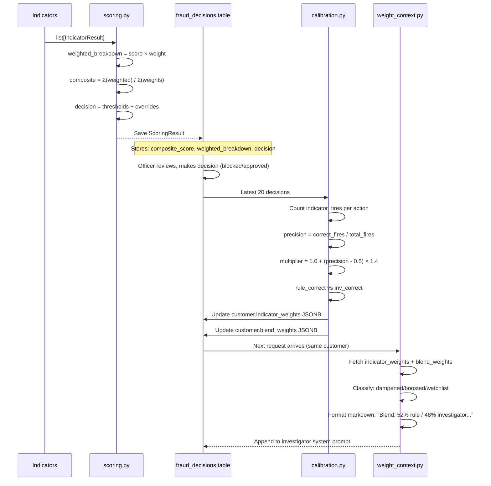
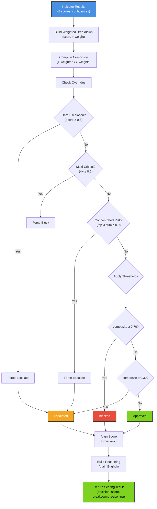

# app/core — Scoring & Calibration

Core domain logic for fraud detection scoring and per-customer weight calibration. Pure functions only—no database writes, HTTP calls, or LLM invocations. All score computations remain deterministic and testable.

## Module Overview

This module owns three responsibilities:

1. **Scoring** — Aggregate 8 indicator scores into a weighted decision (approve/escalate/block) with override rules for critical signals and concentrated risk.
2. **Calibration** — Track per-customer indicator precision from officer feedback; adjust weights and blend ratios to match past accuracy.
3. **Context Building** — Format calibrated weights and thresholds for LLM prompts; extract fraud patterns for signature matching.

## File Summary

| File | Role | Key Functions |
|------|------|---------------|
| `scoring.py` | Aggregate indicator scores → final decision | `calculate_risk_score()`, decision overrides (hard escalation, multi-critical, concentrated risk) |
| `calibration.py` | Track indicator precision; compute multipliers and blend ratios | `calculate_indicator_multiplier()`, `build_effective_weights()`, `recalculate_profile()`, `calculate_blend_weights()` |
| `weight_context.py` | Format calibrated weights for LLM prompts | `build_weight_context()`, classify dampened/boosted/trending indicators |
| `pattern_fingerprint.py` | Extract canonical fraud/false-positive fingerprints | `extract_fingerprint()`, `classify_score_band()`, `build_indicator_combination()` |
| `threshold_manager.py` | Interface stub for DB-backed threshold management | (Not yet implemented) |
| `__init__.py` | Module initialization | (Empty) |

## Core Concepts

### Decision Thresholds

Composite scores map to decisions via fixed boundaries:

| Threshold | Value | Decision | Meaning |
|-----------|-------|----------|---------|
| `APPROVE_THRESHOLD` | 0.30 | Approved | Safe, low risk |
| (gray zone) | 0.30–0.70 | Escalated | Uncertain, needs review |
| `BLOCK_THRESHOLD` | 0.70 | Blocked | High risk, deny |
| `HARD_ESCALATION_THRESHOLD` | 0.80 | Forced Escalation | Single indicator critical |

**Override Rules**:
- Any indicator score ≥ 0.80 (confidence ≥ 0.8) → force escalate
- 4+ indicators ≥ 0.6 (confidence ≥ 0.8) → force block (multi-signal fraud ring)
- Top 3 weighted scores summing ≥ 0.90 → force escalate (concentrated risk)

### Indicator Weights (Base)

Fixed weights determine each indicator's influence on the composite score:

```python
{
    "trading_behavior": 1.5,      # Strongest signal
    "device_fingerprint": 1.3,
    "card_errors": 1.2,
    "geographic": 1.0,
    "amount_anomaly": 1.0,
    "velocity": 1.0,
    "payment_method": 1.0,
    "recipient": 1.0,
}
```

**Composite Score = Σ(score × weight) / Σ(weights)**

### Per-Customer Multipliers

Calibration adjusts weights based on officer feedback. Each indicator gets a multiplier (0.2–3.0):

- **Precision** = (correct_fires + 2.0) / (total_fires + 2.0) [Bayesian smoothing]
- **Multiplier** = 1.0 + (precision − 0.5) × 1.4 [SENSITIVITY]
- **Decay** = After 90 days of inactivity, multiplier drifts back to 1.0 at 0.95^(months)

**Example**: If an indicator has 80% precision across 5 decisions, multiplier = 1.0 + (0.80 − 0.5) × 1.4 ≈ 1.42x

**Effective Weight** = base_weight × multiplier

### Blend Weights (Rule vs. Investigator)

The pipeline blends rule-engine and investigator scores 50/50 by default, but recalibrates per-customer:

- **Rule Correct %** = How often rule engine matched officer decision
- **Investigator Correct %** = How often investigator consensus matched officer decision
- **Blend Shift** = (rule_correct − inv_correct) / total × 0.2
- **Final Rule Weight** = clamp(0.5 + blend_shift, 0.4, 0.8)

If rule engine outperforms investigators, rule weight increases (up to 0.8); if investigators are better, rule weight decreases (down to 0.4).

## Sequence: Scoring → Calibration → Next Decision



## Example: Weight Adjustment After Feedback

**Scenario**: Customer has 4 past decisions; officer action for fraud case.

**Initial weights**:
- geographic: 1.0, trading_behavior: 1.5, velocity: 1.0

**Decisions** (last 4):
```
[
  {indicator_scores: {geographic: 0.75, trading_behavior: 0.20, velocity: 0.05}, officer_action: "approved"},
  {indicator_scores: {geographic: 0.85, trading_behavior: 0.30, velocity: 0.08}, officer_action: "approved"},
  {indicator_scores: {geographic: 0.15, trading_behavior: 0.80, velocity: 0.70}, officer_action: "blocked"},
  {indicator_scores: {geographic: 0.10, trading_behavior: 0.85, velocity: 0.75}, officer_action: "blocked"},
]
```

**Calibration result**:
- **geographic**: fired 2 times (0.75, 0.85), both "approved" → precision 0% → multiplier 0.2x → effective 0.2
- **trading_behavior**: fired 2 times (0.80, 0.85), both "blocked" → precision 100% → multiplier 3.0x → effective 4.5
- **velocity**: fired 2 times (0.70, 0.75), both "blocked" → precision 100% → multiplier 3.0x → effective 3.0

**Next decision**: `geographic` heavily dampened (false positive signal), `trading_behavior` heavily boosted (reliable indicator).

## Mermaid: Scoring Decision Flow



## Functions Reference

### `scoring.py`

**`calculate_risk_score(results, weights=None, approve_threshold=0.30, block_threshold=0.70) → ScoringResult`**
- Aggregates indicator results into a single decision.
- Returns `ScoringResult(decision, composite_score, weighted_breakdown, reasoning)`.

**`_check_hard_escalation(results) → bool`**
- Returns `True` if any indicator score ≥ 0.80 with confidence ≥ 0.8.

**`_check_multi_critical(results) → bool`**
- Returns `True` if 4+ indicators score ≥ 0.6 with confidence ≥ 0.8.

**`_check_concentrated_risk(breakdown) → bool`**
- Returns `True` if top 3 weighted scores sum ≥ 0.90.

### `calibration.py`

**`calculate_indicator_multiplier(correct_fires, total_fires, last_decision_date=None, sample_size=None) → float`**
- Converts precision into a 0.2–3.0 multiplier.
- Applies 90-day decay if data is stale.
- Returns 1.0 for < 3 samples (insufficient data).

**`build_effective_weights(base_weights, profile_weights) → dict[str, float]`**
- Merges base weights with per-customer multipliers.
- Respects `is_pinned` flag (overrides don't decay).

**`recalculate_profile(decisions, current_profile=None) → dict[str, dict]`**
- Rebuilds the `indicator_weights` JSONB from rolling decision window.
- Returns per-indicator: `multiplier, precision, raw_precision, sample_size, is_pinned`.

**`calculate_blend_weights(decisions) → dict[str, float]`**
- Compares rule_engine vs. investigator correctness.
- Returns `{"rule_engine": w, "investigators": 1−w}` where w ∈ [0.4, 0.8].

### `weight_context.py`

**`build_weight_context(indicator_weights, blend_weights, relevant_indicators=None) → str`**
- Formats markdown describing per-customer weight adjustments.
- Returns empty string for new customers (no profile yet).
- Sections: Blend, Dampened, Boosted, Watchlist.

### `pattern_fingerprint.py`

**`extract_fingerprint(indicator_results, officer_action) → dict`**
- Returns `{indicator_combination, indicator_scores, signal_type, score_band}`.
- Used to record confirmed fraud or false-positive patterns for matching.

**`classify_score_band(score) → str`**
- Maps score to `"low"` (< 0.30), `"medium"` (0.30–0.70), or `"high"` (≥ 0.70).

## Integration Points

### Scoring
- **Input**: `list[IndicatorResult]` from 8 indicators (run in parallel, ~50ms)
- **Output**: `ScoringResult` (used by router to auto-skip triage or assign investigators)

### Calibration
- **Input**: Officer decisions (from `fraud_decisions` table)
- **Trigger**: After every officer review; runs asynchronously
- **Output**: Updated `customer.indicator_weights` and `customer.blend_weights` JSONs

### Weight Context
- **Input**: Per-customer `indicator_weights` and `blend_weights` from database
- **Output**: Markdown section injected into investigator system prompts
- **Purpose**: Nudge investigators toward or away from specific indicators based on past accuracy

### Pattern Fingerprint
- **Input**: Indicator results + officer action
- **Output**: Canonical `indicator_combination` and `signal_type`
- **Purpose**: Detect fraud rings (repeated indicator patterns); optimize fraud signature database

## Tuning Constants

### Decision Thresholds (`scoring.py`)
- `APPROVE_THRESHOLD = 0.30` — Withdraw below this automatically approved
- `BLOCK_THRESHOLD = 0.70` — At/above automatically blocked
- `HARD_ESCALATION_THRESHOLD = 0.80` — Single indicator forces escalation
- `MULTI_CRITICAL_THRESHOLD = 0.6` — Per-indicator critical level
- `MULTI_CRITICAL_COUNT = 4` — N indicators to trigger auto-block
- `CONCENTRATED_ESCALATION_THRESHOLD = 0.90` — Top-3 weighted sum for escalation

### Calibration Sensitivity (`calibration.py`)
- `SENSITIVITY = 1.4` — Precision-to-multiplier slope
- `MIN_SAMPLE_SIZE = 3` — Minimum fires before recalibration
- `DECAY_THRESHOLD_DAYS = 90` — Days before multiplier drifts back
- `DECAY_RATE = 0.95` — Monthly decay factor
- `MIN_RULE_WEIGHT = 0.4`, `MAX_RULE_WEIGHT = 0.8` — Blend bounds

### Weight Context Thresholds (`weight_context.py`)
- `DAMPENED_THRESHOLD = 0.85` — Multiplier below = weakened signal
- `BOOSTED_THRESHOLD = 1.15` — Multiplier above = strengthened signal
- `WATCHLIST_DELTA = 0.08` — Minimum delta from 1.0 to display as trending

## Testing Strategy

No pytest—validation via benchmark scripts against 16 seeded customers:

```bash
python scripts/test_investigator_pipeline.py      # Full pipeline test
python scripts/benchmark_investigate.py            # Performance benchmark
```

All scoring and calibration tested implicitly through these end-to-end runs.
