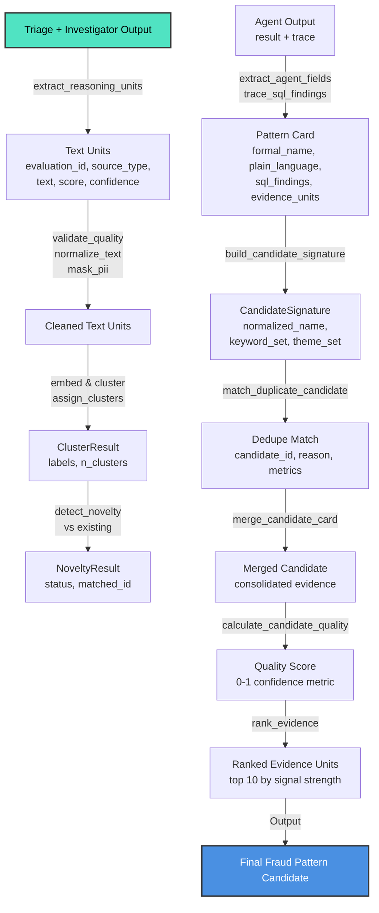

# Background Audit Module

Pure text processing and candidate pattern analysis for fraud detection reasoning audit trails. Extracts, normalizes, clusters, and deduplicates fraud patterns from triage + investigator reasoning text units.

## Overview

This module transforms unstructured investigation reasoning (from triage router + investigator agents) into structured, deduplicated fraud pattern candidates. It combines embedding-based clustering with signature matching to identify recurring behavioral patterns, support metrics for candidate quality assessment, and maintains full traceability through evidence units and tool traces.

**Key capability**: Detects fraud rings, anomalous spending patterns, and coordinated account abuse through automated pattern recognition and deduplication.

## File-by-File Summary

| File | Role | Key Functions/Classes |
|------|------|----------------------|
| `__init__.py` | Public API exports | All 40+ functions re-exported for clean imports |
| `dataset_prep.py` | Text unit extraction & hashing | `extract_reasoning_units()`, `compute_text_hash()`, `scan_text_for_pii()`, `RunWindow` |
| `text_normalization.py` | Text cleaning & thematic analysis | `normalize_text()`, `tokenize_keywords()`, `extract_theme_set()`, `dedupe_dict_rows()` |
| `pattern_analysis.py` | Clustering & novelty detection | `assign_clusters()` (HDBSCAN), `detect_novelty()`, `calculate_candidate_quality()`, `rank_evidence()` |
| `signature_matching.py` | Duplicate candidate detection | `build_candidate_signature()`, `match_duplicate_candidate()`, `CandidateSignature` dataclass |
| `merge_logic.py` | Candidate deduplication metadata | `merge_candidate_card()`, `initialize_dedupe_metadata()`, structured merge operations |
| `candidate_metrics.py` | Quality scoring calculations | `avg_confidence()`, `evidence_quality()`, `novelty_to_float()` |
| `pattern_card.py` | Agent output field extraction | `extract_agent_fields()`, `trace_sql_findings()`, `extract_sql_query()`, `friendly_source_label()` |

## System Flow



## Key Concepts

### 1. Reasoning Units
Extracted from investigation data: triage constellation analysis + investigator reasoning. Each unit has:
- `source_type`: "triage" | "investigator"
- `source_name`: e.g., "cross_account", "financial_behavior"
- `text`: Narrative reasoning (1000-5000 chars)
- `score`, `confidence`: Optional metrics from agent

### 2. Pattern Cards
Structured representation of a fraud pattern discovered by agents. Contains:
- **Narrative**: `formal_pattern_name`, `plain_language`, `analyst_notes`
- **Evidence**: `sql_findings` (queries + results), `evidence_units`, `web_references`
- **Metadata**: `source_types`, `tool_trace`, clustering context

### 3. Clustering & Novelty
Uses HDBSCAN to group similar reasoning embeddings. Each cluster is compared to existing patterns:
- **"new"**: No match >= 0.82 similarity → candidate is novel
- **"drifted_existing"**: Match 0.70-0.82 → variant of known pattern
- **"existing"**: Match >= 0.82 → exact duplicate (skip candidate)

### 4. Signature Matching
Lightweight duplicate detection using:
- **Normalized name match** (exact)
- **Keyword overlap** (Jaccard similarity, 45% weight)
- **Centroid similarity** (cosine, 30% weight)
- **Theme overlap** (behavioral themes, 15% weight)
- **Source overlap** (data sources, 10% weight)

Match reasons: `same_pattern_name`, `high_text_and_embedding_overlap`, `shared_behavioral_theme`

### 5. Quality Metrics
Candidate quality = 35% confidence + 25% support (events/accounts) + 20% evidence quality + 20% impact.
Must meet gate: ≥5 supporting events, ≥2 accounts, ≥0.50 confidence.

### 6. Evidence Ranking
Top 10 evidence units ranked by: 40% confidence + 30% agent score + 30% account diversity bonus.

## Core Operations

### Extract & Validate
```python
from app.core.background_audit import extract_reasoning_units, validate_quality

units = extract_reasoning_units(eval_id, withdrawal_id, investigation_data)
for unit in units:
    if validate_quality(unit["text"]):
        clean_text = normalize_text(unit["text"])
```

### Cluster & Detect Novelty
```python
from app.core.background_audit import assign_clusters, detect_novelty, compute_centroid

result = assign_clusters(embeddings, min_cluster_size=5)
centroid = compute_centroid([emb for emb, label in zip(embeddings, result.cluster_labels) if label == target_id])
novelty = detect_novelty(centroid, existing_centroids)  # "new" | "drifted_existing" | "existing"
```

### Build & Merge Candidates
```python
from app.core.background_audit import (
    build_candidate_signature, match_duplicate_candidate, merge_candidate_card
)

sig = build_candidate_signature(
    candidate_id="cand_123",
    pattern_card=card,
    centroid=centroid_tuple
)
best_id, reason, metrics = match_duplicate_candidate(existing_sigs, sig)
if best_id:
    merge_candidate_card(
        existing_card, new_card,
        incoming_candidate_id=sig.candidate_id,
        cluster_id=cluster_id,
        dedupe_reason=reason,
        similarity_metrics=metrics
    )
```

### Extract Agent Output
```python
from app.core.background_audit import extract_agent_fields, trace_sql_findings

extract_agent_fields(pattern_card, agent_result, tool_trace)
# Populates: formal_pattern_name, plain_language, sql_findings, evidence_units, etc.

sql_findings = trace_sql_findings(tool_trace)  # Queries + results from agent's SQL calls
```

## PII Safety

- **Masking**: `mask_pii()` replaces emails, IPs, SSNs, phone numbers with tokens
- **Detection**: `scan_text_for_pii()` flags unmasked patterns
- Quality gate rejects text <20 or >5000 chars, <5 tokens

## Thematic Analysis

`_THEME_KEYWORDS` map behavioral themes to keywords:
- `shared_device`, `shared_ip`, `shared_recipient` → coordinated fraud indicators
- `pass_through` → money laundering / velocity abuse
- `stolen_cards`, `money_laundering` → explicit fraud type markers

Extracted via `extract_theme_set()` for signature matching.

## Implementation Notes

- **Pure functions**: Zero side effects, no IO or DB writes
- **Deterministic**: Same input → same signature always (stable deduplication)
- **Confidence required**: Every metric includes confidence score
- **Evidence traceability**: All conclusions backed by `evidence` dict with explicit metrics
- **Scalable**: Signature matching O(n × m), clustering O(n log n) with HDBSCAN

## Dependencies

- `numpy` — vector math (cosine similarity, centroid computation)
- `hdbscan` — clustering algorithm (min_cluster_size=5, dynamic min_samples)
- `sqlalchemy` — query models in `dataset_prep.py` only (read-only)
- Standard library: `hashlib`, `re`, `json`, `ast`, `uuid`, `datetime`

## File Organization

All files <150 lines except `pattern_analysis.py` (300 lines — multi-concept).
No monolithic logic files; each module has a single responsibility.
