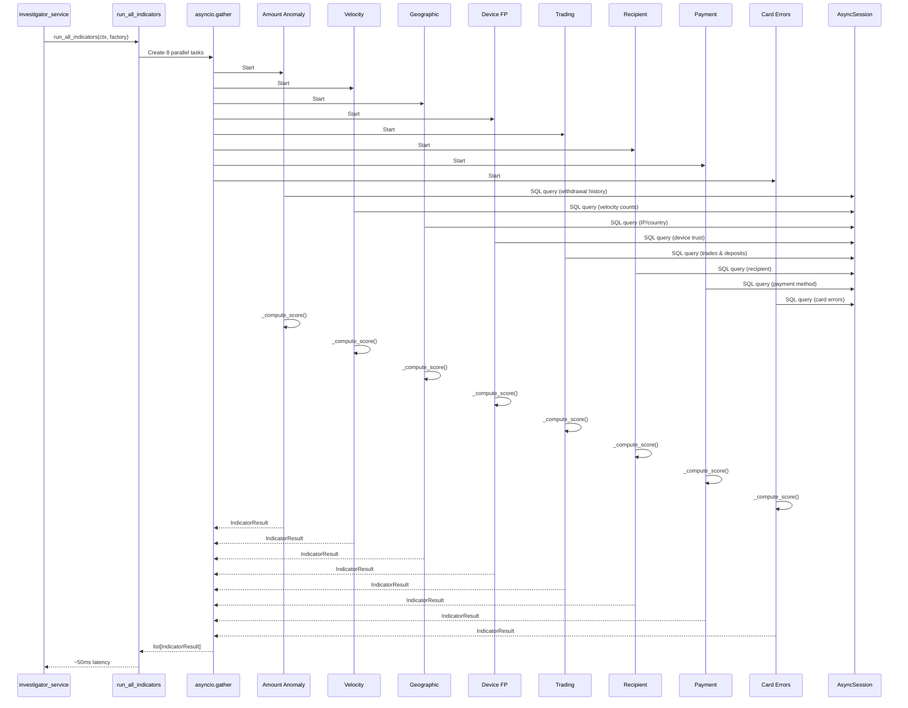
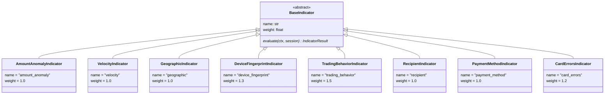

# Indicators Module: Rule-Based Fraud Detection

The indicators module implements a **Strategy Pattern** for fraud detection. Eight independent, SQL-based risk indicators run in parallel to evaluate payout requests. Each indicator executes a deterministic query and returns a risk score (0.0–1.0) with confidence and reasoning. Results are aggregated by `app/core/scoring.py` into a final fraud decision.

**Key property**: No side effects, no LLM calls, pure scoring logic. All indicators execute in ~50ms total.

---

## Architecture & Execution Flow



**Pattern**: Strategy (interchangeable logic via `BaseIndicator` interface). Each indicator: **1 SQL query → Python scoring → `IndicatorResult`**. All use `confidence=1.0` (deterministic).

---

## Class Hierarchy



---

## File Reference

| File | Lines | Weight | Score Logic |
|------|-------|--------|-------------|
| `__init__.py:1-49` | 49 | — | Registry + parallel runner (`run_all_indicators`) |
| `base.py:1-21` | 21 | — | ABC: `evaluate(ctx, session) → IndicatorResult` |
| `amount_anomaly.py:1-61` | 61 | 1.0 | Z-score bands (≤1σ=0, ≤2σ=0.3, ≤3σ=0.6, >3σ=up to 0.9) |
| `velocity.py:1-58` | 58 | 1.0 | Time-window counts (1h/24h/7d), max of bands |
| `device_fingerprint.py:1-78` | 78 | **1.3** | Shared accounts + device age + trust status |
| `trading_behavior.py:1-74` | 74 | **1.5** | Zero-trade detection + withdrawal/deposit ratio |
| `card_errors.py:1-64` | 64 | **1.2** | Failed txns (30d) + payment method switching |
| `payment_method.py:1-76` | 76 | 1.0 | Method age + verification + blacklist + churn |
| `recipient.py:1-82` | 82 | 1.0 | Name mismatch + cross-account usage + history |
| `geographic.py:1-98` | 98 | 1.0 | VPN + country mismatch + travel velocity (dampened by travel history) |
| `_reasoning.py` | — | — | Plain-English explanation builders (1 per indicator) |

---

## Scoring Thresholds & Weights

### Global Scoring Thresholds (from `app/core/scoring.py`)

| Threshold | Value | Effect |
|-----------|-------|--------|
| `APPROVE_THRESHOLD` | 0.30 | Composite score < 0.30 → auto-approve (skip triage) |
| `BLOCK_THRESHOLD` | 0.80 | Composite score >= 0.80 → auto-block (skip triage) |
| `HARD_ESCALATION_THRESHOLD` | 0.80 | Any single indicator >= 0.80 + confidence >= 0.8 → force escalation |
| Gray Zone | 0.30–0.80 | Composite score in range → route to Triage Router for LLM evaluation |

### Indicator Weights (multiplied into composite score)

Higher weight = stronger influence on final decision:

```python
{
    "trading_behavior": 1.5,           # Highest (deposit-and-run is strongest fraud signal)
    "device_fingerprint": 1.3,         # Cross-account sharing (organized fraud)
    "card_errors": 1.2,                # Card testing pattern
    "amount_anomaly": 1.0,
    "velocity": 1.0,
    "geographic": 1.0,
    "payment_method": 1.0,
    "recipient": 1.0,
}
```

### Per-Indicator Score Ranges

| Indicator | Min | Max | Key Thresholds |
|-----------|-----|-----|-----------------|
| **amount_anomaly** | 0.0 | 0.75 | z-score: 0.0 (z≤1.0), 0.25 (z≤2.0), 0.40 (z≤3.0), 0.75 (z>3.0) |
| **velocity** | 0.0 | 0.65 | Warn: 1h≥4, 24h≥7, 7d≥12; Critical: 1h≥6, 24h≥10, 7d≥18 |
| **geographic** | 0.0 | 0.40 | VPN +0.05, mismatch +0.15, diversity +0.20 (dampened by travel history 0.3–1.0) |
| **device_fingerprint** | 0.0 | 1.0 | Shared 3+ accts +0.7, shared 2 +0.4, untrusted +0.25, new <1d +0.25 |
| **trading_behavior** | 0.0 | 1.0 | No trades +0.6, W/D ratio ≥0.9 +0.4 |
| **recipient** | 0.0 | 0.90 | Name mismatch +0.3, cross-acct 3+ +0.4, first-time +0.2 |
| **payment_method** | 0.0 | 1.0 | Blacklist +0.5, unverified +0.2, new <7d +0.3, churn 3+ +0.2 |
| **card_errors** | 0.0 | 0.90 | Failures 5+ +0.5, methods 4+ +0.4 |

---

## Indicator Deep Dives

### 1. Amount Anomaly — Z-Score (`amount_anomaly.py:1-61`)

Statistical outlier detection using standard deviations from the customer's historical withdrawal average.

**Method**: `z = (amount - avg) / std` from past withdrawals.

| Condition | Score | Why |
|-----------|-------|-----|
| No history (count = 0) | 0.30 | Can't assess, moderate caution |
| Some history but std = 0 or count < 2 | 0.15 | Insufficient data |
| z ≤ 1.0 (within 1σ) | 0.00 | Normal range |
| z ≤ 2.0 (1–2σ) | 0.25 | Slightly elevated |
| z ≤ 3.0 (2–3σ) | 0.40 | Unusual — statistically rare (<2.3%) |
| z > 3.0 (beyond 3σ) | min(0.75, 0.40 + (z-3)×0.08) | Extreme outlier, scales with cap |

**Key insight**: Capped at 0.75 to avoid overweighting extreme outliers without corroborating signals.

**SQL**: `WithdrawalRepository.get_amount_stats(customer_id)` → avg_amt, std_amt, total_count

---

### 2. Velocity — Time-Window Counts (`velocity.py:1-107`)

Detects rapid fund extraction by comparing counts in time windows against customer baseline behavior.

**Two-stage scoring**:
1. **Warn thresholds** (count-based): 1h≥4, 24h≥7, 7d≥12 → score=0.25–0.50
2. **Critical thresholds** (count-based): 1h≥6, 24h≥10, 7d≥18 → score=0.50–0.65
3. **Spike ratios** (compared to baseline): 2.5x–4.0x normal behavior → score boost

| Stage | Condition | Score |
|-------|-----------|-------|
| Warn threshold hit | Yes | 0.25 |
| Warn threshold + warn spike | Yes | 0.40 |
| Critical threshold hit | Yes | 0.50 |
| Critical threshold + critical spike (4x+) | Yes | 0.65 |

**Key insight**: Velocity is capped at 0.65 even with highest spike; designed to stay in review zone unless corroborated by other indicators.

**Baseline calculation**: Historical 29 days divided by 29, floor at 0.5/1.5/3.0 per window.

**SQL**: `WithdrawalRepository.get_velocity_counts(customer_id)` → count_1h, count_24h, count_7d, count_30d

---

### 3. Payment Method Risk (`payment_method.py:1-76`)

Additive scoring on payment method trustworthiness and churn.

| Signal | Score | Why |
|--------|-------|-----|
| Blacklisted | +0.50 | Known fraud/compromised method |
| Not verified | +0.20 | Unconfirmed ownership |
| Age < 7 days | +0.30 | Brand new method |
| Age < 30 days | +0.10 | Recently added |
| ≥ 3 methods added in 30d | +0.20 | High churn; testing different methods |

**Max possible**: 1.0 (blacklist + unverified + new + churning).

**No method on file**: 0.30 (moderate caution; can't verify).

**SQL**: `PaymentMethodRepository.get_latest_method_risk(customer_id)` → age_days, is_verified, is_blacklisted, methods_added_30d

---

### 4. Geographic Risk (`geographic.py:1-98`)

Additive scoring on location signals with **travel history dampening** to avoid penalizing legitimate international travelers.

| Signal | Base Score | Dampened? | Notes |
|--------|-----------|-----------|-------|
| VPN detected | +0.05 | No | Low penalty; VPN is common |
| Country mismatch (IP vs registered) | +0.15 | Yes | Dampened by travel_dampen_factor |
| ≥ 4 distinct countries in 7d | +0.20 | Yes | Dampened by travel_dampen_factor |
| ≥ 2 distinct countries in 7d | +0.05 | Yes | Dampened by travel_dampen_factor |

**Dampening factor** (historical distinct countries):
- 1 country: 1.0 (single-location user, full penalty)
- 2 countries: 0.7
- 3 countries: 0.5
- 4 countries: 0.4
- 5+ countries: 0.3 (established traveler, minimal penalty)

**Max score**: ~0.40 (VPN + mismatch + diversity with full dampening).

**SQL**: `IPHistoryRepository.get_recent_with_country()` + `get_distinct_countries_7d()` + `get_distinct_countries_all_time()`

---

### 5. Device Fingerprint (`device_fingerprint.py:1-78`)

Additive scoring on device trust and sharing. Unknown device = 0.40 (moderate caution).

| Signal | Score | Notes |
|--------|-------|-------|
| Shared across ≥ 3 accounts | +0.70 | Strongest organized fraud signal |
| Shared across 2 accounts | +0.40 | Cross-account sharing |
| Device not trusted | +0.25 | First-time or flagged device |
| Age < 1 day (brand new) | +0.25 | Brand new fingerprint |
| Age < 7 days (recent) | +0.15 | Recent device |

**Max possible**: 1.0 (capped; shared 3+ + untrusted + new = 0.7+0.25+0.25 = clamped).

**Weight: 1.3** (highest after trading_behavior). Rationale: Cross-account device sharing is the strongest organized fraud/mule network signal.

**SQL**: `DeviceRepository.get_fingerprint_risk(customer_id, fingerprint)` → is_trusted, device_age_days, shared_account_count

---

### 6. Trading Behavior (`trading_behavior.py:1-74`)

Additive scoring to detect "deposit and run" — depositing money and withdrawing without trading.

| Signal | Score | Why |
|--------|-------|-----|
| Zero trades | +0.60 | No platform usage at all |
| < 3 trades | +0.35 | Minimal engagement |
| < 5 trades | +0.15 | Low engagement |
| Withdrawal/deposit ratio ≥ 0.9 (90%+) | +0.40 | Extracting nearly all deposits |
| Withdrawal/deposit ratio ≥ 0.7 (70%+) | +0.25 | Withdrawing majority |

**Max possible**: 1.0 (zero trades + 90%+ ratio = 0.6 + 0.4).

**Weight: 1.5** (highest overall). Rationale: This is a **derivatives trading platform** — no trading activity with large withdrawals is the strongest single fraud pattern. Legitimate users trade; fraudsters deposit and extract.

**SQL**: `TransactionRepository.get_trading_behavior_stats(customer_id)` → total_deposits, trade_count, total_pnl

---

### 7. Recipient Analysis (`recipient.py:1-82`)

Additive scoring on recipient trust and cross-account patterns.

| Signal | Score | Why |
|--------|-------|-----|
| Name mismatch (customer ≠ recipient) | +0.30 | Withdrawal to different account |
| Recipient used by ≥ 3 accounts | +0.40 | Strong mule account signal |
| Recipient used by 2 accounts | +0.20 | Cross-account usage |
| First-time recipient (no history) | +0.20 | New recipient, no trust history |

**Max possible**: 0.90 (mismatch + 3+ accounts + first-time = 0.3+0.4+0.2).

**No data available**: 0.30 (moderate caution).

**SQL**: `WithdrawalRepository.get_recipient_info(customer_id, recipient_account)` → customer_name, cross_account_count, history_count

---

### 8. Card Error History (`card_errors.py:1-64`)

Additive scoring on payment failures and method switching in 30-day window. Detects card testing patterns.

| Signal | Score | Why |
|--------|-------|-----|
| ≥ 5 failed transactions in 30d | +0.50 | High failure rate |
| ≥ 2 failed transactions in 30d | +0.20 | Some failures |
| ≥ 4 distinct methods in 30d | +0.40 | Card testing; trying multiple stolen cards |
| ≥ 3 distinct methods in 30d | +0.20 | Method switching |

**Max possible**: 0.90 (5+ failures + 4+ methods = 0.5+0.4).

**Weight: 1.2** (elevated). Rationale: Card testing (trying stolen cards until one works) is a classic fraud pattern; method switching indicates desperation.

**SQL**: `TransactionRepository.get_card_error_stats(customer_id)` → fail_count_30d, error_count_30d, distinct_methods_30d

---

---

## Usage Example

```python
from app.core.indicators import run_all_indicators
from app.data.db.engine import AsyncSessionLocal

# Context passed to all indicators
ctx = {
    "customer_id": customer_uuid,
    "withdrawal_id": withdrawal_uuid,
    "amount": 5000.0,
    "currency": "USD",
    "device_fingerprint": "abc123",
    "ip_address": "192.168.1.1",
    "withdrawal_method_id": method_uuid,
    "customer_country": "US",
    "recipient_name": "John Doe",
    "recipient_account": "12345678",
}

# Run all 8 indicators in parallel (~50ms)
results = await run_all_indicators(ctx, AsyncSessionLocal)

# Each result contains:
# - indicator_name: str
# - score: float (0.0–1.0)
# - confidence: float (1.0 for deterministic SQL-based)
# - reasoning: str (human-readable explanation)
# - evidence: dict (metrics used in scoring)

for result in results:
    print(f"{result.indicator_name}: {result.score:.2f}")
    print(f"  Evidence: {result.evidence}")
    print(f"  Reasoning: {result.reasoning}")

# Results are then aggregated by app/core/scoring.py
```

---

## Integration Points

- **Called by**: `app/services/investigator_service.py` (lines ~100–150)
- **Orchestration**: `run_all_indicators()` in `__init__.py` runs all 8 in parallel
- **Results aggregated by**: `app/core/scoring.py:calculate_risk_score()`
- **Response schema**: `app/agentic_system/schemas/indicators.py:IndicatorResult`
- **Context sourced from**: `app/api/routes/investigate.py:POST /api/payout/investigate`
- **Database layer**: Each indicator queries via async repository (no lazy loading)

---

## Adding a New Indicator

1. Create `app/core/indicators/my_indicator.py` extending `BaseIndicator` (from `base.py`)
2. Implement `async evaluate(ctx, session) -> IndicatorResult`
3. Add reasoning builder function to `_reasoning.py`
4. Register class in `ALL_INDICATORS` list in `__init__.py:18-27`
5. Add weight to `INDICATOR_WEIGHTS` dict in `app/core/scoring.py`
6. Update this README with the new indicator in File Reference and a Deep Dive section

---

## Rules & Constraints

1. **No side effects** — Pure functions only; no HTTP calls, LLM invocations, or DB writes
2. **Read-only DB access** — All queries via async repositories; no N+1 queries or lazy loading
3. **Score bounds** — All scores clamped to [0.0, 1.0]
4. **Evidence dict** — Every `IndicatorResult.evidence` must contain keys matching the reasoning
5. **Confidence mandatory** — All indicators return `confidence=1.0` (deterministic SQL-based, no statistical uncertainty)
6. **File length** — All indicator files < 100 lines (enforces single responsibility)
7. **No direct DB models in API** — API layer never imports from `app/data/db/models/`

---

## Performance

- **Parallel execution**: All 8 indicators run concurrently via `asyncio.gather()`
- **Typical latency**: ~30–50ms (database-bound, not CPU-bound)
- **Session management**: Each indicator gets its own `AsyncSession` from factory
- **Scalability**: Horizontal via database connection pooling
- **Confidence**: 1.0 for all (deterministic SQL-based)
