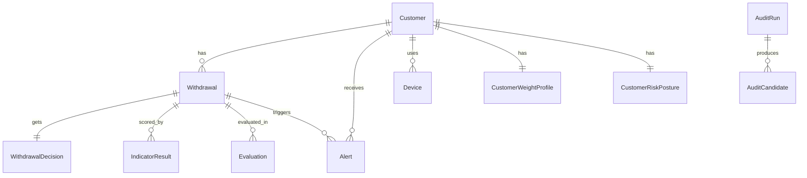

# Data

Persistence layer — async SQLAlchemy, repositories, and vector store.

## Structure

```
data/
├── db/
│   ├── engine.py          # Async engine + session factory + DI
│   ├── base.py            # DeclarativeBase
│   ├── models/            # SQLAlchemy ORM models
│   └── repositories/      # Async data access objects
└── vector/
    ├── store.py           # ChromaDB vector store client
    └── embeddings.py      # Embedding generation
```

## Engine (`db/engine.py`)

- Async SQLAlchemy engine: `pool_size=5`, `max_overflow=10`, `timeout=30s`
- `AsyncSessionLocal` — `expire_on_commit=False`
- `get_session()` — FastAPI `Depends()` DI function
- `init_db()` / `close_db()` — startup/shutdown lifecycle hooks

## Models

| Model | Key Fields | Relations |
|-------|-----------|-----------|
| `Customer` | `id(UUID)`, `external_id(unique)`, `name`, `email`, `country`, `is_flagged` | payments, transactions, trades, withdrawals, devices, ip_history, alerts |
| `Withdrawal` | `id`, `customer_id(FK)`, `amount`, `currency`, `status`, `ip_address`, `device_fingerprint`, `is_fraud` | decision(1:1), indicator_results(1:many), evaluations, alerts |
| `Alert` | `id`, `withdrawal_id(FK)`, `customer_id(FK)`, `alert_type`, `risk_score`, `top_indicators(JSONB)`, `is_read` | — |
| `Evaluation` | `withdrawal_id`, `decision`, `composite_score`, `elapsed_s` | indicator_results |
| `IndicatorResult` | `evaluation_id`, `indicator_name`, `score`, `confidence` | — |
| `CustomerWeightProfile` | `customer_id`, `indicator_weights(JSONB)`, `blend_weights(JSONB)` | — |
| `CustomerRiskPosture` | `customer_id`, `posture`, `composite_score`, `signal_scores(JSONB)` | — |
| `WithdrawalDecision` | `withdrawal_id`, `admin_id`, `action`, `rationale` | — |
| `FraudPattern` | `indicator_combination`, `signal_type`, `score_band` | — |
| `AuditRun` | `id`, `status`, `config_id`, `started_at` | candidates |
| `AuditCandidate` | `run_id`, `cluster_id`, `evidence`, `action` | — |
| `ThresholdConfig` | `version`, `thresholds(JSONB)`, `is_active` | — |

## Model Relationships



## Repositories

| Repository | Key Methods |
|-----------|------------|
| `CustomerRepository` | `get_by_external_id()`, `get_with_relations()` |
| `WithdrawalRepository` | `create()`, `update_status()`, `get_with_decision()` |
| `AlertRepository` | `create()`, `mark_read()`, `list_unread()` |
| `IndicatorResultRepository` | `bulk_create()`, `get_by_evaluation()` |
| `WeightProfileRepository` | `get_or_create()`, `update_weights()` |
| `PostureRepository` | `upsert()`, `get_latest()` |
| `QueueRepository` | `get_pending_escalations()` |
| `FraudPatternRepository` | `upsert_pattern()`, `find_matches()` |
| `AuditRunRepository` | `create()`, `get_status()` |
| `AuditCandidateRepository` | `list_by_run()`, `update_action()` |
| `ThresholdConfigRepository` | `get_active()` |
| `WeightStatsRepository` | `get_drift_stats()` |

## Vector Store (`vector/`)

- `store.py` — ChromaDB client, collection management
- `embeddings.py` — Gemini embedding generation for fraud text units
- Used by: `BackgroundAuditAgent` (KMeans clustering), `embed_cluster.py`

## Rules

- All queries async (`async with session`)
- No lazy loading — use `selectinload` / `joinedload`
- Expunge/convert models before returning to service layer
- No N+1 queries
