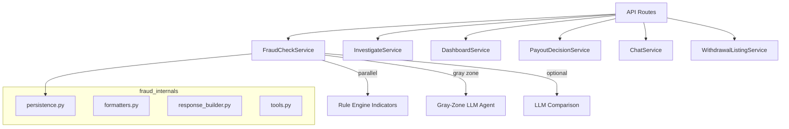
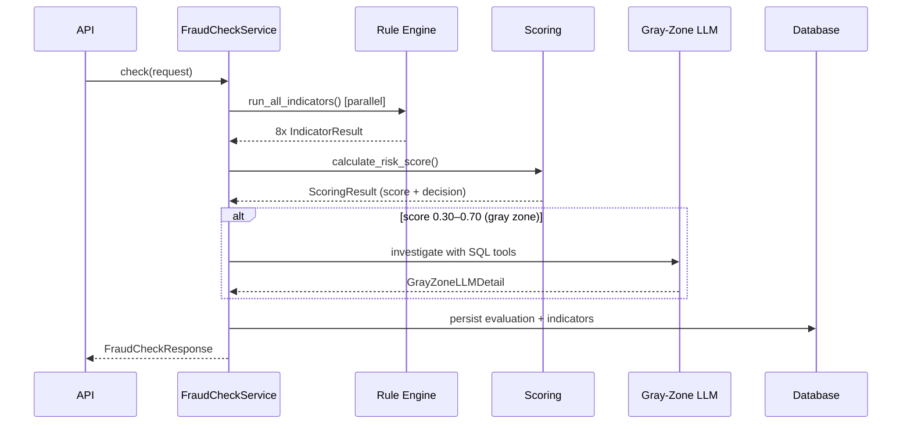

# Services Layer

Business logic orchestration between API routes and data layer. Handles fraud evaluation, investigation, dashboard stats, and officer workflows.

---

## Architecture

---

## File Reference

### Core Services

| File | Lines | Status | Responsibility |
|------|-------|--------|----------------|
| `fraud_check_service.py:1-196` | 196 | Active | Main fraud pipeline: indicators → scoring → gray-zone LLM → persist |
| `investigate_service.py:1-129` | 129 | Active | Gather forensic evidence for a withdrawal's customer |
| `dashboard_service.py:1-103` | 103 | Active | Aggregate DB stats (decisions, accuracy, alerts) |
| `chat/streaming_service.py:1-128` | 128 | Active | Stream fraud Q&A via Gemini + SQL tools (SSE) — moved to chat/ module |
| `payout_decision_service.py:1-69` | 69 | Active | Officer decision submission on escalated withdrawals |
| `withdrawal_listing_service.py:1-82` | 82 | Active | Paginated withdrawal list + CSV export |
| `llm_comparison.py:1-93` | 93 | Active | LLM-only indicator path (5 indicators, parallel) |
| `queue_mapper.py:1-86` | 86 | Active | Map DB rows → QueueResponse with risk assessment |

### Stubs (Not Implemented)

| File | Lines | Intended Purpose |
|------|-------|-----------------|
| `alert_service.py:1-14` | 14 | SSE alert broadcasting via asyncio.Queue |
| `feedback_service.py:1-15` | 15 | Admin feedback + threshold recalculation |

### Fraud Internals (`fraud_internals/`)

| File | Lines | Purpose |
|------|-------|---------|
| `__init__.py:1-28` | 28 | Re-exports all helpers |
| `formatters.py:1-146` | 146 | Context builders, LLM text cleaning, decision parsing |
| `persistence.py:1-64` | 64 | Build Evaluation + IndicatorResult ORM models |
| `response_builder.py:1-160` | 160 | Assemble `FraudCheckResponse` with display names + summaries |
| `tools.py:1-22` | 22 | LangChain SQL tool factory for LLM agents |

---

## Fraud Check Pipeline (`fraud_check_service.py`)

**Decision thresholds**: < 0.30 approve | 0.30–0.70 escalate (→ LLM) | ≥ 0.70 block
