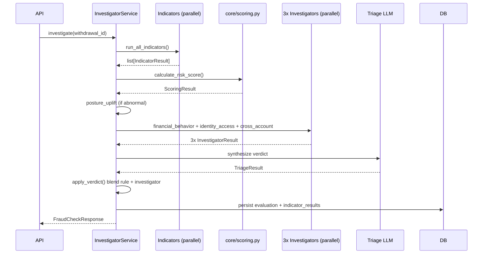
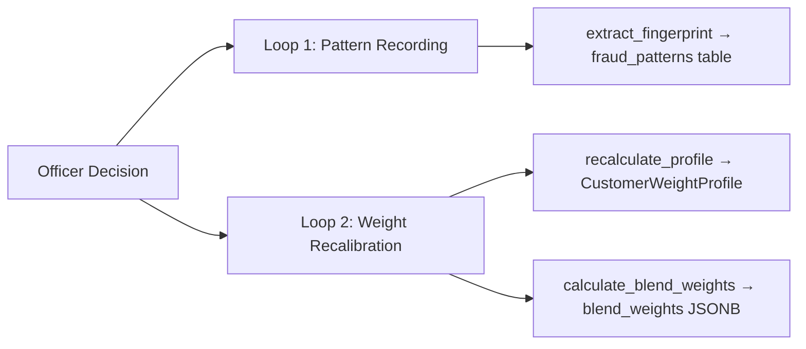
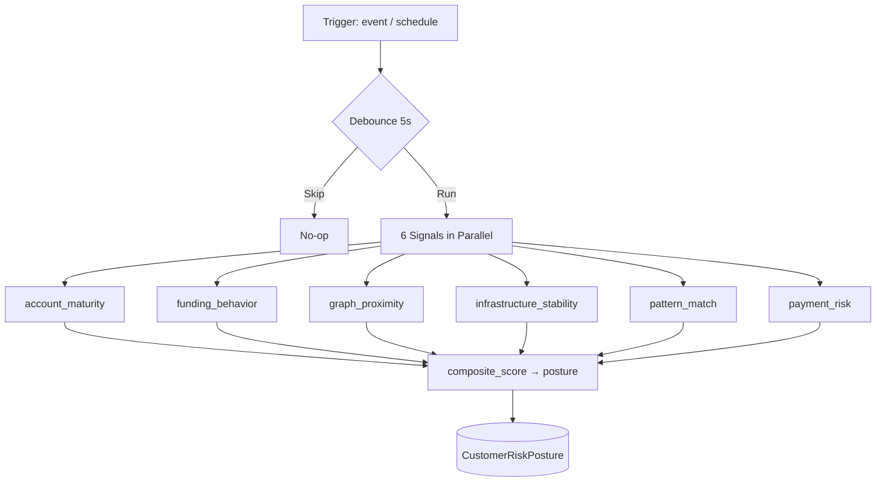
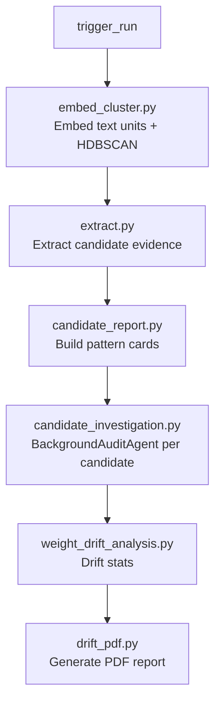
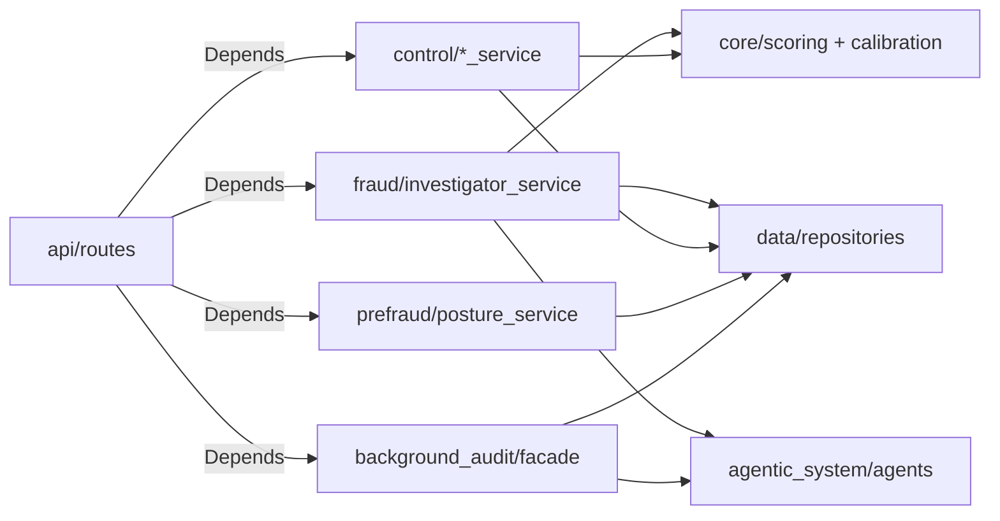

# Services

Business logic layer — orchestrates core algorithms, data access, and agentic calls.

## Submodules

| Module | Entry Point | Purpose |
|--------|------------|---------|
| `fraud/` | `investigator_service.py` | Full fraud investigation pipeline |
| `control/` | `feedback_loop_service.py` | Officer decision + weight recalibration |
| `prefraud/` | `posture_service.py` | Pre-fraud risk posture computation |
| `background_audit/` | `facade.py` | Background audit orchestration |
| `chat/` | `streaming_service.py` | Analyst chat streaming |
| `dashboard/` | `queue_mapper.py` | Review queue formatting |

---

## Fraud (`fraud/`)

### `investigator_service.py` — Main Orchestrator



### Internals (`fraud/internals/`)

| File | Role |
|------|------|
| `data_loader.py` | Async parallel data fetching |
| `formatters.py` | Format indicators/posture/patterns for LLM |
| `llm_context.py` | Assemble LLM system prompt context |
| `investigation_data.py` | `InvestigationData` dataclass |
| `verdict.py` | `apply_verdict()` — blend rule + investigator scores |
| `response_builder.py` | Build `FraudCheckResponse` |
| `persistence.py` | Save evaluations + indicator results |
| `tools.py` | Build SQL/web search tools for agents |

---

## Control (`control/`)

### `feedback_loop_service.py` — Fire-and-Forget

Triggered after every officer decision. Runs as `asyncio.create_task()` — does not block response.



### Other Control Services

| File | Purpose |
|------|---------|
| `decision_service.py` | Persist officer decision + update withdrawal status |
| `evidence_service.py` | Assemble investigation evidence for officer review |
| `threshold_service.py` | Fetch active threshold config |
| `customer_weight_explain_service.py` | Weight snapshot, history, reset, pin |
| `alert_service.py` | Create fraud alerts |
| `card_lockdown_service.py` | Card lockdown on confirmed fraud |
| `withdrawal_service.py` | Withdrawal status transitions |

---

## PreFraud (`prefraud/`)

### `posture_service.py`

Computes pre-fraud risk posture per customer from 6 parallel signals.



**Posture levels:** `normal` → `caution` → `elevated` → `critical`

### `detection_service.py` — Fraud Pattern Detectors

| Detector | File | Pattern |
|----------|------|---------|
| Card Testing | `detectors/card_testing.py` | Multiple small-amount attempts |
| Rapid Funding Cycle | `detectors/rapid_funding_cycle.py` | Deposit → immediate withdrawal |
| Velocity Burst | `detectors/velocity_burst.py` | Sudden spike in transaction frequency |
| Shared Device Ring | `detectors/shared_device_ring.py` | Device shared across multiple customers |
| No-Trade Withdrawal | `detectors/no_trade_withdrawal.py` | Withdrawal with no prior trading activity |

---

## Background Audit (`background_audit/`)

### `facade.py` — Public Interface

| Method | Description |
|--------|------------|
| `trigger_run()` | Start full audit pipeline |
| `list_runs()` | Paginated run history |
| `get_run_status()` | Current run state |
| `attach_progress()` / `detach_progress()` | SSE progress streaming |
| `get_candidates()` | Paginated candidate list |
| `update_candidate_action()` | investigate / whitelist / dismiss |

### Pipeline Flow



### Components (`components/internals/`)

| File | Role |
|------|------|
| `candidate_assembly.py` | Assemble candidate data |
| `candidate_investigation.py` | Run agent per candidate |
| `candidate_pattern_card_builder.py` | Build pattern card |
| `candidate_store.py` | Persist candidates |
| `candidate_support_metrics.py` | Support/confidence metrics |
| `drift_helpers.py` | Drift stat helpers |
| `drift_pdf.py` | PDF generation |

---

## Dependency Flow



---

## Design Decisions

### 1. Services Are the Only Layer That Cross Boundaries

`core/` is pure math. `data/` is pure persistence. Only `services/` is allowed to call both — it's the orchestration layer that wires them together.

```python
# fraud/investigator_service.py:130-150
def _score_rules(self, results, profile, threshold_config) -> tuple[ScoringResult, float, float]:
    effective_weights = build_effective_weights(INDICATOR_WEIGHTS, profile.indicator_weights)  # core/
    scoring = calculate_risk_score(results, weights=effective_weights, ...)                     # core/
    return scoring, approve, block
```

```python
# control/feedback_loop_service.py:85-102
async def _recalibrate_weights(self, customer_id) -> None:
    decisions = await fetch_decision_history(session, customer_id)   # data/
    new_weights = recalculate_profile(decisions, current)            # core/
    await repo.save_profile(profile)                                  # data/
```

**Rule:** API calls service. Service calls core + data. Core and data never call each other.

---

### 2. `InvestigatorService` Is a Singleton — Not Stateless

`InvestigatorService` holds a session factory and `InvestigatorDataLoader` — both expensive to construct. It lives on `app.state` and is reused across all requests.

```python
# fraud/investigator_service.py:59-68
class InvestigatorService:
    def __init__(self, session_factory: async_sessionmaker, sync_db_uri: str) -> None:
        self._session_factory = session_factory
        self._sync_db_uri = sync_db_uri
        self._loader = InvestigatorDataLoader(session_factory)
```

**Why:** LangChain agent instances, the data loader, and the DB URI are all constructed once at startup. Per-request construction would re-initialize Gemini clients on every fraud check. The session factory is thread-safe; session instances are created per-operation inside the service.

---

### 3. Rule Engine and Investigators Run in Sequence, Not in Parallel

The pipeline is sequential by design: rule engine first, investigators only if needed.

```python
# fraud/investigator_service.py:184-206
async def _resolve_triage(self, scoring, posture_uplift, ...) -> tuple:
    adjusted = scoring.composite_score + posture_uplift
    if effective == "approved":
        return self._build_skip_triage(scoring, adjusted), [], 0.0  # skip entirely

    findings, _ = await self._run_investigators(...)   # only runs if not auto-approved
    triage, elapsed = await self._run_triage_verdict(verdict_ctx, ...)
```

**Why:** Investigators are 3 parallel LLM calls costing ~600ms. Running them on every withdrawal — including obvious approvals — would be wasteful and slow. Auto-approved cases short-circuit with a synthetic triage result and zero LLM cost.

---

### 4. Three Investigators Run in Parallel, Each With Filtered Weight Context

Each investigator receives only the weight context for indicators relevant to its domain:

```python
# fraud/investigator_service.py:322-328
relevant = INVESTIGATOR_INDICATORS.get(assignment.investigator)
filtered_ctx = build_weight_context(
    weight_profile.indicator_weights,
    weight_profile.blend_weights,
    relevant_indicators=relevant,   # e.g. financial_behavior only sees velocity, amount_anomaly
)
```

All three are launched with `asyncio.gather()`:

```python
# fraud/investigator_service.py:300-308
tasks = [self._run_single_investigator(a, context, tools, ...) for a in assignments]
results = await asyncio.gather(*tasks)
```

**Why:** Specialization improves verdict quality. `financial_behavior` doesn't need to know about device weights; `identity_access` doesn't need trading behavior weights. Filtering prevents irrelevant calibration data from confusing the LLM's reasoning.

---

### 5. Triage Is Authoritative, With Two Guardrails

`apply_verdict()` gives the triage LLM the final word — but only when it earns it:

```python
# fraud/internals/verdict.py:7-32
def apply_verdict(scoring, triage, posture_uplift, approve_threshold) -> tuple[str, float]:
    if not triage.assignments:          # auto-decided: no investigators ran
        return scoring.decision, adjusted_rule
    if triage.confidence < 0.5:        # low-confidence verdict: fall back
        return scoring.decision, adjusted_rule
    return triage.decision, triage.risk_score  # triage wins
```

**Why:** The triage LLM has SQL evidence the rule engine doesn't — it can legitimately override a rule-engine block if investigators find no corroborating evidence. But a low-confidence verdict (< 0.5) is a signal the LLM was uncertain; in that case the deterministic rule engine is more trustworthy.

---

### 6. Feedback Loop Runs Two Independent Loops in Parallel

`FeedbackLoopService.process_decision()` runs pattern recording and weight recalibration concurrently — they share no state and don't depend on each other:

```python
# control/feedback_loop_service.py:52-55
await asyncio.gather(
    self._record_pattern(evaluation_id, customer_id, officer_action),
    self._recalibrate_weights(customer_id),
)
```

Each loop opens its own DB session. The outer `try/except` catches any failure without crashing the background task — a failure in pattern recording doesn't prevent weight recalibration.

**Why:** These two loops have different data dependencies (`indicator_results` vs `decision_history`) and different write targets (`fraud_patterns` vs `customer_weight_profiles`). Running them in parallel halves the feedback loop latency with no correctness risk.

---

### 7. Posture Is an Additive Uplift, Not a Decision Override

The risk posture computed by `PostureService` doesn't set the decision — it nudges the score upward as an additive term:

```python
# fraud/investigator_service.py:152-164
def _calculate_posture_uplift(self, posture) -> float:
    if settings.POSTURE_INFLUENCE_ENABLED and posture and posture.posture != "normal":
        return min(
            posture.composite_score * POSTURE_UPLIFT_WEIGHT,
            MAX_POSTURE_UPLIFT,
        )
    return 0.0
```

The uplift is then added to the composite score before checking whether to skip triage:

```python
# fraud/investigator_service.py:189-191
adjusted = scoring.composite_score + posture_uplift
if scoring.decision == "approved" and adjusted >= approve_thresh:
    effective = "escalated"  # posture pushes a borderline approve into triage
```

**Why:** Posture is a background signal computed from historical patterns, not real-time indicator scores. Giving it direct veto power over decisions would make fraud checks non-deterministic from the officer's perspective. As an uplift with a hard cap (`MAX_POSTURE_UPLIFT`), it can push borderline cases into review without overriding clear approvals or blocks.
