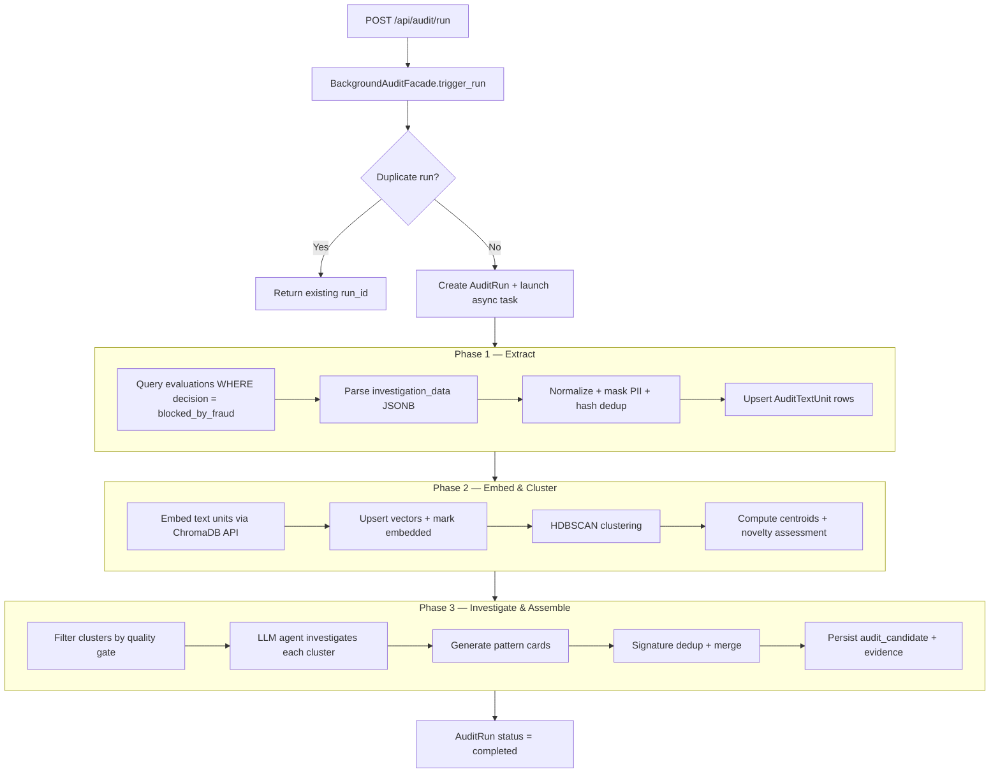
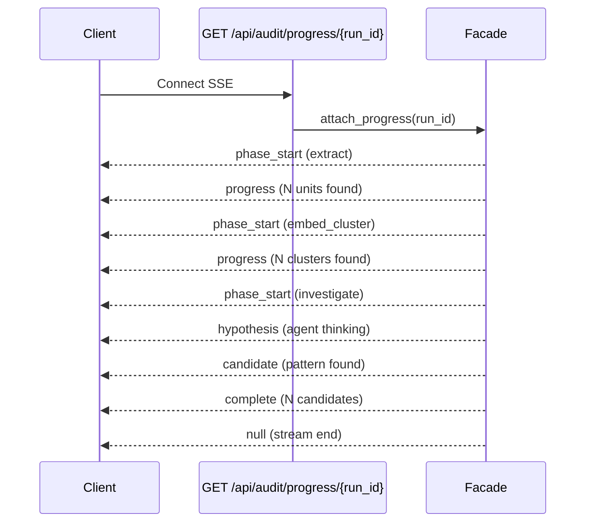
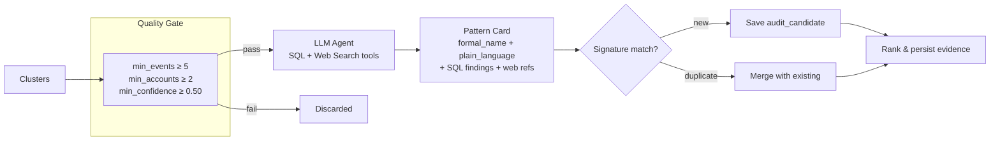
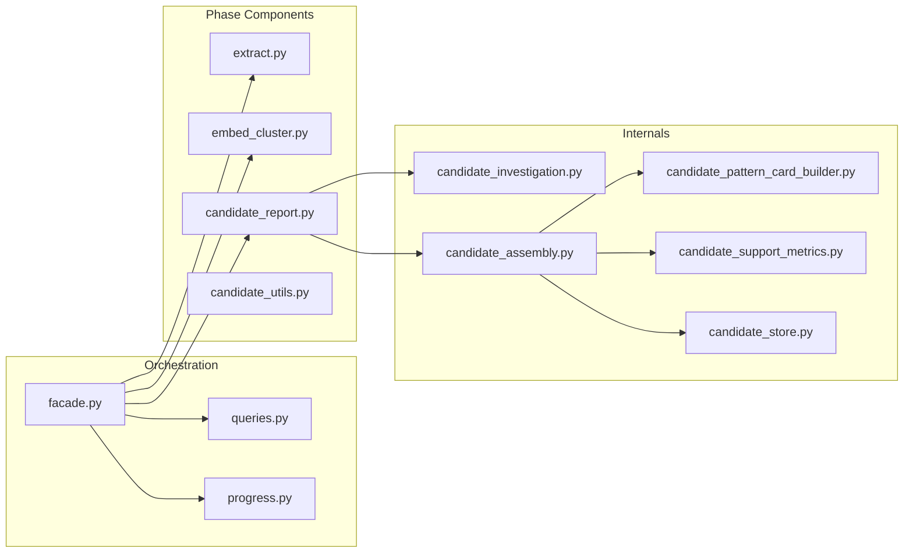

# Background Audit Service

Pattern discovery pipeline from confirmed-fraud evaluations. Extracts reasoning units, clusters via embeddings + HDBSCAN, investigates with an LLM agent, outputs ranked fraud pattern candidates.

## Pipeline Flow

## SSE Event Stream

## Investigation Detail

## File Map

## Key Concepts

| Concept | Description |
|---------|-------------|
| **Reasoning Unit** | Text snippet from `investigation_data` JSONB, normalized + PII-masked + deduped by hash |
| **Cluster** | HDBSCAN group of similar units with centroid vector + novelty status |
| **Pattern Card** | LLM-generated hypothesis: name, explanation, SQL findings, web references |
| **Candidate Signature** | Dedup key from pattern_type + account_ids + amount_range + feature_hash |
| **Novelty Assessment** | Novel vs similar-to-known, based on centroid distance to known clusters |

## Config

| Setting | Default | Description |
|---------|---------|-------------|
| `BACKGROUND_AUDIT_LOOKBACK_DAYS` | 7 | Evaluation window |
| `BACKGROUND_AUDIT_MAX_CANDIDATES` | 50 | Max output candidates |
| `BACKGROUND_AUDIT_CLUSTER_MIN_SIZE` | 8 | HDBSCAN min cluster size |
| `BACKGROUND_AUDIT_CLUSTER_MIN_SAMPLES` | 4 | HDBSCAN min samples |
| `BACKGROUND_AUDIT_CLUSTER_MERGE_SIMILARITY` | 0.90 | Merge threshold |
| `TAVILY_API_KEY` | — | Web search tool (optional) |

DB config overrides env defaults via `_load_run_config()` in `facade.py`.
