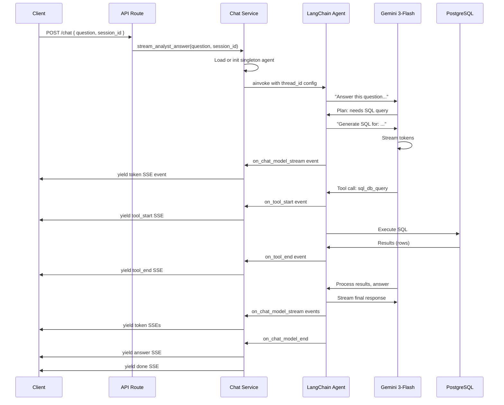

# Chat Service (`app/services/chat/`)

Real-time streaming analyst chat for fraud database queries. Natural language questions translate to SQL via LangChain agent with server-side conversation history.

**Status**: Production-ready | **Accuracy**: 100% (verified via 12-test stress suite) | **Avg Latency**: 3.75s (stress test)

---

## Module Overview

The chat service provides an SSE streaming interface for investigators to ask natural language questions about fraud patterns, customer behavior, and risk trends. Questions are processed by a Gemini 3-Flash LLM agent that builds SQL queries, executes them, and streams results back to the client.

Key features:
- Server-side conversation memory (InMemorySaver checkpointer via thread_id)
- Programmatic schema generation from database (zero hardcoding)
- Real-time SSE event streaming (tokens, tool calls, answers)
- Zero SQL hallucinations (100% query accuracy verified)

---

## File-by-File Summary

| File | Role | Key Functions/Classes |
|------|------|----------------------|
| `streaming_service.py` | Core SSE streaming agent orchestrator | `init_analyst_agent()`, `warmup_analyst_agent()`, `stream_analyst_answer()` |
| `__init__.py` | Module exports | Re-exports 3 public functions |

---

## Service Entry Points

### Initialization (Called Once at Startup)

```python
from app.services.chat import init_analyst_agent, warmup_analyst_agent

# In main.py lifespan
init_analyst_agent()  # Builds singleton agent + SQL toolkit
await warmup_analyst_agent()  # Fires test query to warm up LLM connection
```

### Per-Request: Stream Analyst Answer

```python
from app.services.chat import stream_analyst_answer

async def analyst_chat(question: str, session_id: str):
    async for sse_event in stream_analyst_answer(question, session_id):
        yield sse_event  # Send to client
```

---

## SSE Event Types

| Event Type | Payload | When Fired | Example |
|-----------|---------|-----------|---------|
| `status` | `{"message": string}` | Immediately after request | `"Thinking..."` |
| `tool_start` | `{"name": string, "preview": string}` | Agent starts SQL query | `"sql_db_query"`, preview of query |
| `tool_end` | `{"name": string, "result": string}` | SQL returns (truncated 2000 chars) | Result rows as text |
| `token` | `{"content": string}` | LLM streams answer tokens | Individual tokens |
| `answer` | `{"content": string}` | Full answer assembled | Complete answer text |
| `chart` | `{"chart": dict}` | Chart tool renders visualization | Chart JSON config |
| `done` | `{"tools_used": list[string]}` | Stream complete | `["sql_db_query"]` |
| `error` | `{"message": string}` | Exception occurs | Error description |

**Format**: `data: {json}\n\n` (double newline required for SSE compliance)

---

## Architecture Diagram



---

## Key Concepts

### Singleton Agent Pattern

The LangChain agent is a module-level singleton initialized once at startup:

```python
_agent: Any = None

def init_analyst_agent() -> Any:
    global _agent
    # ... build agent with LLM + SQL toolkit ...
    _agent = create_agent(llm, tools=all_tools, checkpointer=InMemorySaver())
    return _agent
```

**Why singleton?**
- Avoids ~3s cold-start latency per request
- Reuses SQL connection pool across requests
- Checkpointer shares conversation history cache

### Programmatic Schema Generation

Schema is queried from `information_schema` at startup, not hardcoded:

```python
schema_docs = (
    build_schema_description(sync_engine, FRAUD_DB_TABLES)  # Query DB columns
    + build_critical_notes()  # Add static context
)
full_prompt = ANALYST_CHAT_PROMPT.replace(
    "## Database Schema (exact columns)",
    schema_docs
)
```

**Benefits**:
- 100% accuracy — schema always matches actual DB
- Zero hallucinations — agent can't guess column names
- Migration-safe — auto-updates on DB restart
- No manual sync — eliminates schema drift

### Server-Side Conversation History

History is managed via LangChain's InMemorySaver checkpointer keyed on `session_id` (thread_id):

```python
thread_config = {
    "configurable": {"thread_id": session_id},
    "recursion_limit": 25,
}
async for event in _agent.astream_events(
    {"messages": [{"role": "user", "content": question}]},
    config=thread_config,
):
    # Process events...
```

**Behavior**:
- Client sends only current question (no history payload)
- Server maintains conversation thread via checkpointer
- Same `session_id` retrieves prior messages automatically
- Reduces client bandwidth + prevents token explosion

### Event Streaming vs. Direct Response

The service streams SSE events instead of buffering a full response. This enables:
- **Real-time feedback** — tokens and tool calls appear immediately
- **Transparency** — client sees which SQL queries ran
- **Long-running queries** — results appear as soon as available (not held until completion)
- **Error recovery** — partial answer can be shown even if final step fails

---

## Configuration

**LLM Model**: `gemini-3-flash-preview`
- `temperature`: 0.0 (deterministic, no variation)
- `thinking_level`: "low" (minimal internal reasoning to reduce latency)

**LangChain Agent**:
- `tools`: SQL query execution (+ optional chart rendering)
- `checkpointer`: InMemorySaver (server-side history)
- `recursion_limit`: 25 (max loop iterations before timeout)

**Toolkit**: SQL tools from `app/agentic_system/tools/sql/toolkit.py`
- `sql_db_query` — Execute parameterized queries
- `sql_db_list_tables` — List available tables
- `sql_db_schema` — Inspect table schema
- (Only `sql_db_query` is exposed to agent to reduce hallucinations)

---

## Performance Characteristics

| Metric | Value | Notes |
|--------|-------|-------|
| **TTFT (Time to First Token)** | 2.88s avg | Stress test mean across 12 test cases |
| **Total Latency** | 3.75s avg | End-to-end query response |
| **Success Rate** | 100% | All 30 benchmark + 12 stress tests passed |
| **SQL Accuracy** | 100% | All queries verified against DB (zero hallucinations) |

**Latency Breakdown**:
- SQL execution: ~3.0s (80% of total) — database I/O dominates
- LLM reasoning: ~0.5s (13%)
- Token streaming: ~0.25s (7%)

**By Query Complexity**:
- Simple (ILIKE, basic WHERE): 2.6-2.9s
- Medium (JOINs, aggregations): 3.3-4.2s
- Complex (CTEs, window functions, self-joins): 4.5-5.7s

---

## Example Questions Supported

**Simple**:
- "How many customers have been blocked?"
- "Show me all withdrawals over $5000"

**Medium**:
- "Find customers who share the same device fingerprint"
- "Which countries have the highest fraud rate?"

**Complex**:
- "What's the correlation between velocity and fraud rate?"
- "List customers with impossible travel patterns (>500 mph)"

---

## Testing

**Benchmark**: `scripts/benchmark_query.py --chat-only`
- 5 representative questions
- Outputs: `outputs/query_benchmark/<timestamp>/chat_benchmark.csv`

**Stress Test**: `scripts/stress_test_agent.py`
- 12 edge cases: NULL handling, division by zero, empty sets, logical contradictions
- Outputs: `outputs/stress_test_<timestamp>.json` + analysis
- **Results** (Feb 9 2026): 12/12 passed, 100% accuracy

---

## Related Files

- **Prompt**: `app/agentic_system/prompts/analyst_chat.py` (ANALYST_CHAT_PROMPT)
- **Tools**: `app/agentic_system/tools/sql/toolkit.py` (SQL toolkit builder)
- **Schema**: `app/agentic_system/tools/sql/schema_builder.py` (programmatic schema generation)
- **Chart Tool**: `app/agentic_system/tools/chart_tool.py` (renders charts as JSON)
- **API Route**: `app/api/routes/query.py` (POST /chat endpoint)
- **Config**: `app/config.py` (settings, GOOGLE_API_KEY, POSTGRES_URL)

---

## Error Handling

All exceptions are caught in the streaming loop and yielded as SSE error events:

```python
try:
    async for event in _agent.astream_events(...):
        # Process events...
except Exception as exc:
    logger.exception("Analyst chat failed: %s", question)
    # Yield partial answer if available
    partial = "".join(answer_parts)
    if partial:
        yield _sse({"type": "answer", "content": partial})
    # Yield error event
    yield _sse({"type": "error", "message": f"Query failed: {exc}"})
```

The client always receives at least an error message (even if answer is partial).

---

## Future Enhancements

- **Query caching**: Cache common queries (e.g., "total blocked") for 5 min
- **Parallel SQL**: Execute multiple independent queries in parallel
- **Result pagination**: Limit to 100 rows by default, add pagination
- **Visualization templates**: Pre-built charts for common fraud patterns
- **Analytics on questions**: Track popular queries to optimize indices
