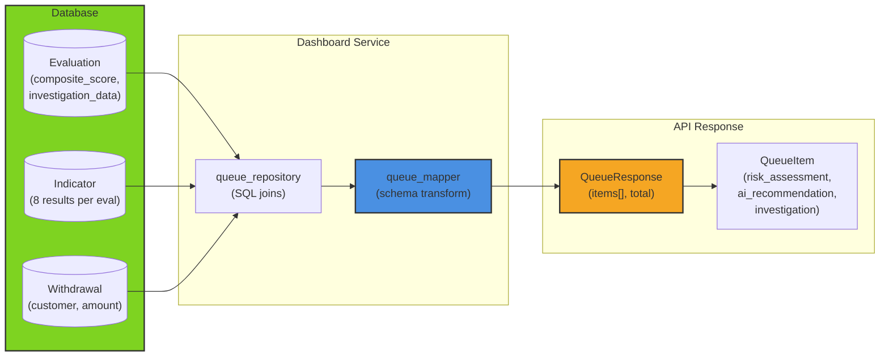

# Dashboard Service

**Role**: Read-only query services for the fraud detection UI dashboard and investigation queue.

## Overview

This service transforms enriched database query results into API schemas for the web UI. It handles:
- Paginated review queue (escalated/blocked evaluations awaiting officer action)
- Dashboard aggregate statistics (approval rates, risk scores, evaluation counts)
- Withdrawal listing with status filtering

**Key principle**: Pure mapping layer — no business logic, no writes, only schema transformation.

## File Summary

| File | Lines | Role | Key Functions |
|------|-------|------|----------------|
| `queue_mapper.py` | 114 | Transform DB Evaluation rows → QueueResponse schema | `build_queue_response()`, `_build_item()`, `_build_risk_assessment()` |
| `__init__.py` | 1 | Module marker | (none) |

## How It Works

### Queue Mapping Flow

**Input**: Enriched DB rows from `queue_repository.query_queue()` (joins evaluation + withdrawal + indicators + investigation_data JSONB)

**Processing** (`queue_mapper.py:19-49`):
```
rows[] → build_queue_response()
  ├─ For each row → _build_item()
  │   ├─ Extract basic fields (withdrawal_id, customer_id, amount, etc.)
  │   ├─ Call _build_risk_assessment(indicators, gray_used)
  │   ├─ Call _build_ai_recommendation(row) — detects decision source
  │   └─ Call _build_investigation(investigation_data) — parses triage + investigators
  └─ Return QueueResponse with items[] + total count
```

**Output**: `QueueResponse` with:
- `items[]` — paginated `QueueItem` objects
- `total` — total escalated/blocked count in DB

### Risk Assessment Classification

**Source** (`queue_mapper.py:51-68`):
- **Type**: "llm_enhanced" (if gray_zone_used=true) or "rule_based"
- **Indicators**: Array of 8 indicator results
  - Each mapped to status: "pass" (score < 0.3), "warn" (0.3-0.6), "fail" (>= 0.6)
  - Includes display_name from `INDICATOR_DISPLAY_NAMES` mapping
  - Shows reasoning and score

### AI Recommendation Detection

**Source** (`queue_mapper.py:71-83`):
Determines which system made the final decision:
1. If `gray_zone_used=true` → decision came from **Gray-Zone LLM** (old pipeline)
2. Else if `investigation_data` exists → decision from **Investigator** agents (new pipeline)
3. Else → **Rule Engine** (auto-decided)

### Investigation Data Parsing

**Source** (`queue_mapper.py:86-105`):
Extracts JSONB `investigation_data` into structured `QueueInvestigation`:
- **Triage** (`QueueTriage`) — constellation analysis, decision, assignments, confidence
- **Investigators** (`QueueInvestigatorFinding[]`) — name, score, findings, confidence per investigator

## Architecture Diagram



## Key Concepts

### Escalation Decision Source Hierarchy
1. **Gray-Zone LLM** (old pipeline) — `evaluation.gray_zone_used=true` + `gray_zone_reasoning` present
2. **Investigator Agents** (new pipeline) — `investigation_data` exists with triage + investigator results
3. **Rule Engine** (fallback) — no LLM, pure indicator-based decision

**Display**: UI shows which system made the call, enabling officers to understand confidence level.

### Status Classification

Indicator scores (0-1 scale) mapped to visual badges:
- **Pass** (< 0.3) — Low risk, acceptable
- **Warn** (0.3-0.6) — Gray zone, needs review
- **Fail** (>= 0.6) — High risk, actionable

**Example**: A "velocity" indicator scoring 0.8 shows "fail" badge, indicating suspicious transaction frequency.

### Investigation Data Structure

JSONB stored in `evaluation.investigation_data`:
```json
{
  "triage": {
    "constellation_analysis": "...",
    "decision": "escalated" or "blocked",
    "assignments": [
      {"name": "financial_behavior", "hypothesis": "..."}
    ]
  },
  "investigators": [
    {
      "name": "financial_behavior",
      "score": 0.72,
      "findings": "...",
      "confidence": 0.85
    }
  ],
  "rule_engine": {
    "decision": "escalated",
    "composite_score": 0.58
  }
}
```

**Usage**: Officers click into queue item to see investigation findings + recommendation basis.

## Performance

- **Mapping**: O(n) where n = number of evaluations (linear, no nested queries)
- **Input size**: Typically 10-50 items per page (paginated)
- **Processing**: < 50ms (pure in-memory transformation)
- **DB latency**: Handled by `queue_repository` (joins + filtering)

## Data Consistency

- **Read-only**: No writes to database
- **Detached entities**: ORM models converted to Pydantic schemas before return
- **Jsonification**: Investigation JSONB fully deserialized for validation

## Testing

Validate via:
- `scripts/test_all_endpoints.py` → calls `GET /api/dashboard/queue` with various filters
- Check `outputs/` for queue responses (see investigation_data structure)
- No unit tests (integration testing against running DB only)
