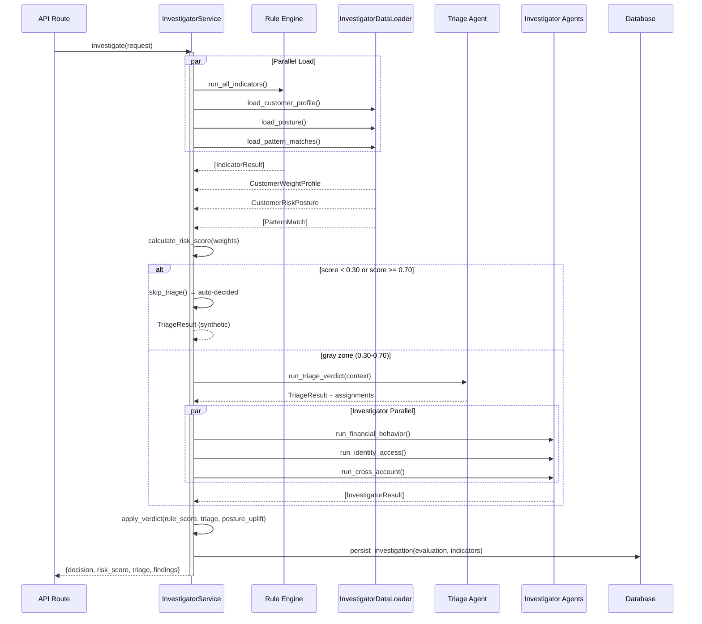

# Fraud Detection Services

This module contains the two fraud evaluation pipelines that orchestrate rule-engine indicators, triage routing, investigator agents, and verdict synthesis. Services mediate between API routes and core business logic, managing data loading, context formatting, and result persistence.

**Key Responsibility**: Transform withdrawal requests into fraud decisions via parallel rule evaluation, optional agent-based investigation, and outcome blending.

---

## File Inventory

| File | Role | Key Functions/Classes |
|------|------|----------------------|
| **investigator_service.py** | NEW pipeline orchestrator (rules + triage + investigators) | `InvestigatorService` — `investigate()` entry point; calls rule engine, skips triage for obvious cases, runs 0-3 agents in parallel, blends scores (50/50), applies verdict guardrails |
| **internals/data_loader.py** | Async customer profile + posture + pattern loader | `InvestigatorDataLoader` — `load_customer_profile()`, `load_posture()`, `load_pattern_matches()` |
| **internals/formatters.py** | Formats indicator results + requests as LLM-readable context | `build_rule_ctx()`, `format_indicators_for_llm()`, `format_investigators_for_verdict()` |
| **internals/llm_context.py** | Builds posture + pattern match context strings for LLM prompts | `format_posture_context()`, `format_pattern_context()` |
| **internals/investigation_data.py** | Serializes triage + investigator findings to JSONB | `build_investigation_data()` — structures triage results, investigator findings, rule engine decision, posture uplift for DB storage |
| **internals/verdict.py** | Maps triage verdict to final decision with guardrails | `apply_verdict()` — enforces safety net (rule-blocked cannot be approved), low-confidence fallback, auto-decided passthrough |
| **internals/response_builder.py** | Builds `FraudCheckResponse` from rule scores + decision | `build_response()` — structures frontend response; sorts indicators by priority; computes risk level, summary text |
| **internals/tools.py** | LangChain SQL tool factory for investigator agents | `build_tools()` — creates `sql_db_query` tool for agents to query customer/transaction history |
| **internals/persistence.py** | ORM model builders + DB persistence | `build_indicator_models()`, `persist_investigation()` — saves `Evaluation` + `IndicatorResult[]` to database |

---

## Fraud Evaluation Pipelines

### NEW Pipeline: Investigator-Driven Workflow (`POST /api/payout/investigate`)

**Performance**: ~0.14s (clean, 56%), ~12s (suspicious, 44%), ~2.8s (80/20 blended)

```
Request
  ↓
[Rule Engine] 8 SQL indicators in parallel (~50ms)
  ↓
[Scoring] Weighted composite + decision (approve/escalated/blocked)
  ↓
[Triage Skip Logic]
├─ score < 0.30 → APPROVE, no triage, return
├─ score >= 0.70 → BLOCK, no triage, return
└─ 0.30 ≤ score < 0.70 → proceed to triage
  ↓
[Triage Router] 1 LLM call reads rule constellation, assigns 0-3 investigators
  ↓
[Investigators] Run assigned agents in parallel
├─ financial_behavior (transaction history, spending patterns)
├─ identity_access (device, geo, velocity)
└─ cross_account (linked accounts, fraud rings)
  ↓
[Verdict Synthesis] 1 LLM call blends rule + agent findings
  ↓
[Blending Logic] 50% rule engine + 50% investigator agents
  ├─ De-escalation: agents can approve if rule score < 0.50 (soft gray zone)
  ├─ No de-escalation: rule score >= 0.50 forces escalated/blocked floor
  └─ Guardrails: rule-blocked cannot be approved by triage
  ↓
Final Decision + Persistent Storage
```

**Key Orchestration**:
- `InvestigatorService.investigate()` coordinates all steps asynchronously
- `_load_all()` parallelizes rule indicators + customer data + thresholds + posture + patterns
- `_score_rules()` applies calibrated indicator weights + threshold config
- `_resolve_triage()` skips for obvious cases or runs investigator assignments
- `apply_verdict()` enforces guardrails before returning final decision

**Blended Scoring**:
```python
# Investigator score = weighted average of agent confidence
inv_score = sum(agent_score * agent_confidence) / sum(agent_confidence)

# Final blend
blended_score = (rule_score * 0.5) + (inv_score * 0.5)
```

**De-Escalation Window (v4)**:
- `rule_score < 0.50`: agents **can** downgrade "escalated" → "approved" (safety floor 0.15)
- `rule_score >= 0.50`: agents investigated but **cannot** de-escalate
- `rule_score >= 0.70`: auto-blocked, agents never called

---

## Architecture & Orchestration

### Data Flow (Investigator Service)



### Service Layers

**InvestigatorService** (`investigator_service.py:59-371`)
- Entry point: `investigate(request: FraudCheckRequest) → dict`
- Orchestrates all pipeline steps asynchronously
- **Does NOT directly query DB** — delegates to `InvestigatorDataLoader` + repositories
- **Does NOT build responses** — returns raw dict; caller formats for API schema

**InvestigatorDataLoader** (`data_loader.py:17-102`)
- Loads customer profiles, posture, and pattern matches from database
- Resolves `external_id` → UUID lookups
- Returns detached ORM entities or None (graceful degradation)

**Formatters & Context Builders** (`formatters.py`, `llm_context.py`)
- `build_rule_ctx()` — extracts fraud-check fields into rule-engine dict
- `format_indicators_for_llm()` — renders scoring results as LLM-readable text
- `format_investigators_for_verdict()` — renders agent findings for triage verdict prompt
- `format_posture_context()` — builds pre-fraud posture evidence text
- `format_pattern_context()` — builds active fraud pattern match context

**Verdict Logic** (`verdict.py:7-36`)
- `apply_verdict()` enforces 3 guardrails:
  1. Auto-decided cases (no investigators) → use rule decision directly
  2. Rule-blocked + triage-approved → override to "escalated" (safety net)
  3. Low-confidence triage (<0.5) → fall back to rule engine

**Persistence Helpers** (`persistence.py`, `investigation_data.py`)
- `build_indicator_models()` — converts domain `IndicatorResult` → ORM models
- `persist_investigation()` — saves `Evaluation` + indicator results atomically
- `build_investigation_data()` — serializes triage + findings to JSONB for audit trail

**Response Building** (`response_builder.py:31-137`)
- `build_response()` — constructs `FraudCheckResponse` schema from rule scores
- Sorts indicators by priority (fail → warn → pass) and weighted score
- Generates human-readable summary without numeric scores

---

## Key Concepts

### Triage Skip Logic
When rule score lands outside the gray zone (0.30-0.70), no LLM calls are made:
- **Score < 0.30** (approve): Safe withdrawal, auto-approve immediately
- **Score >= 0.70** (block): High-risk withdrawal, auto-block immediately
- **0.30 ≤ score < 0.70** (escalated): Ambiguous case, run triage + investigators

This skipping is **the primary latency optimization** — 56% of traffic never hits LLM.

### Blended Scoring (50/50)
Rule engine alone is calibrated but may be overly strict or lenient for novel fraud. Investigator agents provide domain expertise:
- **Rule score = 0.25** (should approve) + **agent consensus = 0.15** → **blended = 0.20** ✓ approve
- **Rule score = 0.65** (escalated) + **agent consensus = 0.80** (suspicious) → **blended = 0.725** ⚠ escalated confirmed

### De-Escalation Window
In v4, agents are allowed to downgrade "escalated" cases ONLY when rule score is < 0.50 (soft gray zone):
- Prevents agents from overriding obvious fraud (rule score ≥ 0.70)
- Gives agents flexibility in borderline cases (0.30-0.50)
- Safety floor ensures blended score never drops below 0.15 (preventing approvals on trivial agent scoring)

### Investigator Data Loader
Resolves `FraudCheckRequest.customer_id` (external ID, e.g., "CUST-001") to UUID via DB lookup, then queries:
- `CustomerWeightProfile` — indicator + blend weight multipliers (customer-specific calibration)
- `CustomerRiskPosture` — abnormal behavior flags (pre-fraud system signal)
- `PatternMatch[]` — active fraud ring / shared device patterns

### LLM Tool Access
Investigators can query transaction history via `build_tools()` → LangChain SQL toolkit:
- Single tool: `sql_db_query(query: str)` (no query_checker, no schema_explorer)
- Agents write their own SQL or ask natural language questions
- DB connection is sync (SQLAlchemy without asyncpg) for LangChain compatibility

---

## Configuration & Tuning

**Model & Timeouts** (investigator_service.py:47-50)
- Triage: `gemini-3-flash-preview`, 25s timeout, low thinking, 512 max tokens
- Investigators: same config, 25s timeout, max 3 iterations

**Weights & Thresholds** (loaded from `app/core/scoring.py`)
- `INDICATOR_WEIGHTS` — hardcoded or customer-overridden via `CustomerWeightProfile`
- `APPROVE_THRESHOLD` (0.30) / `BLOCK_THRESHOLD` (0.70) — triage skip boundaries
- `POSTURE_UPLIFT_WEIGHT` — caps abnormal posture score boost (e.g., 20% of posture.score)

**Calibration** (app/core/calibration.py)
- `build_effective_weights()` — blends global + customer indicator weights
- Allows per-customer risk appetite (e.g., VIP = lower weights)

---

## Testing & Observability

**No Unit Tests** — Validation via end-to-end benchmark scripts:
- `scripts/benchmark_investigate.py` — runs 16 seeded customers, reports latency + accuracy
- Expected split: 56% clean (0.14s), 44% suspicious (12.1s)
- Detects fraud rings, ATO, impossible travel, money laundering patterns

**Logging** (structured JSON)
- `investigate()` logs entry, rule elapsed, triage/investigator results, final decision
- Exceptions logged at boundaries with context (evaluation_id, customer_id, error type)
- No secrets in logs (API keys, tokens, passwords)

**Tracing** (correlation ID propagated through layers)
- All async calls inherit evaluation_id for audit trail
- DB `investigation_data` JSONB contains full triage + findings for post-hoc review

---

## References

- **Orchestration**: `investigator_service.py:69-114` — main `investigate()` method
- **Blending Logic**: `verdict.py:7-36` — `apply_verdict()` guardrails
- **Triage Skip**: `investigator_service.py:184-206` — `_resolve_triage()` conditional
- **Data Loading**: `data_loader.py:17-102` — async profile + posture + pattern queries
- **LLM Context**: `formatters.py`, `llm_context.py` — context builders for agent prompts
- **Persistence**: `persistence.py:40-94`, `investigation_data.py:9-69` — atomic save to DB
