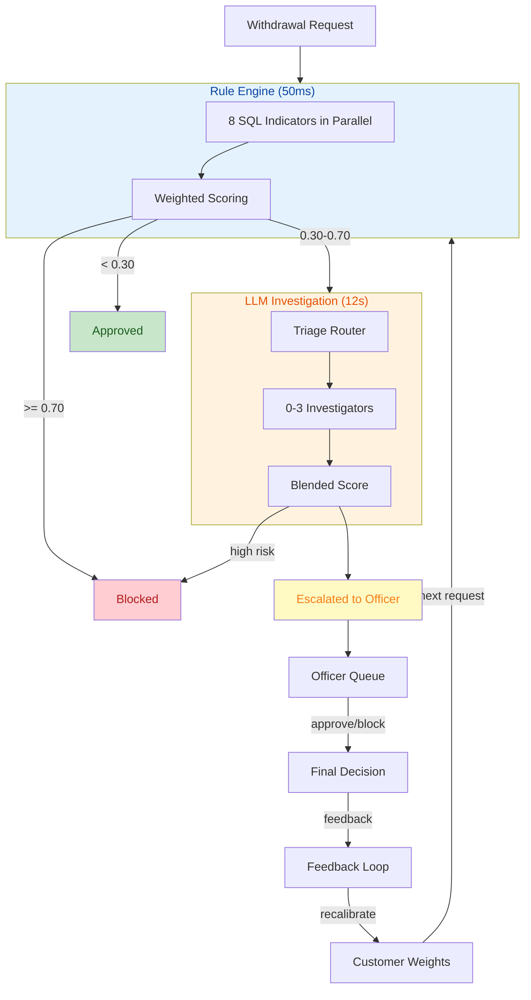

# Fraud Detection System

AI-powered payment fraud detection for the Deriv trading platform. Every withdrawal passes through 8 parallel rule indicators, ambiguous cases escalate to LLM investigators, and officers make final calls on escalated items.

---

## System Overview



---

## Implemented Features

| Feature | What it does | Docs | Key Code |
|---------|-------------|------|----------|
| **Fraud Detection** | Two pipelines: rule engine + optional LLM investigators | [features/fraud_detection/](features/fraud_detection/) | `app/services/fraud/` |
| **Analyst Chat** | Natural language fraud queries with SSE streaming + auto charts | [features/chat/](features/chat/) | `app/services/chat/` |
| **Card Lockdown** | Detect shared payment cards across accounts, lock in one click | [features/card_lockdown/](features/card_lockdown/) | `app/services/control/card_lockdown_service.py` |
| **Adaptive Weights** | Per-customer indicator weights that learn from officer decisions | [features/weights_config/](features/weights_config/) | `app/services/control/customer_weight_explain_service.py` |
| **Background Audits** | Extract fraud reasoning, embed, cluster, surface new patterns | [features/background_audits/](features/background_audits/) | `app/services/audit/` |
| **Officer Queue** | Paginated escalated withdrawals for officer review | [architecture/component_diagram.md](architecture/component_diagram.md) | `app/services/dashboard/queue_mapper.py` |
| **Feedback Loop** | Officer decisions recalibrate customer weight profiles | [features/weights_config/overview.md](features/weights_config/overview.md) | `app/services/control/feedback_loop_service.py` |

---

## Architecture & Reference

| Topic | Docs |
|-------|------|
| Full component diagram | [architecture/component_diagram.md](architecture/component_diagram.md) |
| Problem statement + tech stack | [architecture/problem_statement.md](architecture/problem_statement.md) |
| Withdrawal state machine | [architecture/payout_state_machine.md](architecture/payout_state_machine.md) |
| VPN detection approach | [architecture/vpn_detection.md](architecture/vpn_detection.md) |
| 16 test customer scenarios | [architecture/seeding_scenarios.md](architecture/seeding_scenarios.md) |

---

## Database Schema

| Topic | Docs |
|-------|------|
| Schema overview | [database/README.md](database/README.md) |
| Customers, devices, IPs, trades | [database/customer_and_activity.md](database/customer_and_activity.md) |
| Withdrawals, evaluations, indicators | [database/withdrawal_risk_pipeline.md](database/withdrawal_risk_pipeline.md) |
| Alerts, feedback, officer decisions | [database/review_feedback_alerts.md](database/review_feedback_alerts.md) |
| Weight profiles, thresholds, patterns | [database/config_and_learning.md](database/config_and_learning.md) |
| Investigation JSONB persistence | [database/investigator_service_persistence.md](database/investigator_service_persistence.md) |

---

## Planned Features (No Code)

| Feature | Docs | Status |
|---------|------|--------|
| Background Audit Stage 2 (autonomous agent) | [planning/background_audits/](planning/background_audits/) | Design phase |
| Predictive Fraud / ML Blocking | [planning/predictive_fraud/](planning/predictive_fraud/) | Design phase |

---

## API Endpoints

| Method | Path | Feature |
|--------|------|---------|
| POST | `/api/payout/evaluate` | Old fraud pipeline (rule + gray-zone LLM) |
| POST | `/api/payout/investigate` | New fraud pipeline (rule + triage + investigators) |
| GET | `/api/payout/evaluate/{id}` | Stored indicator results |
| GET | `/api/payout/queue` | Officer review queue |
| GET | `/api/payout/investigate/{id}` | Investigation evidence |
| POST | `/api/payout/decision` | Officer approve/block |
| POST | `/api/query/chat` | Analyst chat (SSE streaming) |
| GET | `/api/customers/{id}/weights` | Customer weight snapshot |
| POST | `/api/customers/{id}/weights/reset` | Reset to baseline weights |
| GET | `/api/cards/check/{customer_id}` | Shared card detection |
| POST | `/api/cards/lockdown` | Card lockdown execution |
| POST | `/api/background-audits/trigger` | Start audit run |
| GET | `/api/background-audits/runs/{id}` | Audit run status |
| GET | `/api/background-audits/runs/{id}/candidates` | Discovered patterns |
| GET | `/api/dashboard/stats` | Dashboard statistics |
| GET | `/api/health` | Health check |

---

## 8 Rule Indicators

| # | Indicator | Weight | Detects |
|---|-----------|--------|---------|
| 1 | Amount Anomaly | 1.0 | Z-score of withdrawal vs history |
| 2 | Velocity | 1.0 | Withdrawal frequency spikes (1h/24h/7d) |
| 3 | Payment Method | 1.0 | New/unverified/blacklisted methods |
| 4 | Geographic | 1.2 | VPN, country mismatch, IP diversity |
| 5 | Device Fingerprint | 1.3 | Cross-account sharing, untrusted devices |
| 6 | Trading Behavior | 1.5 | Deposit & run (0 trades + high withdrawal) |
| 7 | Recipient | 1.0 | Name mismatch, shared recipient accounts |
| 8 | Card Errors | 1.2 | Failed transactions, method switching |

---

## Performance (v3, Feb 2026)

| Traffic | Latency | LLM Calls |
|---------|---------|-----------|
| Clean (56%) | **0.14s** | 0 |
| Suspicious (44%) | **12.1s** | 2-3 |
| Blended (80/20) | **~2.8s** | -- |
| Analyst Chat | **3.7s** | 1 |

---

## Tech Stack

| Layer | Technology |
|-------|-----------|
| API | FastAPI + uvicorn (async, SSE, DI) |
| Agents | LangChain + langchain-google-genai |
| LLM | Google Gemini 3-Flash |
| Database | PostgreSQL 16 (async via asyncpg) |
| Vector DB | ChromaDB |
| ORM | SQLAlchemy 2.0 + Alembic |
| Schemas | Pydantic 2 |
| Frontend | Vue 3 + TypeScript |
| Infra | Docker Compose |

---

## Running

```bash
# Start all services
docker compose up -d

# Seed 16 test customers
python -m scripts.seed_data

# Health check
curl http://localhost:18080/api/health

# Evaluate a withdrawal (new pipeline)
curl -X POST http://localhost:18080/api/payout/investigate \
  -H "Content-Type: application/json" \
  -d '{"customer_id":"CUST-001","amount":500.00,"recipient_name":"Sarah Chen","recipient_account":"GB29NWBK60161331926819","ip_address":"51.148.20.30","device_fingerprint":"f1e2d3c4b5a6f1e2d3c4b5a6f1e2d3c4","customer_country":"GBR"}'
```
