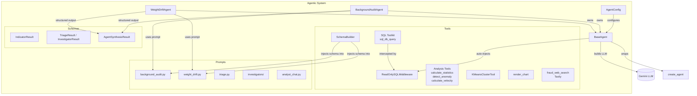
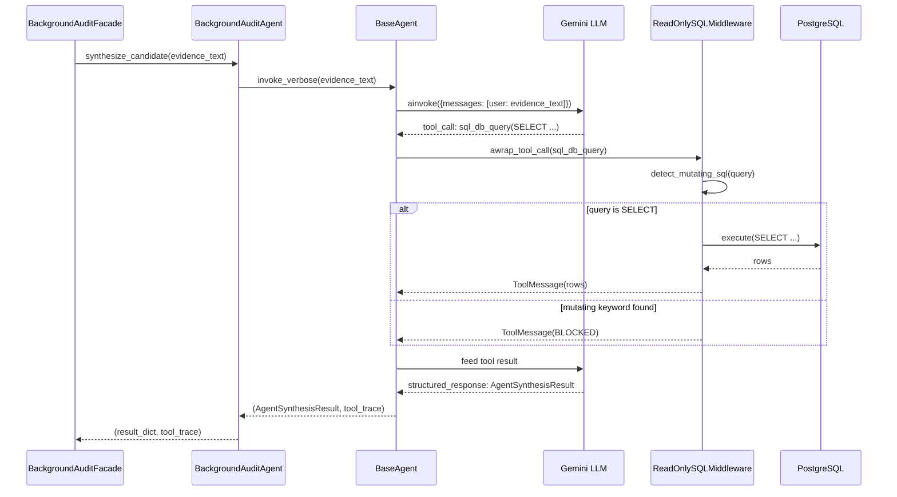
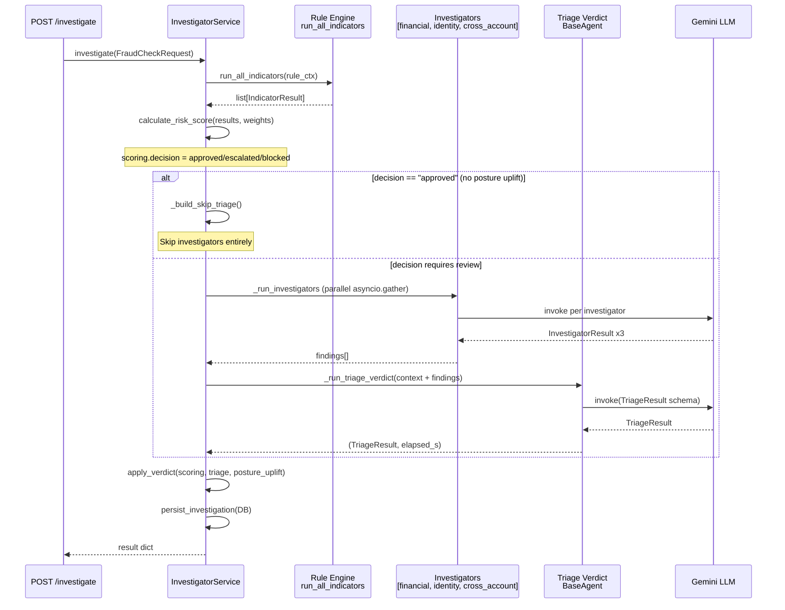

# Agentic System

The agentic system is Nexa's AI backbone. It wraps LangChain 1.0 agents powered by **Google Gemini** and provides reusable, composable building blocks for fraud investigation, background auditing, and weight drift analysis.

---

## Component Diagram

---

## Design Decisions

| Decision | Rationale |
|----------|-----------|
| **Composition over inheritance** | Agents own a `BaseAgent`, never subclass it. Keeps specializations shallow and testable. |
| **Frozen `AgentConfig` dataclass** | Immutable config prevents runtime mutation bugs. All tuning happens at construction time. |
| **`ReadOnlySQLMiddleware` as singleton** | SQL safety is a cross-cutting concern injected automatically when any `sql_db_query` tool is present. No per-agent configuration needed. |
| **Schema injection at construction** | Live DB schema (via `schema_builder.py`) is embedded into the prompt string at agent creation — not at call time — keeping per-request latency minimal. |
| **`invoke_verbose` for audit agents** | Background audit and weight drift need a tool trace for the analyst UI. Investigation agents use plain `invoke`. |
| **Fallback dicts on failure** | Every agent returns a fallback result on exception instead of crashing the pipeline. Analysts see a degraded but complete response. |
| **Gemini `gemini-3-flash-preview` default** | Fast, cheap, and sufficient for structured output tasks. `thinking_level="low"` for investigators/triage keeps latency under 25s timeout. |

---

## Files

| File | Role |
|------|------|
| `base_agent.py` | `BaseAgent` + `AgentConfig` — core LangChain wrapper |
| `agents/background_audit_agent.py` | Autonomous fraud pattern synthesizer |
| `agents/weight_drift_agent.py` | Autonomous weight drift investigator |
| `tools/sql/toolkit.py` | `SQLDatabaseToolkit` setup, `FRAUD_DB_TABLES` whitelist |
| `tools/sql/read_only_middleware.py` | Blocks INSERT/UPDATE/DELETE/DROP before execution |
| `tools/sql/schema_builder.py` | Live schema docs + critical notes for LLM prompts |
| `tools/sql/analysis.py` | Statistical `@tool` functions: stats, anomaly, velocity, cohort |
| `tools/kmeans_tool.py` | KMeans on ChromaDB embeddings for cluster comparison |
| `tools/chart_tool.py` | `render_chart` — produces chart spec for the analyst UI |
| `tools/web_search_tool.py` | Tavily fraud typology search (optional, key-guarded) |
| `prompts/background_audit.py` | System prompt for fraud pattern synthesis |
| `prompts/weight_drift.py` | System prompt for weight drift analysis |
| `prompts/triage.py` | System prompt for final verdict synthesis |
| `prompts/investigators/` | Per-investigator prompts (financial, identity, cross-account) |
| `prompts/analyst_chat.py` | System prompt for the analyst chat interface |
| `schemas/indicators.py` | `IndicatorResult` — output schema for all indicator agents |
| `schemas/triage.py` | `TriageResult`, `InvestigatorResult`, `InvestigatorAssignment` |
| `schemas/background_audit.py` | `AgentSynthesisResult`, `WebReference`, `SQLFinding`, `Recommendation` |

---

## Sequence: BackgroundAuditAgent Invocation

---

## Sequence: Investigator Pipeline (InvestigatorService)

