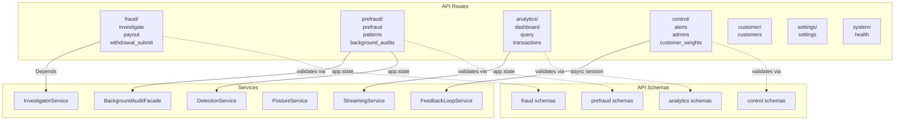
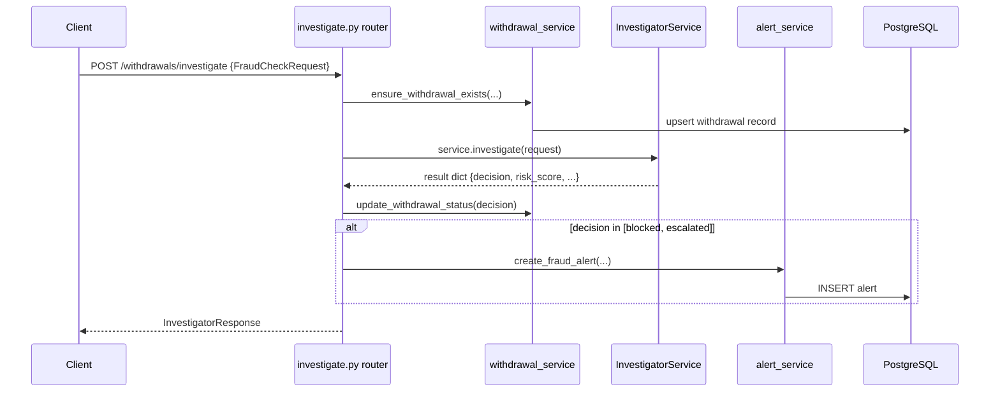
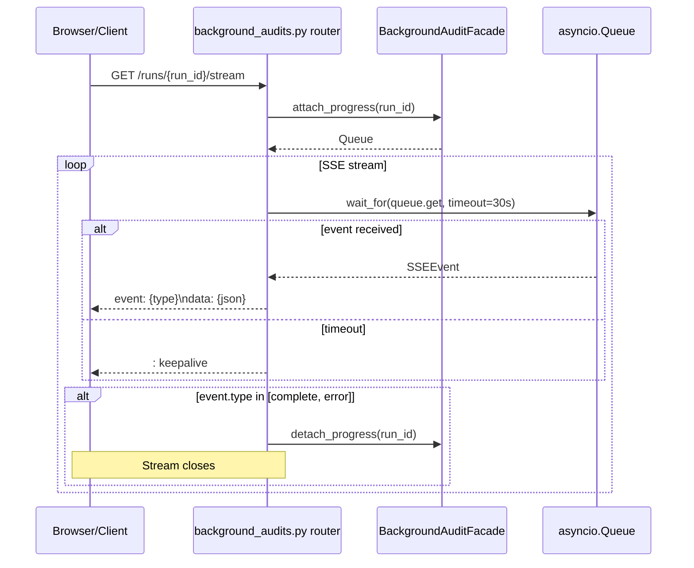

# API Layer

The API layer handles routing, validation, and response formatting. Zero business logic lives here — all work is delegated to services.

---

## Component Diagram

---

## Route Groups

| Prefix | Module | Key Endpoints |
|--------|--------|---------------|
| `/withdrawals` | `fraud/` | `POST /investigate`, `POST /payout`, `POST /submit` |
| `/background-audits` | `prefraud/background_audits` | `POST /trigger`, `GET /runs`, `GET /runs/{id}/stream` (SSE) |
| `/prefraud` | `prefraud/prefraud` | `GET /posture`, `GET /signals` |
| `/patterns` | `prefraud/patterns` | `GET /`, `GET /{id}`, pattern management |
| `/analytics/query` | `analytics/query` | `POST /` — analyst chat with streaming |
| `/analytics/dashboard` | `analytics/dashboard` | `GET /` — queue + KPIs |
| `/analytics/transactions` | `analytics/transactions` | `GET /history` |
| `/alerts` | `control/alerts` | `GET /`, `PUT /{id}` |
| `/admins` | `control/admins` | `POST /decision` — officer approve/block |
| `/customer-weights` | `control/customer_weights` | `GET /{id}`, `PUT /{id}/pin` |
| `/customers` | `customer/customers` | `GET /`, `GET /{id}` |
| `/settings` | `settings/settings` | `GET /thresholds`, `PUT /thresholds` |
| `/health` | `system/health` | `GET /` |

---

## Design Decisions

| Decision | Rationale |
|----------|-----------|
| **Services injected via `app.state`** | Long-lived services (InvestigatorService, BackgroundAuditFacade) are constructed at startup and stored on `app.state`. Avoids rebuilding expensive clients per request. |
| **`Depends(_get_service)`** | Service resolution via FastAPI dependency injection keeps routes clean and testable. Lazy construction on first request as fallback. |
| **SSE for background audit progress** | Background runs can take minutes. SSE (`/runs/{id}/stream`) gives real-time feedback without polling. Keepalive pings every 30s prevent proxy timeouts. |
| **Schemas in `api/schemas/`** | Pydantic models for request/response validation are separate from DB models — the API layer never imports ORM models directly. |
| **Zero business logic in routes** | Routes only: validate input → call service → format response. If a route grows beyond ~30 lines of logic, it belongs in a service. |

---

## Key Schema Types

| Schema | File | Purpose |
|--------|------|---------|
| `FraudCheckRequest` | `fraud/fraud_check.py` | Input for `/investigate` — withdrawal + customer context |
| `InvestigatorResponse` | `fraud/investigator.py` | Full structured verdict with triage + indicator breakdown |
| `TriggerRunRequest` | `prefraud/background_audit.py` | Start a background audit run |
| `RunStatusResponse` | `prefraud/background_audit.py` | Run status + counters |
| `CandidateListResponse` | `prefraud/background_audit.py` | Pattern candidates for a run |
| `AnalyticsQueryRequest` | `analytics/query.py` | Analyst chat prompt |
| `ThresholdConfig` | `settings/threshold_config.py` | Approve/block threshold configuration |
| `AlertResponse` | `control/alert.py` | Fraud alert details |
| `CustomerWeightResponse` | `control/customer_weights.py` | Per-customer indicator weight profile |

---

## Sequence: POST /withdrawals/investigate

---

## Sequence: GET /background-audits/runs/{id}/stream (SSE)

