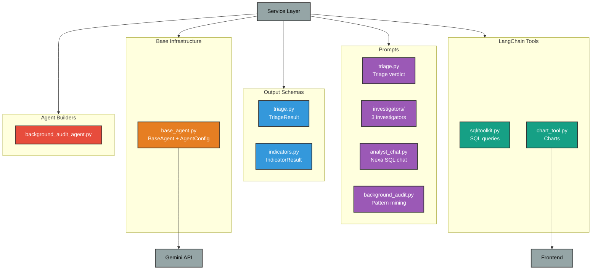

# Agentic System Architecture

LangChain + Gemini wrapper for fraud investigation agents, SQL chat, and background audit.

---

## System Overview



---

## Base Infrastructure

### `base_agent.py` — Reusable LangChain Wrapper

Thin wrapper around `langchain.agents.create_agent` with Google Gemini.

**Key Classes:**
```python
@dataclass(frozen=True)
class AgentConfig:
    prompt: str
    model: str = "gemini-3-flash-preview"
    temperature: float = 0.0
    tools: tuple[BaseTool, ...] = ()
    output_schema: type[BaseModel] | None = None
    thinking_budget: int | None = None
    thinking_level: str | None = None  # "low" | "medium" | "high"
    max_tokens: int | None = None
    timeout: float | None = None
    max_retries: int = 2
    max_iterations: int | None = None

class BaseAgent:
    async def invoke(user_input: str) -> BaseModel | str
    async def invoke_verbose(user_input: str) -> tuple[BaseModel | str, list[dict]]
    async def stream(user_input: str) -> AsyncGenerator[str, None]
```

**Usage Pattern (Composition over Inheritance):**
```python
# In investigator_service.py
agent_config = AgentConfig(
    prompt=INVESTIGATOR_PROMPTS["financial_behavior"],
    model="gemini-3-flash-preview",
    thinking_level="low",
    max_tokens=512,
    tools=sql_tools,
    output_schema=InvestigatorResult,
    timeout=25.0,
)
agent = BaseAgent(agent_config)
result: InvestigatorResult = await agent.invoke(context)
```

**Used By:** `investigator_service.py`, `streaming_service.py`, `background_audit_agent.py`

---

## Prompts

### Triage Verdict Synthesizer (`triage.py`)

**Purpose:** Final decision-maker that synthesizes 8 rule engine scores + investigator findings.

**Key Instructions:**
- Weigh investigator CONSENSUS, not just the loudest signal
- If investigators CONTRADICT each other, escalate — don't let one override the rest
- NEVER approve if cross_account found fraud ring evidence
- NEVER block on single investigator unless confidence ≥ 0.9 AND concrete evidence exists

**Output Schema:** `TriageResult` (decision, risk_score, confidence, constellation_analysis, decision_reasoning)

**Used By:** `investigator_service.py` → `_run_triage()`

---

### Investigators (`prompts/investigators/`)

**3 Consolidated Investigators:**

| Investigator | File | Focus | Table Access |
|--------------|------|-------|--------------|
| **financial_behavior** | `financial_behavior.py` | Amount anomalies, velocity, trading behavior, payment methods | `withdrawals`, `transactions`, `trades`, `payment_methods` |
| **identity_access** | `identity_access.py` | Geographic signals, device fingerprinting | `devices`, `ip_history`, `customers` |
| **cross_account** | `cross_account.py` | Recipient analysis, card errors, shared devices | `withdrawals`, `payment_methods`, `devices`, `customers` |

**Common Pattern:**
- Each prompt includes base instructions + specific focus area
- Built via `build_investigator_prompt(investigator_name, weight_context)`
- Output: `InvestigatorResult` (score, confidence, reasoning, evidence)

**Used By:** `investigator_service.py` → `_run_investigators()`

---

### Analyst Chat (`analyst_chat.py`)

**Purpose:** Natural language SQL query assistant (Nexa).

**Key Instructions:**
- Use simple language — avoid technical jargon
- NEVER retry the same query
- Do NOT include SQL or code in response text
- **NEVER use markdown tables** — numbered list (max 10)
- Call `render_chart` for 2+ rows of comparable data

**Schema Injection:** Live DB schema is injected at startup via `schema_builder.py`

**Output:** Plain text (no structured schema)

**Used By:** `streaming_service.py` (SSE chat endpoint)

---

### Background Audit (`background_audit.py`)

**Purpose:** LLM-based pattern investigation for confirmed fraud clusters.

**Flow:** Extract reasoning units → HDBSCAN clustering → LLM investigates each cluster

**Used By:** `background_audit_agent.py`

---

## Schemas (Pydantic Models)

### Triage & Investigators (`schemas/triage.py`)

```python
class InvestigatorAssignment(BaseModel):
    investigator: InvestigatorName  # "financial_behavior" | "identity_access" | "cross_account"
    priority: Literal["high", "medium", "low"]

class TriageResult(BaseModel):
    constellation_analysis: str  # max_length=500
    decision: Literal["approved", "escalated", "blocked"]
    decision_reasoning: str  # max_length=300
    confidence: float  # 0.0-1.0
    risk_score: float  # 0.0-1.0
    assignments: list[InvestigatorAssignment]

class InvestigatorResult(BaseModel):
    investigator_name: InvestigatorName
    score: float  # 0.0-1.0
    confidence: float  # 0.0-1.0
    reasoning: str  # max_length=300
    evidence: dict[str, object]
```

**Used By:** `investigator_service.py`, `fraud/internals/formatters.py`

---

### Indicators (`schemas/indicators.py`)

```python
class IndicatorResult(BaseModel):
    indicator_name: str
    score: float  # 0.0-1.0
    confidence: float  # 0.0-1.0
    reasoning: str
    evidence: dict[str, object]
```

**Used By:** All 8 indicators in `app/core/indicators/`, `investigator_service.py`

---

### Background Audit (`schemas/background_audit.py`)

Cluster-related schemas for pattern mining (not actively used in main fraud pipeline).

---

## Tools

### SQL Toolkit (`tools/sql/toolkit.py`)

**Purpose:** LangChain SQL tools for database queries.

**Tables Included:**
```python
FRAUD_DB_TABLES = [
    "customers", "withdrawals", "transactions", "trades",
    "payment_methods", "devices", "ip_history",
    "withdrawal_decisions", "indicator_results", "alerts", "threshold_config"
]
```

**Functions:**
- `create_sql_toolkit(db_uri, llm)` → SQLDatabaseToolkit
- `get_sql_tools(toolkit)` → 4 tools (list, schema, query, query_checker)
- `get_query_tools(toolkit)` → **1 tool only** (query) — skips schema/list/checker to minimize LLM round-trips

**Used By:** `streaming_service.py` (analyst chat), `investigator_service.py` (investigators)

---

### Schema Builder (`tools/sql/schema_builder.py`)

**Purpose:** Programmatically query DB schema at startup, inject into prompts.

**Key Innovation:** Schema is NEVER hardcoded — always queried from `information_schema` at app startup.

**Functions:**
- `build_schema_description(engine, tables)` → queries column types, constraints
- `build_critical_notes()` → returns static critical notes (two-layer status system)

**Used By:** `streaming_service.py` (injects into `ANALYST_CHAT_PROMPT`)

---

### Chart Tool (`tools/chart_tool.py`)

**Purpose:** LLM-callable tool for rendering charts in the chat UI.

```python
@tool
def render_chart(
    title: str,
    chart_type: str,  # "bar" | "line" | "pie"
    x_key: str,
    series: list[dict],
    rows: list[dict],
) -> str:
    """Render a chart in the chat UI."""
```

**Guidelines:**
- Use "bar" for ranked lists, top-N
- Use "line" for time series
- Use "pie" for part-to-whole (≤8 slices)
- Max 24 rows

**Used By:** `streaming_service.py` (analyst chat)

---

### Other Tools

| Tool | File | Purpose | Used By |
|------|------|---------|---------|
| **KMeansClusterTool** | `kmeans_tool.py` | K-means clustering for background audit | `background_audit_agent.py` |
| **Web Search** | `web_search_tool.py` | Web search tool (not actively used) | N/A |

---

## Agent Builders

### `agents/background_audit_agent.py`

**Purpose:** Wrapper for background audit pipeline — builds BaseAgent with SQL tools + K-means tool.

**Used By:** `background_audit/facade.py`

---

## Usage Patterns

### Pattern 1: Structured Output Agent (Investigators)

```python
from app.agentic_system.base_agent import AgentConfig, BaseAgent
from app.agentic_system.schemas.triage import InvestigatorResult

config = AgentConfig(
    prompt=investigator_prompt,
    model="gemini-3-flash-preview",
    thinking_level="low",
    max_tokens=512,
    tools=sql_tools,
    output_schema=InvestigatorResult,  # Pydantic schema
    timeout=25.0,
)
agent = BaseAgent(config)
result: InvestigatorResult = await agent.invoke(context_text)
```

---

### Pattern 2: Streaming Text Agent (Chat)

```python
from app.agentic_system.base_agent import AgentConfig, BaseAgent

config = AgentConfig(
    prompt=ANALYST_CHAT_PROMPT,
    model="gemini-2.5-flash",
    thinking_level="low",
    tools=(render_chart, *sql_tools),
    output_schema=None,  # Plain text
)
agent = BaseAgent(config)

async for token in agent.stream(user_question):
    yield f"data: {json.dumps({'type': 'token', 'content': token})}\n\n"
```

---

### Pattern 3: Tool Trace Debugging

```python
result, trace = await agent.invoke_verbose(user_input)

for entry in trace:
    print(f"Tool: {entry['tool']}")
    print(f"Args: {entry['args_preview']}")
    print(f"Result: {entry['result_preview']}")
```

---

## Configuration Summary

| Agent Type | Model | Thinking Level | Max Tokens | Timeout | Used By |
|------------|-------|----------------|------------|---------|---------|
| **Triage** | gemini-3-flash-preview | low | 512 | 25s | `investigator_service.py` |
| **Investigators** | gemini-3-flash-preview | low | 512 | 25s | `investigator_service.py` |
| **Analyst Chat** | gemini-2.5-flash | low | None | None | `streaming_service.py` |
| **Background Audit** | gemini-3-flash-preview | low | 1024 | 60s | `background_audit_agent.py` |

---

## Performance Characteristics

| Agent | Avg Latency | LLM Calls | Notes |
|-------|-------------|-----------|-------|
| **Triage** | ~4s | 1 | Reads rule scores + investigator findings |
| **Investigators** (each) | ~4s | 1-2 | Depends on SQL query complexity |
| **Analyst Chat** | 2.88s (TTFT) | 1 | Streaming SSE, 100% accuracy |
| **Background Audit** | 30-60s | 3-5 | Cluster investigation |

**Key Optimization:** `thinking_level="low"` reduces Gemini thinking time by ~2-3s per call.

---

## Rules

1. **Composition over inheritance** — Services own a `BaseAgent`, don't subclass it.
2. **Prompts are immutable** — Frozen dataclasses, no runtime mutation.
3. **Structured output via Pydantic** — `output_schema` parameter enforces schema.
4. **Tool trace for debugging** — Use `invoke_verbose()` to see tool calls.
5. **Schema is live** — SQL schema queried at startup, never hardcoded.
6. **Max iterations** — Set `max_iterations` to prevent infinite loops (default: 2-4).

---

## File Organization

```
agentic_system/
├── base_agent.py              — BaseAgent + AgentConfig wrapper
├── prompts/
│   ├── triage.py              — Triage verdict synthesizer
│   ├── analysts_chat.py       — Nexa SQL chat prompt
│   ├── background_audit.py    — Pattern mining prompt
│   └── investigators/
│       ├── base.py            — Shared investigator base
│       ├── financial_behavior.py
│       ├── identity_access.py
│       └── cross_account.py
├── schemas/
│   ├── triage.py              — TriageResult, InvestigatorResult
│   ├── indicators.py          — IndicatorResult
│   └── background_audit.py    — Cluster schemas
├── tools/
│   ├── sql/
│   │   ├── toolkit.py         — SQL query tools
│   │   ├── schema_builder.py  — Live schema extraction
│   │   └── analysis.py        — SQL helpers
│   ├── chart_tool.py          — render_chart()
│   ├── kmeans_tool.py         — K-means clustering
│   └── web_search_tool.py     — Web search (unused)
└── agents/
    └── background_audit_agent.py — Background audit wrapper
```

---

## Used By (Service Layer)

| Agentic Module | Used By (Services) |
|----------------|-------------------|
| **base_agent.py** | `investigator_service.py`, `streaming_service.py`, `background_audit/facade.py` |
| **prompts/triage.py** | `investigator_service.py` |
| **prompts/investigators/** | `investigator_service.py` |
| **prompts/analyst_chat.py** | `streaming_service.py` |
| **schemas/triage.py** | `investigator_service.py`, `fraud/internals/formatters.py` |
| **schemas/indicators.py** | All 8 indicators in `app/core/indicators/`, `investigator_service.py` |
| **tools/sql/toolkit.py** | `streaming_service.py`, `investigator_service.py` |
| **tools/chart_tool.py** | `streaming_service.py` |
| **agents/background_audit_agent.py** | `background_audit/facade.py` |

---
