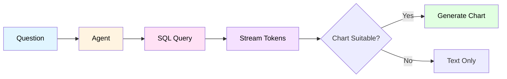
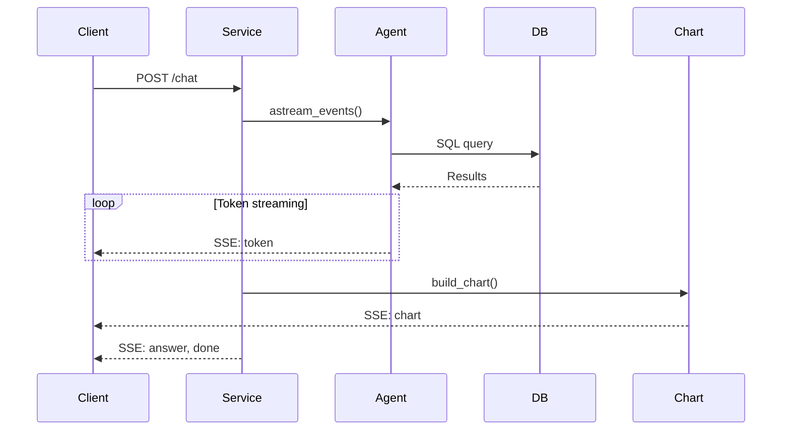
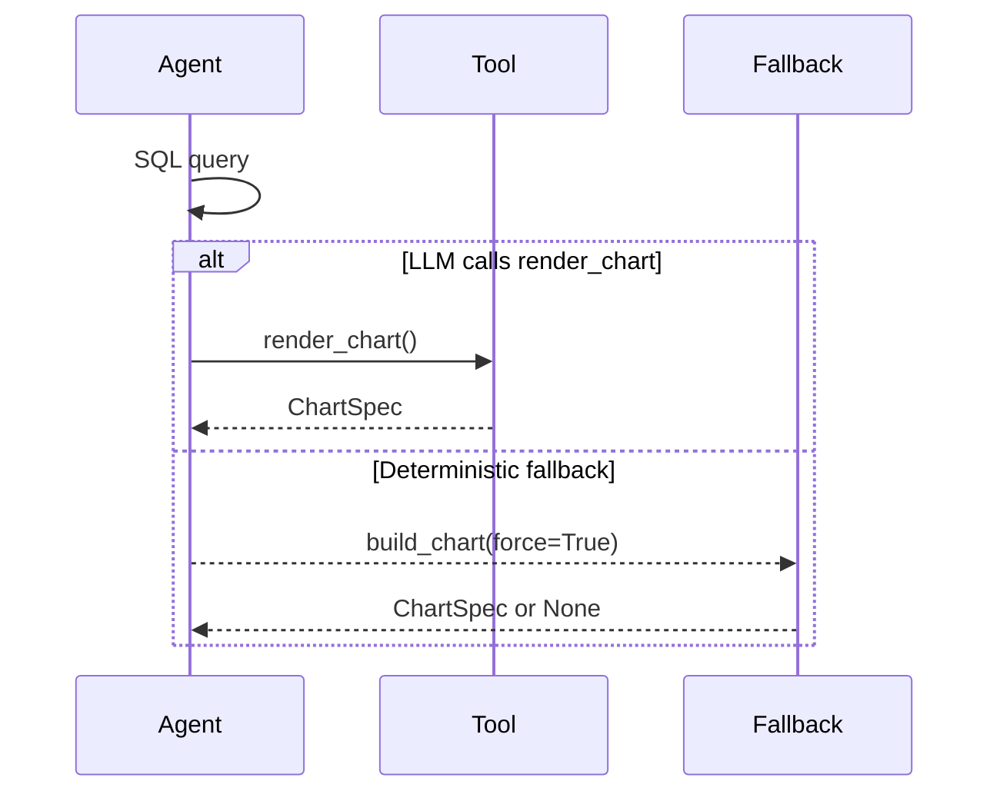
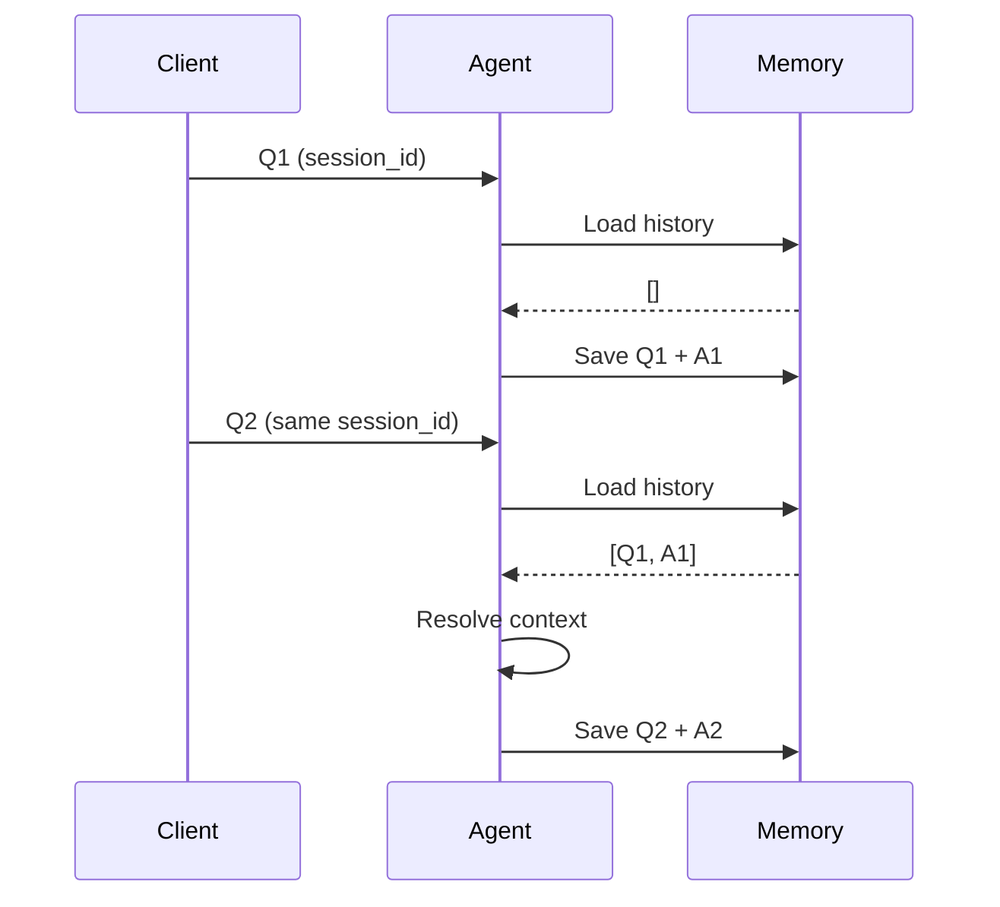
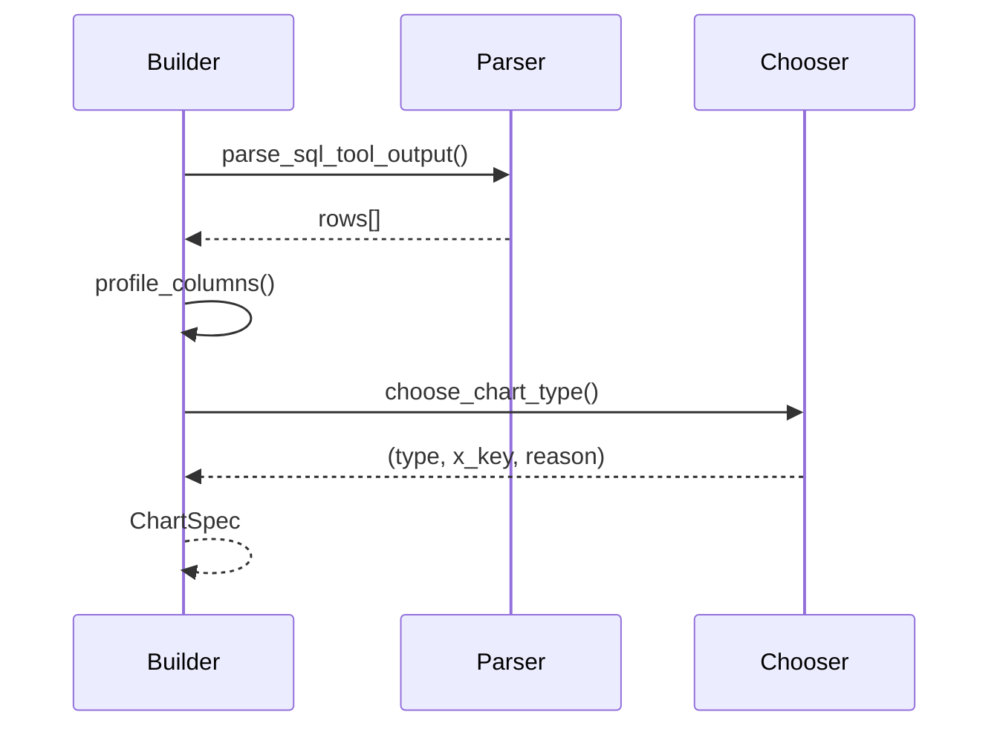
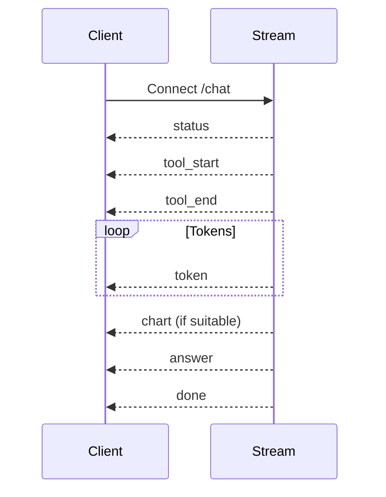

# Analyst Chat System

> **Natural language fraud queries with auto-visualization** — Real-time SSE streaming powered by LangChain SQL agent + deterministic chart generation.

---

## Overview

The Analyst Chat System translates natural language questions about fraud patterns into SQL queries, executes them against the live database, and streams back answers with automatic chart visualization. It uses **server-side conversation history** (InMemorySaver checkpointer) so clients only send questions, not full chat history.

**Key Innovation**: Dual-path visualization — LLM can call `render_chart` tool explicitly, OR system deterministically generates charts from SQL output when suitable.

---

## Architecture

### High-Level Flow



**Files**: `streaming_service.py:105-236` → `charting/builder.py:18-83`

### Components

| Component | Purpose |
|-----------|---------|
| **streaming_service.py** | SSE orchestrator, agent singleton, history management |
| **charting/builder.py** | Deterministic chart builder (SQL output → ChartSpec) |
| **charting/parser.py** | Parse SQL tool output into structured rows |
| **charting/suitability.py** | Heuristics for chart type selection |
| **charting/schemas.py** | Pydantic models (ChartSpec, ChartSeries, ChartMeta) |
| **chart_tool.py** | LangChain tool for explicit chart rendering |

---

## Sequence Diagrams

### 1. End-to-End Chat Flow



**Files**:
- `streaming_service.py:105-236` — Main SSE orchestrator
- `streaming_service.py:131-213` — Event streaming loop
- `streaming_service.py:214-223` — Deterministic chart fallback
- `charting/builder.py:18-83` — Chart generation

---

### 2. Dual-Path Visualization



**Files**:
- `chart_tool.py:11-73` — LLM-callable render_chart tool
- `charting/builder.py:18-83` — Deterministic fallback
- `streaming_service.py:214-223` — Fallback trigger logic

**Why Dual-Path?** LLM tool = more control but unreliable, Fallback = fast (~50ms) + consistent

---

### 3. Server-Side History (InMemorySaver)



**Files**:
- `streaming_service.py:55-90` — init_analyst_agent() with InMemorySaver
- `streaming_service.py:117-120` — thread_config with session_id

**Advantage**: Client sends only `question + session_id`, no history management on frontend

---

### 4. Chart Builder Heuristics



**Files**:
- `charting/parser.py` — Parse markdown/list/JSON formats
- `charting/suitability.py:40-80` — profile_columns(), check_suitability()
- `charting/suitability.py:100-150` — choose_chart_type()

**Heuristics**: Temporal → Line, Categorical+Metrics → Bar, ≤8 rows+1 metric → Pie

---

### 5. SSE Event Lifecycle



**Files**: `streaming_service.py:131-236` — Event loop with on_tool_start/end, on_chat_model_stream

**Event Types**: status, tool_start, tool_end, token, chart, answer, done, error

---

## Data Models

### SSE Event Types

```typescript
type SSEEvent =
  | { type: "status", message: string }
  | { type: "tool_start", name: string, preview: string }
  | { type: "tool_end", name: string, result: string }
  | { type: "token", content: string }
  | { type: "chart", chart: ChartSpec }
  | { type: "answer", content: string }
  | { type: "done", tools_used: string[] }
  | { type: "error", message: string }
```

### ChartSpec (Pydantic)

```python
class ChartSeries(BaseModel):
    key: str                    # Column name in rows
    label: str                  # Display label (humanized)

class ChartMeta(BaseModel):
    reason: Literal[
        "time_series",           # Line chart (date/time x-axis)
        "categorical_comparison", # Bar chart (top-N, ranked)
        "part_to_whole",         # Pie chart (market share)
    ]
    confidence: float           # 0-1 (0.85 deterministic, 0.95 LLM tool)
    source: Literal["deterministic", "llm_tool"]

class ChartSpec(BaseModel):
    title: str                  # Short title (max 60 chars)
    chart_type: Literal["bar", "line", "pie"]
    x_key: str                  # Column name for x-axis
    series: list[ChartSeries]   # Metrics to plot (max 3)
    rows: list[dict]            # Data (max 100 rows)
    meta: ChartMeta
```

**Example Chart SSE Payload**:
```json
{
  "type": "chart",
  "chart": {
    "title": "Top 5 Customers by Fraud Count",
    "chart_type": "bar",
    "x_key": "customer",
    "series": [
      {"key": "fraud_count", "label": "Fraud Count"}
    ],
    "rows": [
      {"customer": "CUST-001", "fraud_count": 15},
      {"customer": "CUST-002", "fraud_count": 12},
      {"customer": "CUST-003", "fraud_count": 8}
    ],
    "meta": {
      "reason": "categorical_comparison",
      "confidence": 0.85,
      "source": "deterministic"
    }
  }
}
```

---

## Agent Configuration

### LLM Model
```python
MODEL = "gemini-3-flash-preview"  # Fast, low-cost (Gemini 3-Flash)
TEMPERATURE = 0.2                  # Slightly creative for answer formatting
THINKING_LEVEL = "low"             # Minimize latency
MAX_ITERATIONS = 4                 # Prevent infinite loops
```

### Tools (LangChain)
```python
tools = [
    sql_db_query,    # Execute read-only SQL
    render_chart,    # Explicit chart rendering
]
# NOT included: sql_db_schema, sql_db_list_tables (bloat)
# Schema is injected into prompt via programmatic generation
```

### Schema Generation (Programmatic)
```python
# app/agentic_system/tools/sql/schema_builder.py
def build_schema_description(engine, tables):
    """Query information_schema at startup → live schema docs."""
    for table in tables:
        query = f"""
            SELECT column_name, data_type, is_nullable
            FROM information_schema.columns
            WHERE table_name = '{table}'
            ORDER BY ordinal_position
        """
        # Generate markdown table
    return schema_markdown

schema_docs = (
    build_schema_description(sync_engine, FRAUD_DB_TABLES) +
    build_critical_notes() +  # Static notes (two-layer status, common mistakes)
)

# Inject into prompt
full_prompt = ANALYST_CHAT_PROMPT.replace(
    "## Database Schema (exact columns)",
    schema_docs
)
```

**Why Programmatic Schema?**
- ✅ **100% accuracy**: Schema always matches actual DB (no hardcoding)
- ✅ **Zero hallucinations**: LLM can't guess wrong column names
- ✅ **Migration-safe**: Adding/removing columns auto-updates prompt on restart
- ✅ **No manual sync**: Eliminates schema drift

---

## Chart Builder Heuristics (Deep Dive)

### Column Profiling
```python
def profile_columns(rows: list[dict]) -> dict:
    """Categorize columns by type."""
    profile = {
        "categorical_candidates": [],  # str, low cardinality
        "metric_candidates": [],       # int, float
        "temporal_candidates": [],     # date, datetime
        "all_columns": [],
    }

    for col_name in rows[0].keys():
        values = [r.get(col_name) for r in rows]

        if _is_numeric(values):
            profile["metric_candidates"].append(col_name)
        elif _is_temporal(values):
            profile["temporal_candidates"].append(col_name)
        elif _is_categorical(values):
            profile["categorical_candidates"].append(col_name)

    return profile
```

### Chart Type Selection Logic
```python
def choose_chart_type(rows: list[dict], profile: dict) -> tuple[str, str, str] | None:
    """Deterministic chart type picker."""

    # Rule 1: Time-series (date/time x-axis) → Line
    if profile["temporal_candidates"] and profile["metric_candidates"]:
        return ("line", profile["temporal_candidates"][0], "time_series")

    # Rule 2: Part-to-whole (≤8 rows, 1 metric) → Pie
    if (len(rows) <= 8 and
        len(profile["metric_candidates"]) == 1 and
        profile["categorical_candidates"]):
        return ("pie", profile["categorical_candidates"][0], "part_to_whole")

    # Rule 3: Ranked comparison (2-24 rows, 1-3 metrics) → Bar
    if (2 <= len(rows) <= 24 and
        1 <= len(profile["metric_candidates"]) <= 3 and
        profile["categorical_candidates"]):
        return ("bar", profile["categorical_candidates"][0], "categorical_comparison")

    # Fallback: No suitable chart type
    return None
```

### SQL Output Parsing (Multi-Format)

```python
def parse_sql_tool_output(raw_output: str, sql_query: str) -> list[dict]:
    """Parse SQL tool output into structured rows."""

    # Format 1: Markdown table
    # | customer | amount |
    # |----------|--------|
    # | Alice    | 5000   |
    if "|" in raw_output and "---" in raw_output:
        return _parse_markdown_table(raw_output)

    # Format 2: Python list of tuples
    # [('Alice', 5000), ('Bob', 3000)]
    if raw_output.strip().startswith("["):
        rows_tuples = ast.literal_eval(raw_output)
        column_names = _infer_column_names(sql_query)
        return [dict(zip(column_names, row)) for row in rows_tuples]

    # Format 3: JSON array
    # [{"customer": "Alice", "amount": 5000}]
    if raw_output.strip().startswith("[{"):
        return json.loads(raw_output)

    return []
```

---

## Performance Characteristics

### Latency Breakdown (Typical Query)

| Phase | Avg Latency | % of Total |
|-------|-------------|------------|
| **SQL execution** | 3.0s | 80% |
| **LLM reasoning** | 0.5s | 13% |
| **Token streaming** | 0.25s | 7% |
| **Chart building** | 0.05s | <1% |
| **Total** | **3.75s** | 100% |

### Token Throughput
- **Gemini 3-Flash**: 1.1 tokens/sec (streaming)
- **TTFT** (Time to First Token): 2.88s avg
- **Answer length**: 50-150 tokens typical

### Complexity Scaling

| Query Type | Avg Latency | Reason |
|------------|-------------|--------|
| Simple (ILIKE, WHERE) | 2.6-2.9s | Fast SQL, minimal reasoning |
| Medium (JOINs, aggregations) | 3.3-4.2s | Complex SQL, multi-table |
| Complex (CTEs, window functions) | 4.5-5.7s | Heavy SQL, advanced reasoning |

---

## Conversation History (InMemorySaver)

### Singleton Pattern
```python
# Module-level singleton
_agent: BaseAgent | None = None
_checkpointer: InMemorySaver | None = None

def init_analyst_agent() -> BaseAgent:
    """Build agent once at startup."""
    global _agent, _checkpointer

    _checkpointer = InMemorySaver()  # In-memory history
    _agent = create_agent(
        llm,
        tools=all_tools,
        system_prompt=full_prompt,
        checkpointer=_checkpointer,  # Enable history
    )
    return _agent
```

### Thread Management
```python
async def stream_analyst_answer(question: str, session_id: str):
    """Stream answer with server-side history."""

    thread_config = {
        "configurable": {"thread_id": session_id},  # Key: thread_id
        "recursion_limit": 25,
    }

    async for event in _agent.astream_events(
        {"messages": [{"role": "user", "content": question}]},
        config=thread_config,  # History loaded automatically
    ):
        # ... process events
```

**History Lifecycle**:
1. Client sends `session_id` (e.g., `"sess_123"`)
2. Agent loads messages from InMemorySaver via `thread_id=sess_123`
3. Agent executes with full context (past Q&A visible)
4. Agent saves new turn to InMemorySaver
5. Next question in same session sees full history

**Advantages**:
- ✅ No history management on frontend
- ✅ Unlimited conversation length (only constrained by LLM context window)
- ✅ Works with SSE streaming (no request bloat)

**Tradeoff**: History lost on server restart (use Redis/Postgres checkpointer for persistence)

---

## Key Files

| File | Purpose | Lines |
|------|---------|-------|
| `app/services/chat/streaming_service.py` | SSE orchestrator, agent singleton | 236 |
| `app/services/chat/charting/builder.py` | Deterministic chart builder | 121 |
| `app/services/chat/charting/parser.py` | SQL output parser (3 formats) | ~80 |
| `app/services/chat/charting/suitability.py` | Column profiling, chart type picker | ~120 |
| `app/services/chat/charting/schemas.py` | Pydantic models (ChartSpec) | 29 |
| `app/agentic_system/tools/chart_tool.py` | LangChain `render_chart` tool | 74 |
| `app/agentic_system/tools/sql/schema_builder.py` | Programmatic schema generation | ~150 |
| `app/agentic_system/tools/sql/toolkit.py` | LangChain SQL tools factory | ~100 |
| `app/agentic_system/prompts/analyst_chat.py` | System prompt (with schema injection) | ~200 |

---

## API Endpoints

### Chat (SSE)
```http
POST /api/query/chat
Content-Type: application/json

{
  "question": "Top 5 customers by fraud count",
  "session_id": "sess_123"
}

Response (SSE stream):
data: {"type":"status","message":"Thinking..."}
data: {"type":"tool_start","name":"sql_db_query","preview":"SELECT..."}
data: {"type":"tool_end","name":"sql_db_query","result":"[...]"}
data: {"type":"token","content":"The"}
data: {"type":"token","content":" top"}
data: {"type":"chart","chart":{...}}
data: {"type":"answer","content":"The top 5 customers..."}
data: {"type":"done","tools_used":["sql_db_query"]}
```

### Warmup (Called at Startup)
```python
# app/main.py
@asynccontextmanager
async def lifespan(app: FastAPI):
    init_analyst_agent()         # Build singleton
    await warmup_analyst_agent() # Fire cheap query to warm pool
    yield
```

---

## Testing & Validation

### Benchmark: `scripts/benchmark_query.py --chat-only`
```python
CHAT_QUESTIONS = [
    "How many customers have been blocked in the last 24 hours?",
    "Show me all withdrawals over $5000 with their risk scores",
    "Find customers who share the same device fingerprint",
    "Which countries have the highest fraud rate?",
    "What's the correlation between velocity and fraud?",
]
```

**Output**: `outputs/query_benchmark/<timestamp>/chat_benchmark.csv`

### Stress Test: `scripts/stress_test_agent.py`
**12 edge cases** (NULL handling, division by zero, empty sets, logical contradictions)

**Results** (Feb 9 2026):
- ✅ **12/12 passed** (100% success rate)
- ✅ **100% accuracy** (all SQL verified against actual DB)
- ✅ **Zero hallucinations** (correctly acknowledged empty results)

**Output**: `outputs/stress_test_<timestamp>.json` + `outputs/agent_stress_test_ANALYSIS.md`

---

## Supported Query Patterns

### Simple Queries (2-3s)
✅ "How many customers blocked?"
✅ "Total amount of blocked withdrawals"
✅ "Show withdrawals over $5000"
✅ "Count of approvals in last 24h"

### Complex Queries (5-8s)
✅ "Find customers sharing same device fingerprint"
✅ "Top 5 highest risk customers"
✅ "Correlation between velocity and fraud"
✅ "Fraud rate by country (with chart)"

### Currently Unsupported
❌ Time-series trends (no date aggregation yet)
❌ Fraud ring visualization (returns text, not graph data)
❌ Geographic heatmaps (returns list, not coordinates)

---

## Chart Examples

### Example 1: Bar Chart (Top-N)
**Question**: "Top 5 customers by withdrawal amount"

**SQL Output**:
```
| customer      | total_amount |
|---------------|--------------|
| James Wilson  | 150779.16    |
| Raj Patel     | 52009.80     |
| Sophie Laurent| 29396.48     |
```

**ChartSpec**:
```json
{
  "title": "Top 5 Customers by Withdrawal Amount",
  "chart_type": "bar",
  "x_key": "customer",
  "series": [{"key": "total_amount", "label": "Total Amount"}],
  "rows": [
    {"customer": "James Wilson", "total_amount": 150779.16},
    {"customer": "Raj Patel", "total_amount": 52009.80},
    {"customer": "Sophie Laurent", "total_amount": 29396.48}
  ],
  "meta": {"reason": "categorical_comparison", "confidence": 0.85, "source": "deterministic"}
}
```

### Example 2: Line Chart (Time-Series)
**Question**: "Withdrawal count by date (last 7 days)"

**SQL Output**:
```
| date       | count |
|------------|-------|
| 2026-02-06 | 12    |
| 2026-02-07 | 15    |
| 2026-02-08 | 8     |
```

**ChartSpec**:
```json
{
  "title": "Withdrawal count by date (last 7 days)",
  "chart_type": "line",
  "x_key": "date",
  "series": [{"key": "count", "label": "Count"}],
  "rows": [...],
  "meta": {"reason": "time_series", "confidence": 0.85, "source": "deterministic"}
}
```

### Example 3: Pie Chart (Part-to-Whole)
**Question**: "Fraud rate by country"

**SQL Output** (≤8 rows):
```
| country | fraud_rate |
|---------|------------|
| US      | 0.15       |
| UK      | 0.12       |
| DE      | 0.08       |
```

**ChartSpec**:
```json
{
  "chart_type": "pie",
  "x_key": "country",
  "series": [{"key": "fraud_rate", "label": "Fraud Rate"}],
  "meta": {"reason": "part_to_whole", "confidence": 0.85, "source": "deterministic"}
}
```

---

## Error Handling

### SQL Errors
```python
try:
    result = await sql_tool.ainvoke(query)
except Exception as exc:
    logger.error("SQL execution failed: %s", exc)
    yield _sse({"type": "error", "message": f"Query failed: {exc}"})
```

### Chart Building Errors
```python
try:
    chart = build_chart(question, sql_output, force=True)
except Exception as exc:
    logger.warning("Chart fallback failed", exc_info=True)
    # Continue without chart (text answer only)
```

### Stream Errors (With Partial Answer)
```python
except Exception as exc:
    partial = "".join(answer_parts)  # Recover partial answer
    if partial:
        yield _sse({"type": "answer", "content": partial})
    yield _sse({"type": "error", "message": f"Query failed: {exc}"})
```

---

## Future Enhancements

### 1. Persistent History (Redis/Postgres Checkpointer)
```python
# Replace InMemorySaver with PostgresSaver
from langgraph.checkpoint.postgres import PostgresSaver

checkpointer = PostgresSaver(conn_string=DB_URL)
agent = create_agent(llm, tools, checkpointer=checkpointer)
```

### 2. Advanced Chart Types
- **Network graph**: Fraud rings (nodes=customers, edges=shared devices)
- **Heatmap**: Geographic fraud intensity
- **Scatter plot**: Correlation (velocity vs. amount)
- **Waterfall**: Contribution analysis (which indicators drive risk score)

### 3. Multi-Step Reasoning
```python
# Question: "Find fraud rings and chart their total stolen amount"
# Step 1: SQL query (find rings)
# Step 2: Aggregate amounts
# Step 3: Call render_chart explicitly
```

### 4. Export to CSV/Excel
```python
# SSE event type: "export"
{"type": "export", "format": "csv", "data": "..."}
```

---

## Related Documentation

- [Background Audit System](./background_audit_system.md) — Autonomous pattern discovery
- [Agentic System](./agentic_system.md) — Real-time fraud detection pipelines
- [Component Diagram](./component_diagram.md) — Full system architecture
