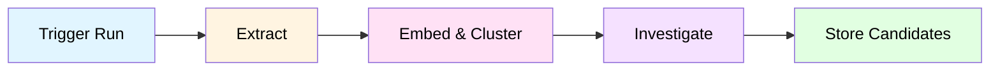
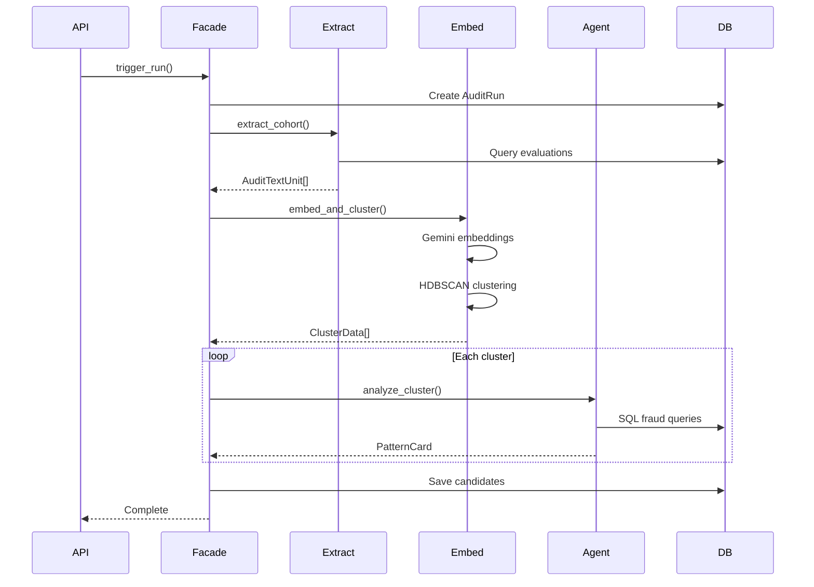
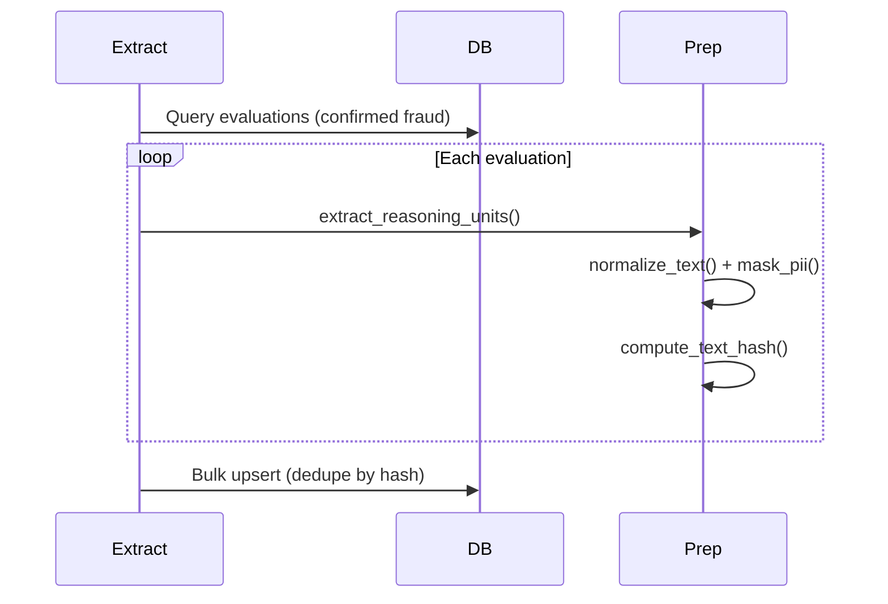
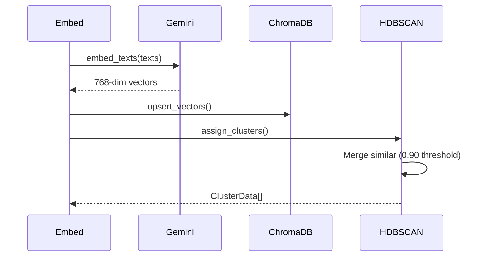
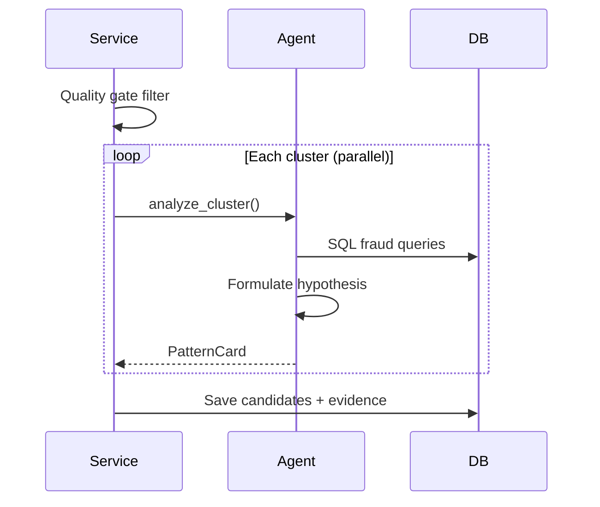
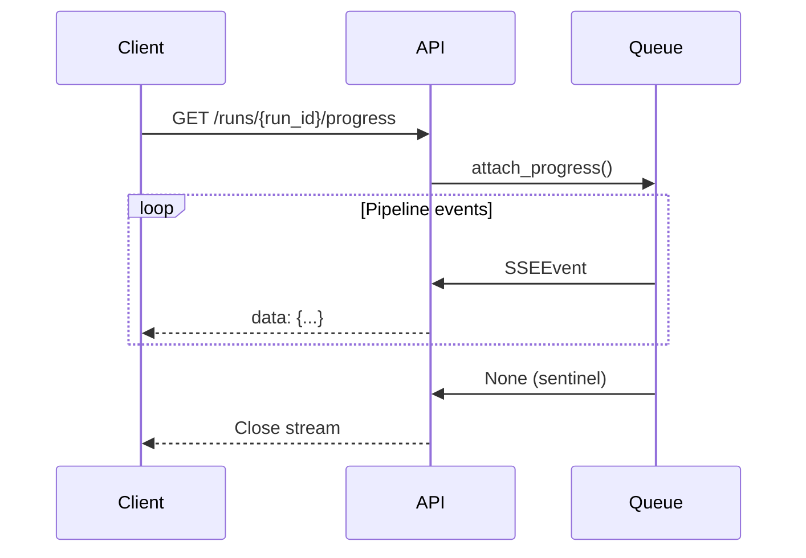

# Background Audit System

> **Autonomous fraud pattern discovery** — Extract, embed, cluster, and investigate historical fraud evidence to uncover novel attack patterns.

---

## Overview

The Background Audit System is a multi-phase autonomous pipeline that analyzes confirmed fraud cases to discover recurring patterns, fraud rings, and novel attack vectors. Unlike the real-time fraud detection pipelines, this system runs asynchronously in the background and uses unsupervised learning (HDBSCAN clustering) combined with LLM-based investigation.

**Key Innovation**: Converts LLM reasoning chains from past fraud investigations into reusable pattern cards that can inform future detection rules.

---

## Architecture

### High-Level Flow



**Files**: `facade.py:95-176` → `extract.py:27-76` → `embed_cluster.py:35-99` → `candidate_report.py:27-57` → DB

### Components

| Component | Purpose | Output |
|-----------|---------|--------|
| **Extract** | Query confirmed-fraud evaluations, extract reasoning units | `AuditTextUnit[]` |
| **Embed** | Vectorize text units via Gemini embeddings | `float[][]` (768-dim) |
| **Cluster** | HDBSCAN clustering + centroid computation | `ClusterData[]` |
| **Investigate** | LLM agent analyzes each cluster, generates pattern hypothesis | `PatternCard[]` |
| **Quality Gate** | Filter by min_events, min_accounts, min_confidence | `AuditCandidate[]` |
| **Store** | Persist candidates + evidence to DB | — |

---

## Sequence Diagrams

### 1. End-to-End Pipeline Flow



**Files**:
- `facade.py:95-130` — trigger_run()
- `facade.py:132-176` — _run_pipeline()
- `extract.py:27-76` — extract_cohort()
- `embed_cluster.py:35-99` — embed_and_cluster()
- `candidate_report.py:27-57` — generate_candidates()

---

### 2. Extract Phase



**Files**:
- `extract.py:27-76` — Main extraction logic
- `dataset_prep.py:100-150` — extract_reasoning_units()
- `dataset_prep.py:50-80` — normalize_text(), mask_pii()

**Key Operations**: Parse investigation_data JSONB → normalize → mask PII → dedupe by SHA256 hash

---

### 3. Embed & Cluster Phase



**Files**:
- `embed_cluster.py:35-99` — Main clustering logic
- `pattern_analysis.py:80-120` — assign_clusters() + HDBSCAN
- `pattern_analysis.py:40-60` — compute_centroid(), detect_novelty()

**Config**: min_cluster_size=8, min_samples=4, merge_similarity=0.90

---

### 4. Investigate Phase



**Files**:
- `candidate_report.py:27-57` — Main orchestration
- `candidate_investigation.py:30-80` — Agent invocation
- `candidate_assembly.py:40-100` — Quality scoring + persistence

**Agent**: Gemini 3-Flash, tools=[sql_db_query, tavily_search, kmeans_cluster]
**Quality Gate**: min_events=5, min_accounts=2, min_confidence=0.50

---

### 5. SSE Progress Streaming



**Files**: `facade.py:46-62` — attach/detach progress, `facade.py:144-145` — emit events

**Event Types**: phase_start, progress, hypothesis, agent_tool, candidate, complete, error

---

## Data Models

### AuditTextUnit (Extracted)
```python
class AuditTextUnit:
    id: UUID                    # PK
    unit_id: str                # "{eval_id}:{source_type}:{index}"
    evaluation_id: UUID         # FK → evaluations
    withdrawal_id: UUID         # FK → withdrawals
    source_type: str            # "triage" | "investigator" | "rule"
    source_name: str            # "financial_behavior" | "cross_account" | ...
    text_masked: str            # PII-masked reasoning text
    text_hash: str              # SHA256[:16] for deduplication
    score: float | None         # Risk score from source
    confidence: float | None    # Confidence from source
    vector_status: str          # "pending" | "embedded" | "failed"
    created_at: datetime
```

### AuditCandidate (Pattern Card)
```python
class AuditCandidate:
    id: UUID
    candidate_id: str           # "cand_{uuid4()[:8]}"
    run_id: str                 # FK → audit_runs
    title: str                  # "Cross-Account Velocity Ring"
    status: str                 # "pending" | "approved" | "ignored"
    quality_score: float        # 0-1 composite quality metric
    confidence: float           # Agent confidence in pattern
    support_events: int         # Evidence count
    support_accounts: int       # Unique customer count
    novelty_status: str         # "novel" | "recurring" | "unknown"
    pattern_card: dict          # Full JSON pattern card
    created_at: datetime
```

### AuditEvidence (Ranked)
```python
class AuditEvidence:
    id: UUID
    candidate_id: str           # FK → audit_candidates
    unit_id: str | None         # FK → audit_text_units
    evidence_type: str          # "supporting" | "sql_trace" | "web_trace"
    rank: int                   # 0-indexed evidence rank
    snippet: str                # Text preview
    metadata_: dict             # {confidence, score, rank_score, ...}
```

---

## Configuration

### Environment Variables
```bash
# Lookback window (default: 7 days)
BACKGROUND_AUDIT_LOOKBACK_DAYS=7

# Max candidates per run (default: 50)
BACKGROUND_AUDIT_MAX_CANDIDATES=50

# Output directory for debug files
BACKGROUND_AUDIT_OUTPUT_DIR=outputs/background_audits/stage_1

# HDBSCAN clustering
BACKGROUND_AUDIT_CLUSTER_MIN_SIZE=8         # Min cluster size
BACKGROUND_AUDIT_CLUSTER_MIN_SAMPLES=4      # Min samples for core point
BACKGROUND_AUDIT_CLUSTER_MERGE_SIMILARITY=0.90  # Centroid merge threshold
BACKGROUND_AUDIT_CLUSTER_NORMALIZE_EMBEDDINGS=true
```

### Database Config (Overrides ENV)
```sql
-- audit_configs table
SELECT * FROM audit_configs WHERE is_active = true;
-- {
--   lookback_days: 7,
--   max_candidates: 50,
--   output_dir: "outputs/background_audits/stage_1",
--   min_events: 5,       -- Quality gate
--   min_accounts: 2,     -- Quality gate
--   min_confidence: 0.50 -- Quality gate
-- }
```

---

## Performance Characteristics

### Typical Run (7-day window)

| Phase | Avg Latency | Operations |
|-------|-------------|------------|
| **Extract** | 2-5s | SQL query + text parsing + PII masking |
| **Embed** | 10-30s | Gemini embeddings (batch 100) + ChromaDB upsert |
| **Cluster** | 1-3s | HDBSCAN + centroid computation |
| **Investigate** | 60-180s | LLM agent per cluster (parallel, max 5 concurrent) |
| **Total** | **75-220s** | ~1.5-3.5 minutes |

### Scaling Factors
- **Evaluations**: Linear O(n) for extraction
- **Embeddings**: Batch overhead ~2s per 100 units
- **Clustering**: O(n log n) for HDBSCAN
- **Investigation**: O(clusters) but parallelized (5 concurrent agents)

---

## Quality Gates

### Cluster Qualification
```python
def select_qualifying(clusters: list[ClusterData]) -> list[ClusterData]:
    return [
        c for c in clusters
        if len(c.units) >= config.min_events
        and len({u.withdrawal_id for u in c.units}) >= config.min_accounts
        and c.novelty.confidence >= 0.30  # Minimum clustering confidence
    ]
```

### Candidate Filtering
```python
quality_score = (
    (support_events / max_events) * 0.40 +
    (support_accounts / max_accounts) * 0.30 +
    confidence * 0.30
)
if quality_score < 0.50:
    skip_candidate()
```

---

## Key Files

| File | Purpose |
|------|---------|
| `app/services/background_audit/facade.py` | Main orchestrator, SSE progress |
| `app/services/background_audit/components/extract.py` | Extract reasoning units from evaluations |
| `app/services/background_audit/components/embed_cluster.py` | Embed + HDBSCAN + novelty detection |
| `app/services/background_audit/components/candidate_report.py` | Investigate clusters → pattern cards |
| `app/core/background_audit/dataset_prep.py` | Text normalization, PII masking, hashing |
| `app/core/background_audit/pattern_analysis.py` | HDBSCAN wrapper, centroid merging, novelty |
| `app/agentic_system/agents/background_audit_agent.py` | LLM agent for pattern investigation |
| `app/agentic_system/tools/kmeans_tool.py` | K-means sub-clustering tool |
| `app/data/vector/store.py` | ChromaDB wrapper |

---

## API Endpoints

### Trigger Run
```http
POST /api/background-audit/trigger
{
  "lookback_days": 7,
  "run_mode": "full"
}
Response: {"run_id": "run_abc123"}
```

### Stream Progress (SSE)
```http
GET /api/background-audit/runs/{run_id}/progress
Accept: text/event-stream

data: {"type":"phase_start","phase":"extract","title":"Extracting fraud evidence..."}
data: {"type":"progress","phase":"extract","progress":1.0,"detail":"Found 42 units"}
data: {"type":"complete","detail":"15 candidates from 6 clusters"}
```

### Get Candidates
```http
GET /api/background-audit/runs/{run_id}/candidates?skip=0&limit=50
Response: [
  {
    "candidate_id": "cand_a1b2c3d4",
    "title": "Cross-Account Velocity Ring",
    "confidence": 0.85,
    "support_events": 12,
    "support_accounts": 4,
    "pattern_card": {...},
    "novelty_status": "novel"
  }
]
```

### Update Candidate Action
```http
POST /api/background-audit/candidates/{candidate_id}/action
{
  "action": "approved" | "ignored"
}
```

---

## Future Enhancements

1. **Auto-rule generation**: Convert high-confidence pattern cards → new indicators
2. **Feedback loop**: Incorporate analyst approvals/ignores into novelty scoring
3. **Multi-modal embeddings**: Add numerical features (amounts, velocities) to text embeddings
4. **Incremental clustering**: Only re-cluster new units, reuse historical clusters
5. **Pattern versioning**: Track pattern evolution over time (v1, v2, ...)

---

## Related Documentation

- [Fraud Detection Pipelines](./agentic_system.md) — Real-time evaluation pipelines
- [Analyst Chat System](./analyst_chat_system.md) — Natural language fraud queries
- [Component Diagram](./component_diagram.md) — Full system architecture
