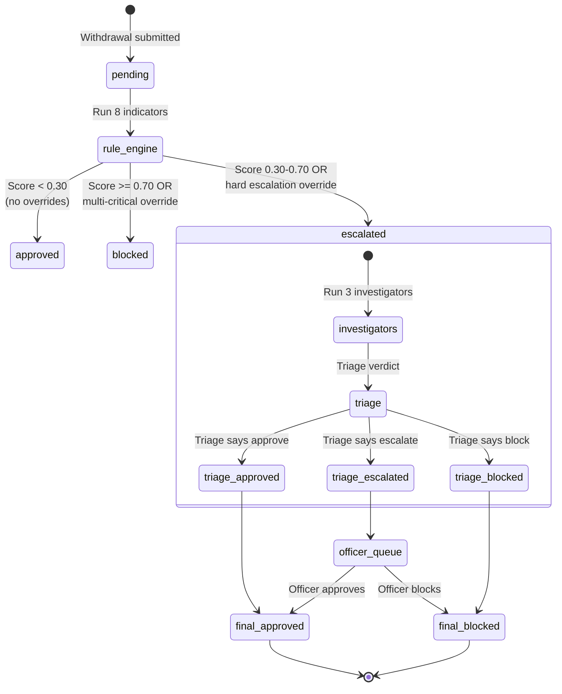
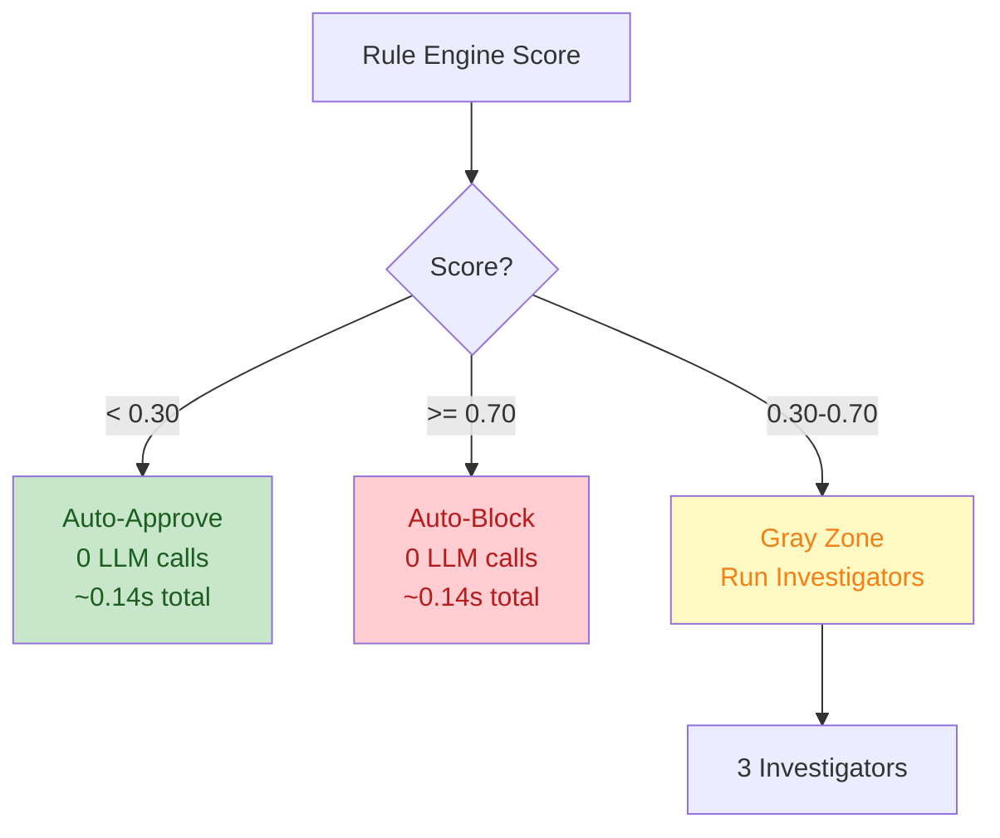
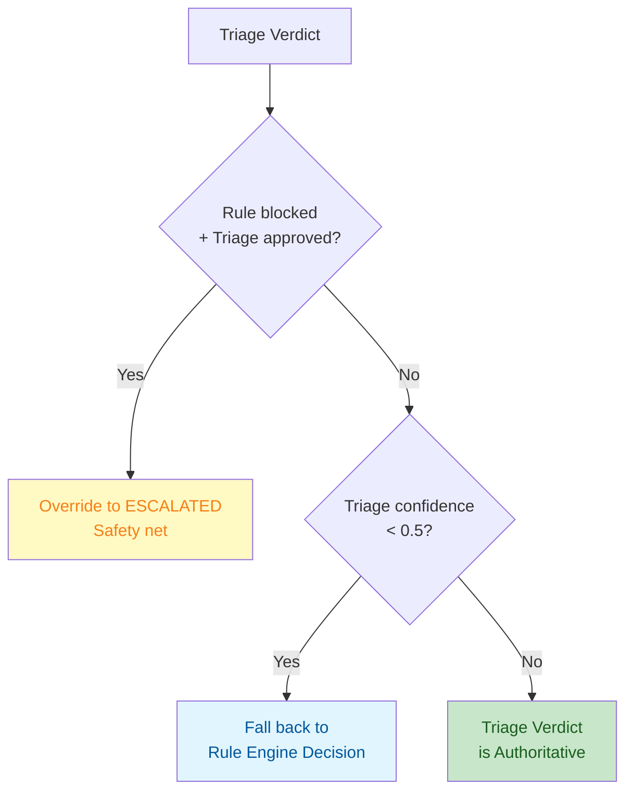

# Payout State Machine (NEW Pipeline)

**Endpoint:** `POST /withdrawals/investigate`
**Service:** `InvestigatorService` (`app/services/fraud/investigator_service.py`)

---

## Withdrawal Lifecycle



---

## Pipeline Flow (Step-by-Step)

### 1. Rule Engine (~50ms, 0 LLM calls)

**Run 8 SQL-based indicators in parallel:**

| Indicator | Weight | Detects |
|-----------|--------|---------|
| trading_behavior | 1.5 | Zero trades, W/D ratio ≥ 0.7 |
| device_fingerprint | 1.3 | Shared devices (≥2 accounts), new/unknown |
| card_errors | 1.2 | Failed txns, method churn |
| geographic | 1.0 | VPN, country mismatch, multi-country |
| amount_anomaly | 1.0 | Z-score > 2.5 vs history |
| velocity | 1.0 | Frequency spikes (1h/24h/7d) |
| payment_method | 1.0 | New/unverified methods |
| recipient | 1.0 | Name mismatch, cross-account reuse |

**Composite Score Formula:**
```python
composite = sum(indicator_score * weight) / sum(weights)
```

**Thresholds (configurable):**
- **Approve**: < 0.30
- **Escalate**: 0.30 - 0.70
- **Block**: ≥ 0.70

**Override Rules:**
1. **Hard Escalation**: Any 1 indicator ≥ 0.80 (confidence ≥ 0.8) → force escalate
2. **Multi-Critical**: 4+ indicators ≥ 0.60 (confidence ≥ 0.8) → force block
3. **Concentrated Risk**: Top 3 weighted scores sum ≥ 0.90 → force escalate

---

### 2. Skip Logic (0 LLM calls for 56% of cases)



**Performance:**
- **Clean cases (score < 0.30)**: ~0.14s, 0 LLM calls, auto-approve
- **High-risk cases (score ≥ 0.70)**: ~0.14s, 0 LLM calls, auto-block
- **Gray zone (0.30-0.70)**: ~12s, 2-4 LLM calls, investigators + triage

---

### 3. Investigators (Gray Zone Only, ~8s, 3 LLM calls)

**Run ALL 3 investigators in parallel:**

| Investigator | Focus | Table Access | Typical Latency |
|--------------|-------|--------------|-----------------|
| **financial_behavior** | Amount anomaly, velocity, trading, payment methods | withdrawals, transactions, trades, payment_methods | 3-4s |
| **identity_access** | Geographic signals, device fingerprinting | devices, ip_history, customers | 3-4s |
| **cross_account** | Recipient analysis, card errors, shared devices | withdrawals, payment_methods, devices, customers | 3-4s |

**Each investigator:**
- Gets rule engine context (8 indicator scores + evidence)
- Runs SQL queries via LangChain SQL tools
- Returns `InvestigatorResult(score, confidence, reasoning, evidence)`

**Config:**
- Model: `gemini-3-flash-preview`
- Thinking level: `low`
- Max tokens: `512`
- Timeout: `25s`
- Max iterations: `3`

---

### 4. Triage Verdict (~4s, 1 LLM call)

**Purpose:** Synthesize rule engine scores + investigator findings into final decision.

**Input:**
- 8 rule engine indicator scores + reasoning
- 3 investigator results (score, confidence, reasoning)
- Customer weight history (adaptive calibration)
- Risk posture context (if available)
- Pattern match context (fraud rings, etc.)

**Output:** `TriageResult`
```python
{
    "constellation_analysis": str,  # 1-2 sentence summary
    "decision": "approved" | "escalated" | "blocked",
    "decision_reasoning": str,  # Why this verdict
    "confidence": float,  # 0.0-1.0
    "risk_score": float,  # 0.0-1.0
}
```

**Decision Guidelines:**
- **approved**: Majority of investigators found low risk, evidence shows legitimate activity
- **escalated**: Investigators disagree OR mixed signals → needs human review
- **blocked**: Multiple investigators confirmed fraud OR single investigator found irrefutable evidence

**Hard Rules:**
- If ALL investigators found low risk (score <0.3) and rule score was borderline, approve
- If investigators DISAGREE (spread > 0.4 between highest and lowest), escalate
- NEVER approve if cross_account found fraud ring evidence
- NEVER block on single investigator unless confidence ≥ 0.9 AND concrete evidence

---

### 5. Verdict Application (Guardrails)

**Guardrails applied AFTER triage:**



**Implementation (`_apply_verdict()`):**
1. **Auto-decided cases** (no investigators ran): Use rule engine decision directly
2. **Rule blocked + Triage approved**: Override to `escalated` (safety net)
3. **Low confidence (<0.5)**: Fall back to rule engine decision
4. **Otherwise**: Triage verdict is authoritative

---

## Decision Matrix

| Rule Engine Decision | Posture Uplift | Investigators Run? | Triage Decision | Final Decision | LLM Calls |
|---------------------|----------------|-------------------|-----------------|----------------|-----------|
| **approved** (< 0.30) | None | No | N/A | **approved** | 0 |
| **approved** (< 0.30) | Pushes to 0.30+ | Yes | approved | **approved** | 4 |
| **approved** (< 0.30) | Pushes to 0.30+ | Yes | escalated | **escalated** | 4 |
| **escalated** (0.30-0.70) | Any | Yes | approved | **approved** | 4 |
| **escalated** (0.30-0.70) | Any | Yes | escalated | **escalated** | 4 |
| **escalated** (0.30-0.70) | Any | Yes | blocked | **blocked** | 4 |
| **blocked** (≥ 0.70) | Any | No | N/A | **blocked** | 0 |

**LLM Call Breakdown:** 3 investigators (parallel) + 1 triage verdict = 4 total

---

## Override Rules Reference

### Hard Escalation (scoring.py:112-117)

```python
HARD_ESCALATION_THRESHOLD = 0.80

# Any single indicator ≥ 0.80 with confidence ≥ 0.8 → force escalate
return any(
    r.score >= 0.80 and r.confidence >= 0.8
    for r in results
)
```

**Effect:** Even if composite < 0.30, a single critical indicator forces escalation.

---

### Multi-Critical (scoring.py:120-126)

```python
MULTI_CRITICAL_THRESHOLD = 0.6
MULTI_CRITICAL_COUNT = 4

# 4+ indicators ≥ 0.60 with confidence ≥ 0.8 → force block
count = sum(
    1 for r in results
    if r.score >= 0.60 and r.confidence >= 0.8
)
return count >= 4
```

**Effect:** Even if composite < 0.70, 4+ moderate-high signals force block (fraud ring pattern).

---

### Concentrated Risk (scoring.py:129-137)

```python
CONCENTRATED_ESCALATION_THRESHOLD = 0.90
CONCENTRATED_TOP_N = 3

# Top 3 weighted scores summing ≥ 0.90 → force escalate
top = sorted(breakdown.values(), reverse=True)[:3]
return sum(top) >= 0.90
```

**Effect:** Catches converging moderate signals that get diluted in the full average.

---

## Score Alignment (scoring.py:156-172)

**Why it exists:** When overrides bump decision upward, the displayed score should match the threshold to avoid contradictory UX (e.g., "33% but blocked").

```python
if decision == "blocked":
    return max(composite, 0.70)  # Bump to at least 70%
if decision == "escalated":
    return max(composite, 0.30)  # Bump to at least 30%
return composite
```

---

## Posture Influence (Optional)

**Enabled when:** `POSTURE_INFLUENCE_ENABLED=true` in config

**Effect:**
```python
# Add posture uplift to rule score BEFORE skip logic
posture_uplift = min(
    posture.composite_score * POSTURE_UPLIFT_WEIGHT,  # 0.15
    MAX_POSTURE_UPLIFT,  # 0.10
)
adjusted_rule_score = scoring.composite_score + posture_uplift
```

**Example:**
- Rule score: 0.28 (would auto-approve)
- Posture: "elevated" (score 0.65)
- Uplift: 0.65 * 0.15 = 0.0975 (capped at 0.10)
- Adjusted: 0.28 + 0.10 = **0.38** → escalated (investigators run)

---

## Performance Summary

| Traffic Type | Avg Latency | LLM Calls | Decision |
|-------------|-------------|-----------|----------|
| **Clean (56%)** | 0.14s | 0 | approved |
| **High-risk (20%)** | 0.14s | 0 | blocked |
| **Gray zone (24%)** | 12.1s | 4 | approved/escalated/blocked |
| **Blended (80/20)** | ~2.8s | — | — |

**Breakdown (Gray Zone):**
- Rule engine: ~50ms
- 3 investigators (parallel): ~8s
- Triage verdict: ~4s
- Total: ~12.1s

---

## State Reference

| State | Trigger | Next States | Terminal? |
|-------|---------|-------------|-----------|
| **pending** | Withdrawal submitted | rule_engine | No |
| **rule_engine** | 8 indicators run | approved, escalated, blocked | No |
| **approved** | Score < 0.30, no overrides | [*] | Yes |
| **blocked** | Score ≥ 0.70, multi-critical, or triage blocks | [*] | Yes |
| **escalated** | Score 0.30-0.70, hard escalation, or concentrated risk | investigators | No |
| **investigators** | 3 parallel SQL agents | triage | No |
| **triage** | Verdict synthesizer | triage_approved, triage_escalated, triage_blocked | No |
| **triage_approved** | Triage + guardrails | final_approved | No |
| **triage_escalated** | Triage says escalate | officer_queue | No |
| **triage_blocked** | Triage says block | final_blocked | No |
| **officer_queue** | Awaiting officer decision | final_approved, final_blocked | No |
| **final_approved** | Terminal | [*] | Yes |
| **final_blocked** | Terminal | [*] | Yes |

---

## File References

| Component | File | Key Functions |
|-----------|------|---------------|
| **Endpoint** | `app/api/routes/fraud/investigate.py` | `investigate_payout()` |
| **Service** | `app/services/fraud/investigator_service.py` | `investigate()`, `_run_investigators()`, `_run_triage_verdict()`, `_apply_verdict()` |
| **Scoring** | `app/core/scoring.py` | `calculate_risk_score()`, `_check_hard_escalation()`, `_check_multi_critical()`, `_align_score_with_decision()` |
| **Indicators** | `app/core/indicators/` | `run_all_indicators()` + 8 concrete indicators |
| **Triage Prompt** | `app/agentic_system/prompts/triage.py` | `TRIAGE_VERDICT_PROMPT` |
| **Investigator Prompts** | `app/agentic_system/prompts/investigators/` | `financial_behavior.py`, `identity_access.py`, `cross_account.py` |
| **Schemas** | `app/agentic_system/schemas/triage.py` | `TriageResult`, `InvestigatorResult` |

---
