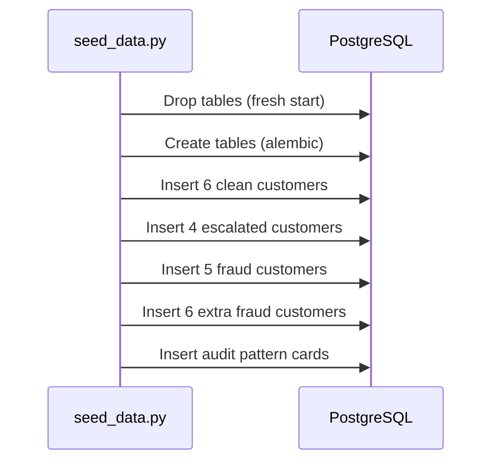

# Test Data Seeding — Comprehensive Fraud Scenarios

> **22 realistic customer profiles** spanning clean, escalated, and fraud scenarios for benchmarking and validation.

---

## Overview

The seeding system generates **complete customer profiles** with transaction histories, devices, IP patterns, and withdrawal requests. This data powers benchmarking, testing, and background audit validation.

**Purpose**:
- **Benchmark performance** — measure latency and accuracy across diverse scenarios
- **Validate decision logic** — ensure rule engine + agents produce correct outcomes
- **Test fraud patterns** — verify cross-account detection, fraud rings, ATO, velocity abuse
- **Seed background audit** — provide confirmed-fraud evaluations for pattern discovery

---

## Total Seeded Customers: 22

| Category | Count | IDs | Expected Outcome |
|----------|-------|-----|------------------|
| **Clean** | 6 | CUST-001 to CUST-006 | **Approve** (~0.14s, 0 LLM calls) |
| **Escalated** | 4 | CUST-007 to CUST-010 | **Escalate** → manual review |
| **Fraud (Original)** | 5 | CUST-011 to CUST-016 | **Block** (~12s, 2-3 LLM calls) |
| **Fraud (Extra)** | 6 | CUST-017 to CUST-022 | **Block** (advanced patterns) |

**Files**: `scripts/seeding/*.py` (~2000 lines total)

---

## File Structure

```
scripts/seeding/
├── constants.py                 — Shared config, fingerprints, IPs
├── generators.py                — Bulk generators (trades, deposits)
├── clean_customers.py           — 6 clean (CUST-001 to CUST-006)
├── escalate_customers.py        — 4 gray zone (CUST-007 to CUST-010)
├── fraud_customers.py           — 5 fraud (CUST-011 to CUST-016)
├── fraud_customers_extra.py     — 6 advanced fraud (CUST-017 to CUST-022)
├── audit_pattern_cards.py       — 4 pattern cards for background audit
└── fraud_evaluations_*.py       — Evaluations for fraud customers
```

---

## Clean Customers (Approve)

### CUST-001: Sarah Chen — Reliable Regular
**Profile**: 540-day account (GBR), 15 deposits, 80 trades, consistent London IP
**Withdrawal**: $500 to verified account
**Why Clean**: Steady history, normal amount, trusted device
**File**: `clean_customers.py:15-58`

---

### CUST-002: James Wilson — VIP Whale
**Profile**: 1095-day account (USA), $5k-$25k deposits, 150 trades
**Withdrawal**: $15,000 (within normal range)
**Why Clean**: VIP whale, large withdrawal expected
**File**: `clean_customers.py:61-101`

---

### CUST-003: Aisha Mohammed — E-Wallet Loyalist
**Profile**: 240-day account (ARE), Skrill deposits, Dubai IP
**Withdrawal**: $200 to Skrill
**Why Clean**: Small routine, consistent profile
**File**: `clean_customers.py:104-144`

---

### CUST-004: Kenji Sato — Crypto Consistent
**Profile**: 365-day account (JPN), BTC wallet used 6 times
**Withdrawal**: $1,200 to same BTC wallet
**Why Clean**: Trusted crypto wallet
**File**: `clean_customers.py:147-188`

---

### CUST-005: Emma Davies — Low-Volume Veteran
**Profile**: 730-day account (GBR), small deposits (£100-£500)
**Withdrawal**: £150 to verified account
**Why Clean**: 2-year veteran, matches pattern
**File**: `clean_customers.py:191-232`

---

### CUST-006: Raj Patel — Premium Trader
**Profile**: 365-day account (IND), 120 trades, $1k-$5k deposits
**Withdrawal**: $3,000 to HDFC bank
**Why Clean**: Active trader, normal range
**File**: `clean_customers.py:235-275`

---

## Escalated Customers (Manual Review)

### CUST-007: David Park — Business Traveler
**Profile**: 180-day account (KOR), IPs in Seoul/Tokyo/NYC/VPN
**Withdrawal**: $1,000 from **VPN IP** (NLD)
**Why Escalated**: VPN usage suspicious BUT trusted device + real trading
**Rule Score**: 0.45 (soft gray zone)
**Expected**: Investigators **approve** (de-escalate) — business traveler
**File**: `escalate_customers.py:16-63`

---

### CUST-008: Maria Santos — New High-Roller
**Profile**: 21-day account (BRA), $3k-$8k deposits, 15 trades
**Withdrawal**: $5,000 (large for new account)
**Why Escalated**: New account + high amount + untrusted device
**Rule Score**: 0.52
**File**: `escalate_customers.py:66-99`

---

### CUST-009: Tom Brown — Method Switcher
**Profile**: 365-day account (AUS), visa → BTC switch
**Withdrawal**: A$800 to **new BTC wallet** (added 1 day ago)
**Why Escalated**: Payment method change
**Rule Score**: 0.48
**File**: `escalate_customers.py:102-146`

---

### CUST-010: Yuki Tanaka — Dormant Returner
**Profile**: 730-day account (JPN), dormant 180 days, now active
**Withdrawal**: $1,500 from **new device**
**Why Escalated**: Dormancy + new device
**Rule Score**: 0.55
**Expected**: Investigators **approve** (device upgrade)
**File**: `escalate_customers.py:149-201`

---

## Fraud Customers (Block)

### CUST-011: Victor Petrov — No-Trade Fraudster
**Profile**: 5-day account (RUS), deposited $3k, **1 token trade** ($10, 15s)
**Withdrawal**: $2,990 (>99% of deposits)
**Patterns**:
- ❌ No-trade withdrawal (deposit-and-run)
- ❌ **Shared device** with CUST-012 (Sophie, FRA)
- ❌ New account (5 days)
**Rule Score**: 0.78
**Shared FP**: `a1b2c3d4e5f6...`
**File**: `fraud_customers.py:19-76`

---

### CUST-012: Sophie Laurent — Card Tester
**Profile**: 14-day account (FRA), **3 failed cards** → 4th succeeded
**Withdrawal**: $480 (96% of deposit)
**Patterns**:
- ❌ Card testing (3 failed attempts)
- ❌ Minimal trading (2 trades, $5 each, 30s)
- ❌ **Shared device** with CUST-011 (Victor, RUS)
**Rule Score**: 0.81
**Shared FP**: `a1b2c3d4e5f6...`
**File**: `fraud_customers.py:79-151`

---

### CUST-013 + CUST-014: Ahmed & Fatima — Fraud Ring
**Profile**: Both 7-day accounts (EGY), **share device + IP + recipient**
**Timing**: Ahmed withdraws 8 min ago, Fatima 2 min ago (coordinated)
**Patterns**:
- ❌ **Fraud ring** — shared device `deadbeef...`, IP `41.44.55.66`
- ❌ **Third-party recipient** — "Mohamed Nour" (not their names)
- ❌ Token trades — Ahmed 1 trade (45s), Fatima **0 trades**
- ❌ **Coordinated timing** — same-hour withdrawals
**Rule Score**: 0.85 (Ahmed), 0.89 (Fatima)
**File**: `fraud_customers.py:154-251`

---

### CUST-015: Carlos Mendez — Velocity Abuser
**Profile**: 90-day account (MEX), **5 withdrawals in 1 hour** ($400 each)
**Patterns**:
- ❌ **Velocity abuse** — 5 withdrawals, 10-min intervals
- ❌ **VPN IP** — `185.199.108.55` (USA exit)
- ❌ **3 devices** — device hopping
- ❌ **Structuring** — $400 each (under $500 threshold)
**Rule Score**: 0.72
**File**: `fraud_customers.py:254-306`

---

### CUST-016: Nina Volkov — Impossible Travel + Rapid Funding
**Profile**: 30-day account (UKR), Kyiv → São Paulo in 35 min
**Patterns**:
- ❌ **Impossible travel** — Kyiv → São Paulo in 35 min
- ❌ **New device** at destination — macOS 14 in São Paulo
- ❌ **Rapid funding** — 3 deposit→withdraw cycles in 3 days
- ❌ **4x normal amount** — $2,000 (avg was $500)
**Rule Score**: 0.76
**Likely**: Account takeover (ATO)
**File**: `fraud_customers.py:309-405`

---

## Extra Fraud (Advanced Patterns)

### CUST-017: Liam Chen — Refund Abuser
**Pattern**: 3 chargebacks in 30 days, profitable BTC trades, then withdrawal
**File**: `fraud_customers_extra.py:17-90`

---

### CUST-018: Olga Ivanova — Smurfing / Structuring
**Pattern**: **12 deposits of $990** (under $1k threshold) → $11k withdrawal
**File**: `fraud_customers_extra.py:93-150`

---

### CUST-019: Dmitri Sokolov — ATO Victim
**Pattern**: 400-day trusted account, sudden device change + **shares device with CUST-021**
**File**: `fraud_customers_extra.py:153-220`

---

### CUST-020: Priya Kumar — Mule Account
**Pattern**: **Shares device** with CUST-013/014 ring, IP in same /24 subnet, zero trades
**File**: `fraud_customers_extra.py:223-290`

---

### CUST-021: Elena Petrov — ATO Accomplice
**Pattern**: **Shares device with CUST-019** (coordinated ATO pair)
**File**: `fraud_customers_extra.py:293-360`

---

### CUST-022: Marcus Dubois — Synthetic Identity
**Pattern**: Fake persona, payment country ≠ registration country
**File**: `fraud_customers_extra.py:363-420`

---

## Shared Fraud Indicators

### Shared Device Fingerprints (constants.py)
```python
FP_SHARED_FRAUD = "a1b2c3d4..."    # Victor (RUS) ↔ Sophie (FRA)
FP_FRAUD_RING = "deadbeef..."      # Ahmed ↔ Fatima ↔ Priya
FP_ATO_STOLEN = "cc11dd22..."      # Dmitri ↔ Elena (ATO pair)
```

### Shared IPs
```python
IP_FRAUD_RING = "41.44.55.66"   # Ahmed + Fatima
IP_MULE_RING = "41.44.55.77"    # Priya (same /24 subnet)
```

**Purpose**: Enable cross-account fraud detection
**File**: `constants.py:26-33`

---

## Bulk Generators

### _gen_trades()
Generates `n` closed trades spread evenly between dates.
**Random**: instrument, type, amount, PnL, duration (5min-4h)
**File**: `generators.py:13-45`

---

### _gen_deposits()
Generates `n` successful deposit transactions.
**File**: `generators.py:48-79`

---

### _gen_past_withdrawals()
Generates `n` past **approved** withdrawals (baseline behavior).
**File**: `generators.py:82-122`

---

## Background Audit Pattern Cards

### ATO Pattern (CUST-016)
**Indicators**: impossible_travel, new_device_at_destination
**Score**: 0.78 (confidence: 0.83)
**File**: `audit_pattern_cards.py:3-34`

---

### Deposit & Run (CUST-011, 012, 013, 014)
**Indicators**: no_trade_withdrawal, shared_device, near_full_withdrawal
**Score**: 0.82 (confidence: 0.79)
**File**: `audit_pattern_cards.py:36-72`

---

### Mule Network (CUST-013, 014, 020)
**Indicators**: shared_device, shared_recipient, ip_subnet_cluster
**Score**: 0.92 (confidence: 0.87)
**File**: `audit_pattern_cards.py:74-110`

---

### Velocity Ring (CUST-015)
**Indicators**: velocity_abuse, device_hopping, vpn_masking, structuring
**Score**: 0.85 (confidence: 0.81)
**File**: `audit_pattern_cards.py:112-150`

---

## Seeding Flow



**Command**: `python -m scripts.seed_data`
**Time**: ~2-3s (inserts 500+ records)

---

## Usage in Benchmarks

### benchmark_investigate.py
Tests **all 16 customers** (CUST-001 to CUST-016):
- Clean (9): 0 LLM calls, ~0.14s
- Suspicious (7): 2-3 LLM calls, ~12s
**File**: `scripts/benchmark_investigate.py`

---

### test_investigator_pipeline.py
Tests **3 representative customers**:
- CUST-001: clean → approved
- CUST-007: escalated → approved (de-escalate)
- CUST-011: fraud → blocked
**File**: `scripts/test_investigator_pipeline.py`

---

## Key Insights

### Fraud Ring Detection (Cross-Account)
**Old pipeline**: Each customer isolated → misses shared devices/IPs
**New pipeline**: Cross-account queries → detects:
- Victor-Sophie pair (shared device, different countries)
- Ahmed-Fatima-Priya ring (shared device + IP + recipient)

### Correct De-Escalation
- **CUST-007** (David): Rule escalates (VPN) → Investigators approve (business traveler)
- **CUST-010** (Yuki): Rule escalates (dormancy) → Investigators approve (device upgrade)

### Advanced Patterns
- **Impossible travel** (CUST-016): Kyiv → São Paulo, 35 min
- **Velocity abuse** (CUST-015): 5 withdrawals/1 hour, 3 devices
- **Rapid funding** (CUST-016): 3 deposit→withdraw cycles, 3 days

---

## Related Documentation

- [Background Audit System](./background_audit_system.md) — Pattern discovery
- [Agentic System](./agentic_system.md) — How investigators analyze data
- [Component Diagram](./component_diagram.md) — Full architecture
