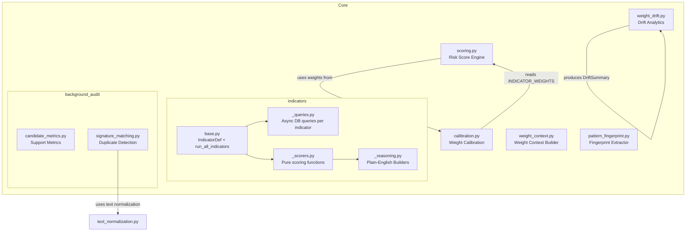
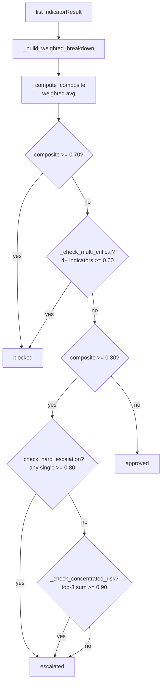

# Core Layer

Pure business logic — no DB access, no HTTP calls. Everything here is deterministic, testable, and side-effect-free.

---

## Component Diagram



---

## Modules

### `scoring.py` — Risk Score Engine

**File**: `core/scoring.py`

Aggregates 8 indicator scores into a final `approved / escalated / blocked` decision.

**Thresholds:**

| Constant | Value | Meaning |
|----------|-------|---------|
| `APPROVE_THRESHOLD` | 0.30 | Below this → approved |
| `BLOCK_THRESHOLD` | 0.70 | Above this → blocked |
| `HARD_ESCALATION_THRESHOLD` | 0.80 | Single indicator ≥0.80 + confidence ≥0.8 → escalate |
| `MULTI_CRITICAL_THRESHOLD` | 0.60 | 4+ indicators ≥0.60 + confidence ≥0.8 → auto-block |
| `CONCENTRATED_ESCALATION_THRESHOLD` | 0.90 | Top-3 weighted scores sum ≥0.90 → escalate |

**Indicator Weights:**

| Indicator | Weight |
|-----------|--------|
| `trading_behavior` | 1.5 |
| `device_fingerprint` | 1.3 |
| `card_errors` | 1.2 |
| `amount_anomaly` | 1.0 |
| `velocity` | 1.0 |
| `payment_method` | 1.0 |
| `geographic` | 1.0 |
| `recipient` | 1.0 |

**Key functions:**

| Function | Lines | Purpose |
|----------|-------|---------|
| `calculate_risk_score()` | 45–86 | Main entry — returns `ScoringResult` |
| `_check_hard_escalation()` | 112–116 | Single critical indicator override |
| `_check_multi_critical()` | 120–126 | Multi-indicator auto-block |
| `_check_concentrated_risk()` | 129–137 | Converging moderate signals |
| `_align_score_with_decision()` | 156–172 | Display score ≥ decision threshold |
| `_build_reasoning()` | 187–240 | Plain-English reasoning string |

---

### `calibration.py` — Per-Customer Weight Calibration

**File**: `core/calibration.py`

Tracks per-customer indicator precision (correct fires / total fires) and adjusts weights using Bayesian smoothing + temporal decay.

**Constants:**

| Constant | Value | Purpose |
|----------|-------|---------|
| `FIRE_THRESHOLD` | 0.30 | Minimum score to count as a "fire" |
| `MIN_MULTIPLIER` | 0.20 | Floor on weight multiplier |
| `MAX_MULTIPLIER` | 3.00 | Cap on weight multiplier |
| `SENSITIVITY` | 1.40 | Amplification factor from precision |
| `PRIOR_STRENGTH` | 2.0 | Bayesian smoothing strength |
| `DECAY_THRESHOLD_DAYS` | 90 | Days before decay starts |
| `DECAY_RATE` | 0.95 | Monthly decay factor |

**Key functions:**

| Function | Lines | Purpose |
|----------|-------|---------|
| `calculate_indicator_multiplier()` | 42–57 | Precision → multiplier (Bayesian + decay) |
| `apply_decay()` | 60–68 | Drift multiplier toward 1.0 over time |
| `build_effective_weights()` | 71–88 | Base weights × per-customer multipliers |
| `recalculate_profile()` | 91–128 | Rebuild full `indicator_weights` JSONB from decision window |
| `calculate_blend_weights()` | 131–175 | Rule engine vs. investigator blend ratio |

**Design decision**: Bayesian smoothing (`PRIOR_STRENGTH=2`) prevents wild swings on low sample sizes. A customer with 2 correct fires out of 3 does not get 100% precision — the prior pulls it toward 0.5.

---

### `weight_drift.py` — Drift Analytics

**File**: `core/weight_drift.py`

Pure math for detecting weight drift across the customer fleet. No DB.

| Function | Purpose |
|----------|---------|
| `build_drift_summary()` | Per-indicator stats from a list of profiles |
| `detect_outliers()` | IQR-based outlier detection on multipliers |
| `indicator_trend()` | `rising / falling / stable` via linear slope |
| `suggest_countermeasures()` | Flag indicators where max >2.0 or min <0.5 or std >0.5 |

---

### `pattern_fingerprint.py` — Fingerprint Extractor

**File**: `core/pattern_fingerprint.py`

Extracts a canonical fingerprint from indicator results + officer action for fraud pattern recording.

```
fingerprint = {
    indicator_combination: ["amount_anomaly", "velocity"],  # sorted, fired
    indicator_scores: {name: {score, confidence, evidence_keys}},
    signal_type: "confirmed_fraud" | "false_positive",
    score_band: "low" | "medium" | "high",
}
```

---

### `indicators/base.py` — Indicator Runner

**File**: `core/indicators/base.py`

Defines the 8 indicators as `IndicatorDef` dataclasses and runs them all in parallel.

```python
@dataclass(frozen=True)
class IndicatorDef:
    name: str
    weight: float
    query: Callable    # async (ctx, session) -> dict  [from _queries.py]
    scorer: Callable   # pure  (evidence)  -> (float, str)  [from _scorers.py]

async def run_all_indicators(
    ctx: dict, session_factory: async_sessionmaker,
) -> list[IndicatorResult]: ...
# asyncio.gather over all 8 IndicatorDef.query() calls
```

**Design decision**: Splitting `query` and `scorer` enforces the Core rule — DB access only in queries, zero side effects in scorers. Scorers are pure and trivially testable.

---

### `indicators/_queries.py` + `_scorers.py`

**`_queries.py`**: One `async` function per indicator. Opens a session, runs DB queries, returns raw evidence dict. No scoring logic.

**`_scorers.py`**: One pure function per indicator. Takes evidence dict, returns `(score: float, reasoning: str)`. No DB access, no imports from data layer.

---

### `indicators/_reasoning.py` — Plain-English Builders

**File**: `core/indicators/_reasoning.py`

One builder function per indicator. Called by the indicator computation layer to produce human-readable explanations.

| Function | Indicator |
|----------|-----------|
| `build_amount_reasoning()` | amount_anomaly |
| `build_velocity_reasoning()` | velocity |
| `build_payment_method_reasoning()` | payment_method |
| `build_geographic_reasoning()` | geographic |
| `build_device_reasoning()` | device_fingerprint |
| `build_trading_reasoning()` | trading_behavior |
| `build_recipient_reasoning()` | recipient |
| `build_card_errors_reasoning()` | card_errors |

---

### `background_audit/` — Audit Core

| File | Purpose |
|------|---------|
| `candidate_metrics.py` | `avg_confidence()`, `evidence_quality()`, `novelty_to_float()` |
| `signature_matching.py` | `CandidateSignature`, `build_candidate_signature()`, `match_duplicate_candidate()` using Jaccard + cosine |
| `dataset_prep.py` | `compute_window()`, `generate_run_id()`, `compute_run_fingerprint()` — idempotency helpers |
| `text_normalization.py` | `normalize_text()`, `tokenize_keywords()`, `extract_theme_set()` — NLP utilities for signature building |

**Duplicate detection strategy** (`signature_matching.py`):
- `centroid_sim >= 0.80` → `high_embedding_overlap`
- `token_sim >= 0.35 AND centroid_sim >= 0.60` → `high_text_and_embedding_overlap`
- `same_name AND (token_sim >= 0.15 OR centroid_sim >= 0.70)` → `same_pattern_name`

---

## Scoring Flow


