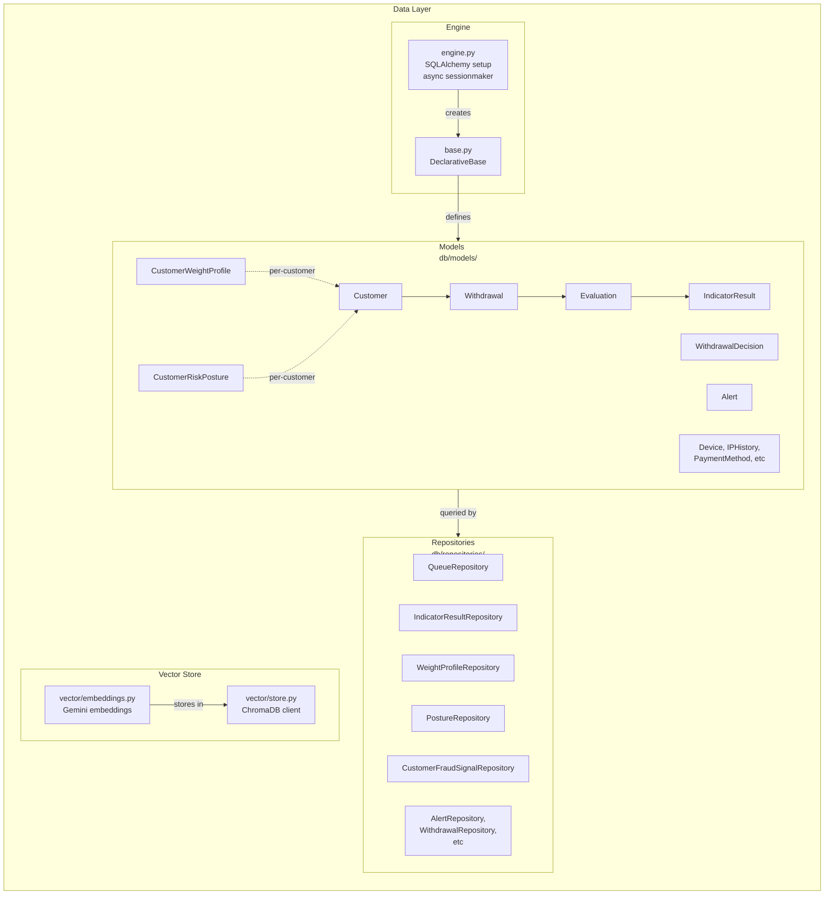

# Data Layer

Async SQLAlchemy ORM with PostgreSQL. Models, repositories, and vector store management.

---

## Component Diagram



---

## Models

| Model | Columns | Key Relations |
|-------|---------|---------------|
| `Customer` | id, external_id, name, email, country, is_flagged, registration_date | payments, transactions, trades, withdrawals, devices, ip_history, alerts |
| `Withdrawal` | id, customer_id, amount, currency, payment_method_id, recipient, ip, device_fingerprint, status, is_fraud, requested_at | decision(1:1), indicator_results(1:many), evaluations, alerts, feedback |
| `Evaluation` | withdrawal_id, composite_score, decision, elapsed_s, checked_at | indicator_results(1:many) |
| `IndicatorResult` | id, evaluation_id, indicator_name, score, confidence, evidence_keys (JSON) | — |
| `CustomerWeightProfile` | customer_id, indicator_weights(JSONB), blend_ratio, last_updated | — |
| `CustomerRiskPosture` | customer_id, signal_scores(JSONB), composite_posture(normal/caution/elevated/critical) | — |
| `WithdrawalDecision` | id, withdrawal_id, admin_id, action, reasoning, decided_at | — |
| `Alert` | id, withdrawal_id, customer_id, alert_type, risk_score, top_indicators(JSONB), locked_by_admin_id | — |

**Index strategy**: Withdrawal: `(customer_id, requested_at)` + `status`. Supports recent-first queries and fast status filtering.

---

## Repositories

### Core Repositories

| Repo | Purpose | Methods |
|------|---------|---------|
| `QueueRepository` | Active withdrawals awaiting review | `get_queue()`, `count_by_status()` |
| `IndicatorResultRepository` | Indicator scores per evaluation | `get_by_evaluation()`, `save_batch()` |
| `WeightProfileRepository` | Per-customer indicator weights | `get_by_customer()`, `upsert()` |
| `PostureRepository` | Per-customer risk posture | `get_or_create()`, `update_signals()` |
| `CustomerFraudSignalRepository` | Active fraud pattern matches | `get_active_by_customer()`, `create()` |

### Pattern

All repos extend `BaseRepository<T>`:
```python
async def get_by_id(self, id: UUID) -> Optional[T]
async def save(self, obj: T) -> T
async def save_batch(self, objs: list[T]) -> list[T]
async def delete(self, obj: T) -> None
```

---

## Session Management

```python
from app.data.db.engine import get_session

# Dependency injection
async def my_handler(session: AsyncSession = Depends(get_session)):
    result = await session.execute(query)
    await session.commit()
```

**Async only**: All operations use `async with session` or explicit `await commit()`. No lazy loading outside session scope.

**N+1 prevention**: Use `selectinload()` / `joinedload()` for relationships.

**Expunge before return**: Call `session.expunge(obj)` before returning ORM instances to prevent lazy-load errors in async contexts.

---

## Vector Store (ChromaDB)

**File**: `vector/store.py`

- Client: ChromaDB (HNSW cosine distance)
- Embeddings: Google Gemini `embedding-001` (768-dim, vectorstore.py)
- Collection: `fraud_cases` — stores withdrawal evidence + metadata

**Usage**:
```python
from app.data.vector.store import get_vector_store

store = get_vector_store()
# add_documents(evidence_texts, metadata)
# query(evidence, n_results=10) → [(text, metadata, distance)]
```

**Background audit integration**: BackgroundAuditFacade embeds investigation evidence into ChromaDB, then uses HDBSCAN for clustering.

---

## Design Decisions

| Decision | Rationale |
|----------|-----------|
| **Async-only SQLAlchemy** | All I/O is non-blocking. Supports high concurrency (fraud checks per second). |
| **Repositories over raw queries** | Encapsulates DB logic; easy to test with mocks. Services never write raw SQL. |
| **JSONB for flex fields** | `indicator_weights`, `signal_scores`, `top_indicators` stored as JSONB. No schema migration for new indicators. |
| **No lazy loading** | Expunge ORM objects before leaving session scope. Prevents `DetachedInstanceError` in async. |
| **Immutable base models** | `Base` uses `__table_args__` for indexes. Migrations via Alembic, never ORM changes. |
| **Vector store separate** | ChromaDB is ephemeral for background audits. Not the source of truth — PostgreSQL is. |

---

## Initialization

```python
from app.data.db.engine import init_db, close_db

# Startup
await init_db()  # Create engine, connection pool

# Shutdown
await close_db()  # Close pool
```

**Connection pool**: `pool_size=5`, `max_overflow=10` (10 extra connections if needed). Tunable via `DATABASE_URL` env var.

---

## Files

| File | Role |
|------|------|
| `db/engine.py` | AsyncEngine, sessionmaker, init/close |
| `db/base.py` | DeclarativeBase parent class |
| `db/models/__init__.py` | All models exported here |
| `db/repositories/base_repository.py` | `BaseRepository<T>` abstract class |
| `db/repositories/*.py` | One per model (e.g., `customer_repository.py`) |
| `vector/store.py` | ChromaDB client initialization + query interface |
| `vector/embeddings.py` | Gemini embeddings integration |
