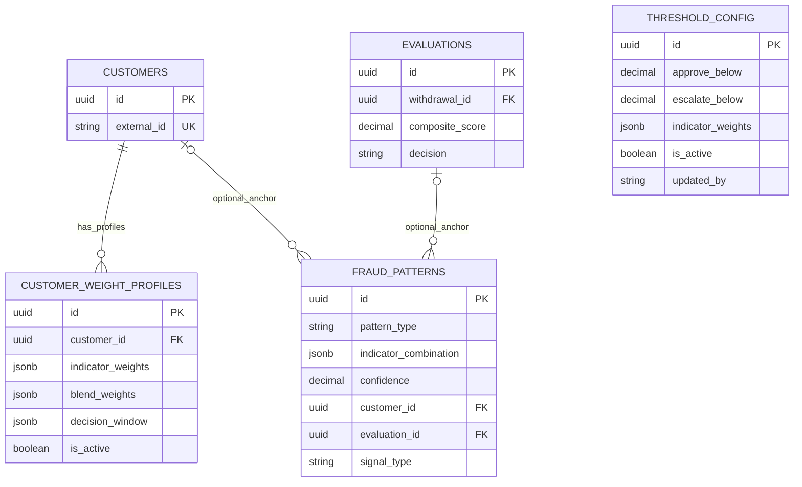

# ER Diagram: Config and Learning Tables

This view covers dynamic scoring configuration and pattern-learning data.

Notes:

- `threshold_config` has no FK links; it is a versioned global config table.
- `customer_weight_profiles` supports per-customer personalization over time.
- `fraud_patterns` can optionally point to either a customer, an evaluation, or both.
