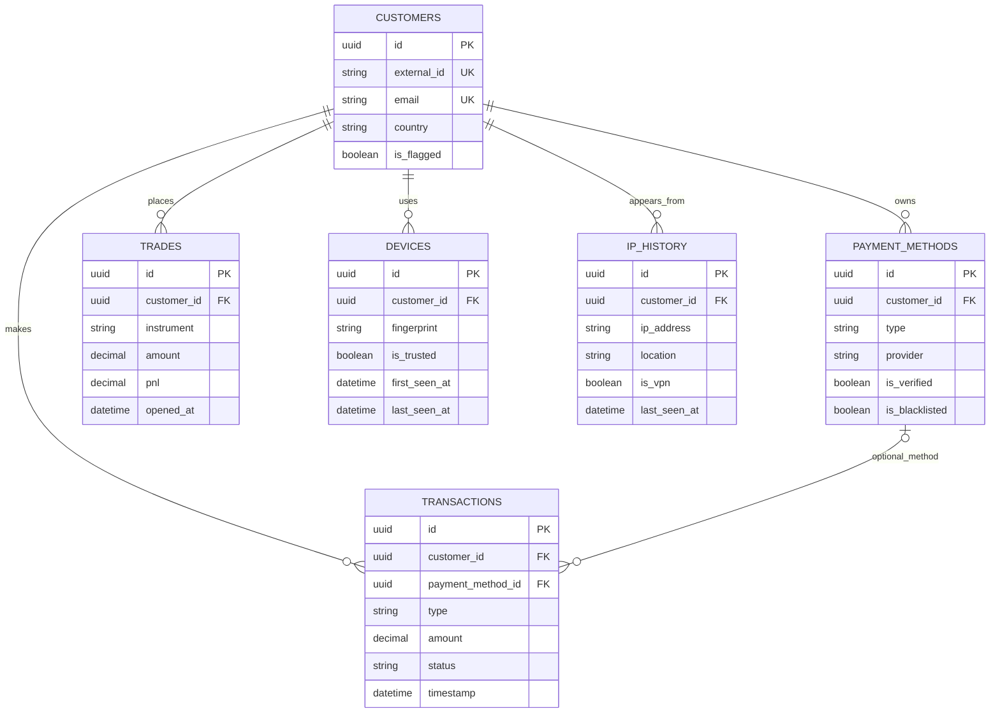

# ER Diagram: Customer and Activity

This view focuses on customer profile data and account activity tables.

Notes:

- `transactions.payment_method_id` is nullable, so not every transaction is tied to a saved method.
- `customers.external_id` is the API-facing identifier (for example `CUST-001`).
