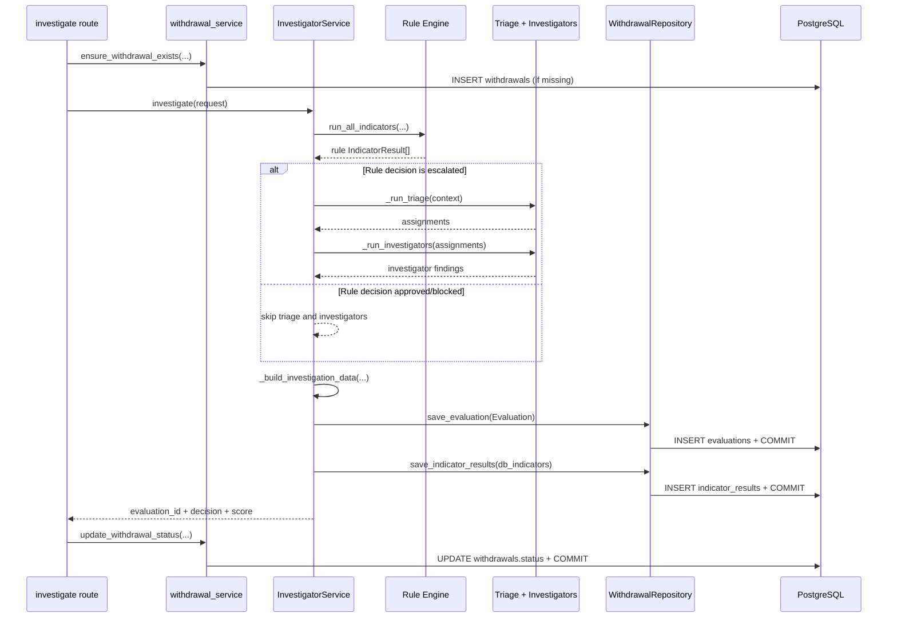
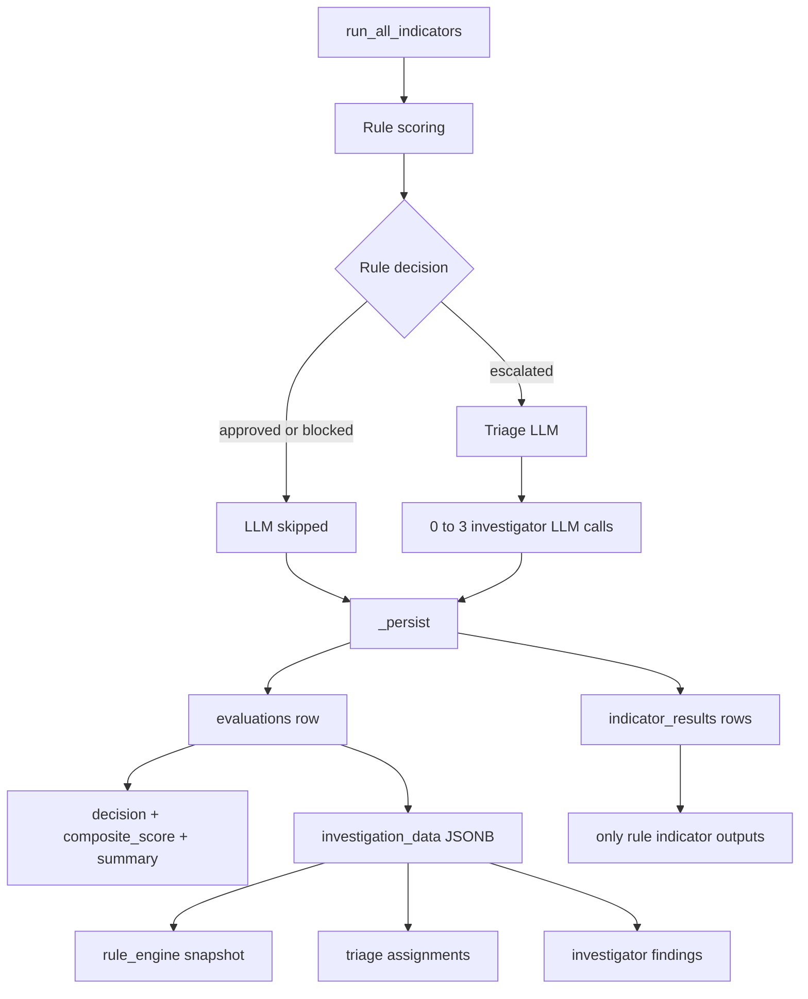

# Investigator Service Persistence View

This view explains where persistence happens for `app/services/fraud/investigator_service.py` and how rule-based and LLM-based outputs are stored.

## 1) Persistence sequence

## 2) Rule-based vs LLM-based storage

## Exactly where writes happen

- `InvestigatorService._persist(...)` is the main persistence method.
- `WithdrawalRepository.save_evaluation(...)` commits the `evaluations` row.
- `WithdrawalRepository.save_indicator_results(...)` commits `indicator_results` rows.
- Route-level `update_withdrawal_status(...)` commits `withdrawals.status`.
- `withdrawal_decisions` is not written by `InvestigatorService`; officer decisions are written in `app/services/control/decision_service.py` via `submit_decision(...)`.

## Important persistence nuance

- `_persist(...)` uses two separate commits: first `evaluations`, then `indicator_results`.
- If the second commit fails, the evaluation row can still exist while indicator rows are missing for that run.
