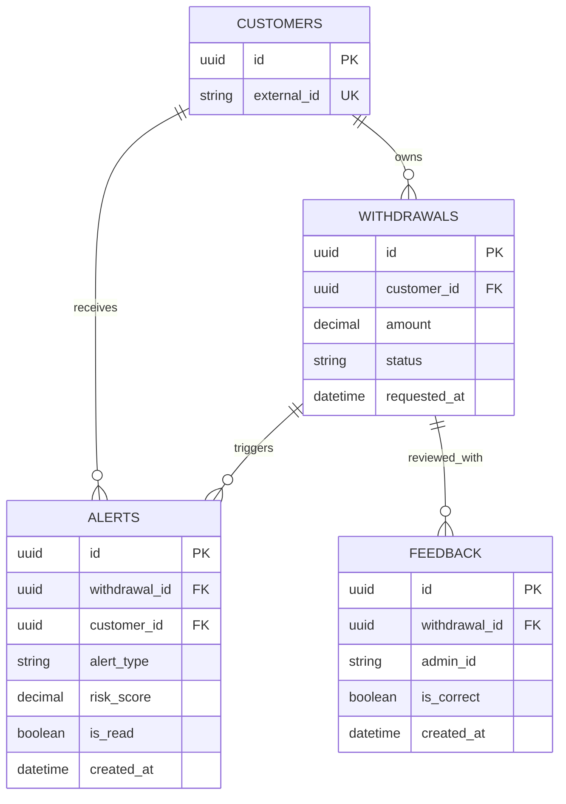

# ER Diagram: Review, Feedback, and Alerts

This view focuses on operational review artifacts around a withdrawal.

Notes:

- `alerts.top_indicators` stores a compact JSONB explanation payload.
- `feedback` is used to track whether system decisions were correct after human review.
