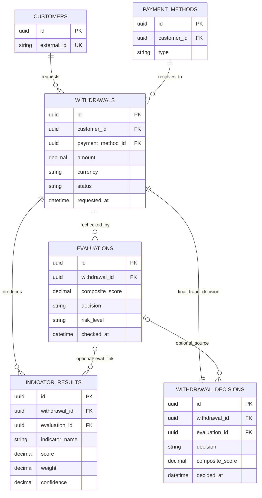

# ER Diagram: Withdrawal Risk Pipeline

This view focuses on the core fraud-evaluation flow for withdrawals.

Notes:

- `withdrawal_decisions.withdrawal_id` is unique, so each withdrawal has at most one final decision row.
- `indicator_results` keeps both `withdrawal_id` and optional `evaluation_id` to support old and new pipeline linkage.
- `withdrawals.status` is workflow state, while `withdrawal_decisions.decision` is the fraud decision of record.
- For service-level write flow (`_persist`) and rule-vs-LLM storage split, see `investigator_service_persistence.md`.
