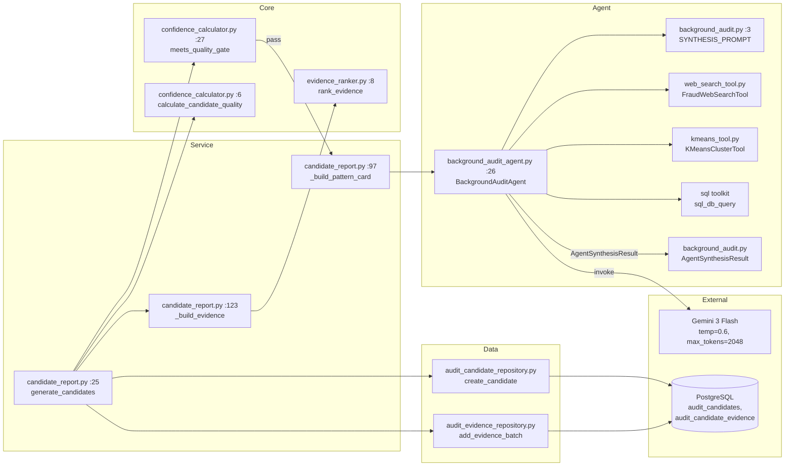
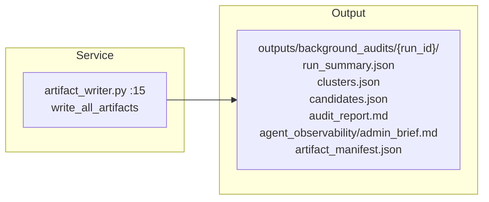
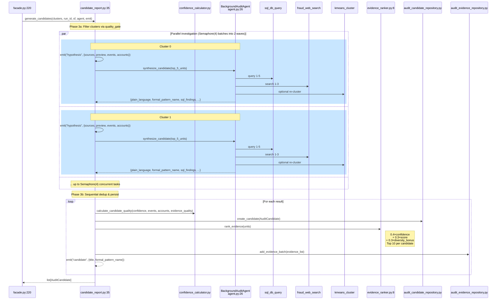
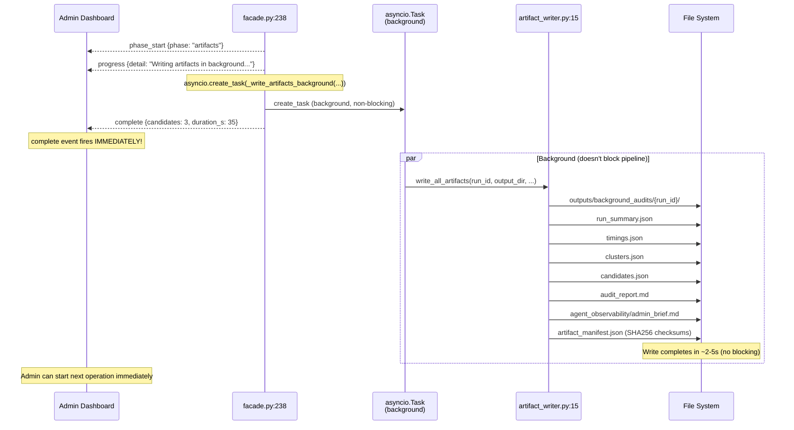
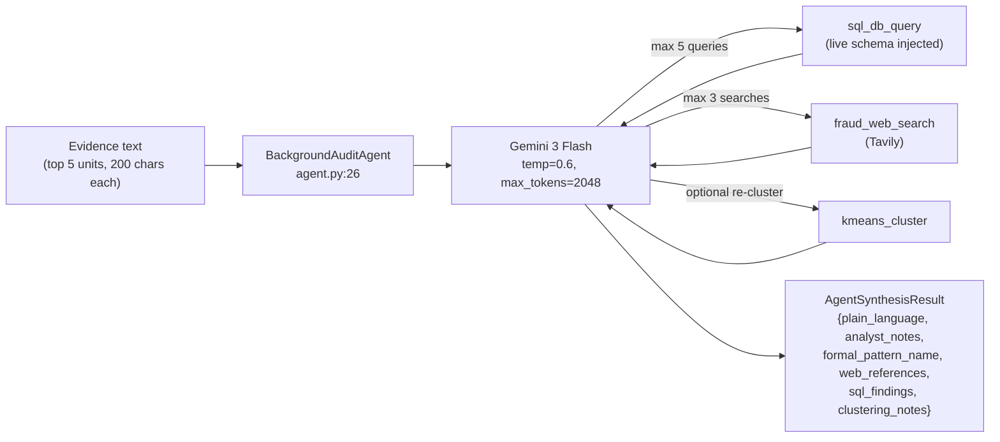

# 04 — Candidate Generation & Artifacts (Phases 3–4)

Scores clusters through a quality gate, synthesizes an admin brief via LLM, persists candidates, writes file artifacts.

## Component Diagram — Phase 3 (Candidates)



## Component Diagram — Phase 4 (Artifacts)



## Files Involved

### Phase 3 — Candidate Generation

| File | Lines | Key | Line |
|------|-------|-----|------|
| `app/services/background_audit/components/candidate_report.py` | 149 | `generate_candidates()` | 25 |
| | | `_build_pattern_card()` | 97 |
| | | `_build_evidence()` | 123 |
| `app/core/background_audit/confidence_calculator.py` | 41 | `calculate_candidate_quality()` | 6 |
| | | `meets_quality_gate()` | 27 |
| `app/core/background_audit/evidence_ranker.py` | 34 | `rank_evidence()` | 8 |
| `app/agentic_system/agents/background_audit_agent.py` | 60 | `BackgroundAuditAgent` | 26 |
| | | `synthesize_candidate()` | 45 |
| `app/agentic_system/prompts/background_audit.py` | 46 | `SYNTHESIS_PROMPT` | 3 |
| `app/agentic_system/schemas/background_audit.py` | — | `AgentSynthesisResult` | — |
| `app/agentic_system/tools/web_search_tool.py` | — | `FraudWebSearchTool` (Tavily) | — |
| `app/agentic_system/tools/kmeans_tool.py` | — | `KMeansClusterTool` | — |
| `app/data/db/repositories/audit_candidate_repository.py` | — | `create_candidate` | — |
| `app/data/db/repositories/audit_evidence_repository.py` | — | `add_evidence_batch` | — |

### Phase 4 — Artifact Writing

| File | Lines | Key | Line |
|------|-------|-----|------|
| `app/services/background_audit/components/artifact_writer.py` | 187 | `write_all_artifacts()` | 15 |

## What Happens — Phase 3

### Phase 3a: Filter Qualifying Clusters
1. For each cluster, check `meets_quality_gate()`:
   - `support_events ≥ 5`, `support_accounts ≥ 2`, `avg_confidence ≥ 0.50`
   - Fails → cluster dropped silently
2. Emit `hypothesis` event with cluster label: `"{source1, source2}: preview_text..."` (line 116, candidate_report.py)

### Phase 3b: Parallel Investigation (asyncio.gather + Semaphore)
**File**: `app/services/background_audit/components/candidate_report.py:59-64`

For each qualifying cluster, run in parallel (batched via `Semaphore(4)` into ~2 waves):
1. `_investigate_single_cluster()` receives `Semaphore` and acquires lock (line 113)
2. `build_pattern_card()` — takes top 5 units (200 chars each), sends to agent
3. `BackgroundAuditAgent.synthesize_candidate()` — calls Gemini 3 Flash
   - Uses `SYNTHESIS_PROMPT` with **live DB schema injected** at runtime (no hardcoded columns)
   - Agent has 3 tools: `fraud_web_search` (Tavily), `sql_db_query`, `kmeans_cluster`
   - Returns `{plain_language, analyst_notes, formal_pattern_name, web_references, sql_findings, clustering_notes}`
4. Emit `agent_tool` events for each tool invocation (streamed to dashboard)

### Phase 3c: Sequential Dedup & Persist
1. `calculate_candidate_quality()` — weighted score:
   ```
   0.35×confidence + 0.25×support + 0.20×impact + 0.20×evidence
   ```
2. Dedup by `formal_pattern_name` (line 82-84) — merge duplicate patterns
3. Persist `AuditCandidate` + evidence to DB:
   - `create_candidate()` → `audit_candidates` table (line 86)
   - `add_evidence_batch()` → `audit_candidate_evidence` table with ranked units (line 90-91)
   - Evidence ranking: `0.4×confidence + 0.3×score + 0.3×diversity_bonus`, top 10 per candidate
4. Emit `candidate` event with `formal_pattern_name`

### Sequence Diagram — Phase 3 (Parallel Investigation)



## What Happens — Phase 4 (Non-Blocking)

**File**: `app/services/background_audit/facade.py:238-247`

Artifact writing is **fire-and-forget** via `asyncio.create_task()`. The `complete` SSE event fires immediately without waiting for disk writes.

```python
asyncio.create_task(_write_artifacts_background(...))  # Background task
await emit("complete", {...})  # Fires immediately
```

This reduces perceived latency: Phase 3 investigation (parallel) completes in ~35s, and SSE `complete` event reaches the admin dashboard instantly. File writes (~2-5s) happen asynchronously.

**Output files** (written in background):
- `run_summary.json`, `timings.json`, `clusters.json`, `candidates.json`
- `audit_report.md` — human-readable overview
- `agent_observability/admin_brief.md` — agent synthesis narrative
- `artifact_manifest.json` — SHA256 checksums for integrity

**Note**: The DB already holds all results (`audit_candidates` + `audit_candidate_evidence` tables from Phase 3). Disk artifacts are for observability/audit trail only.

### Sequence Diagram — Phase 4 (Non-Blocking, Fire-and-Forget)



## Agent Structure

The `BackgroundAuditAgent` is a simple LangChain agent wrapper, not a LangGraph state machine.



**Live schema injection**: The facade builds schema docs from the live DB at runtime using `build_schema_description()` + `build_critical_notes()` (same pattern as the chat service). This replaces the `## Database Schema (exact columns)` marker in `SYNTHESIS_PROMPT`, eliminating hardcoded column mismatches.

**Key limitation**: Multi-step tool usage but still a single-shot invocation. No graph nodes, no conditional edges, no state persistence.
