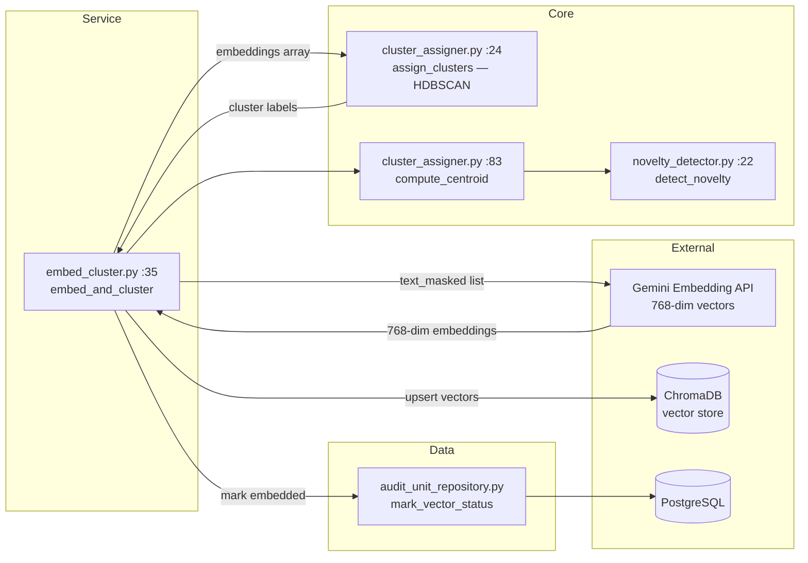
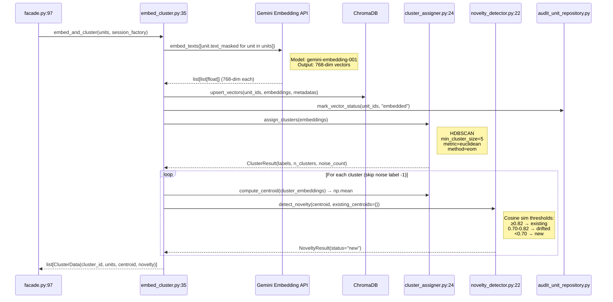

# 03 — Embed & Cluster (Phase 2)

Turns text units into vectors, stores them in ChromaDB, clusters with HDBSCAN.

## Component Diagram

## Files Involved

| File | Lines | Key | Line |
|------|-------|-----|------|
| `app/services/background_audit/components/embed_cluster.py` | 86 | `ClusterData` dataclass | 25 |
| | | `embed_and_cluster()` | 35 |
| `app/core/background_audit/cluster_assigner.py` | 95 | `assign_clusters()` | 24 |
| | | `compute_centroid()` | 83 |
| `app/core/background_audit/novelty_detector.py` | 55 | `NoveltyResult` dataclass | 13 |
| | | `detect_novelty()` | 22 |

## What Happens

1. Embed all `text_masked` strings via Gemini (`gemini-embedding-001`, 768 dims)
2. Upsert vectors + metadata to ChromaDB
3. Mark `vector_status = "embedded"` in PostgreSQL
4. Run HDBSCAN: `min_cluster_size=5, metric=euclidean, method=eom`
   - Label `-1` = noise → discarded
5. For each cluster:
   - `compute_centroid()` — `np.mean(embeddings, axis=0)`
   - `detect_novelty()` — cosine sim vs existing centroids:
     - ≥0.82 → `"existing"`, 0.70–0.82 → `"drifted_existing"`, <0.70 → `"new"`
     - Currently always `"new"` (no prior centroids stored yet)

**Output**: `list[ClusterData(cluster_id, units, centroid, novelty)]`

## Sequence Diagram

