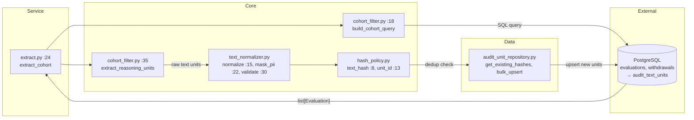
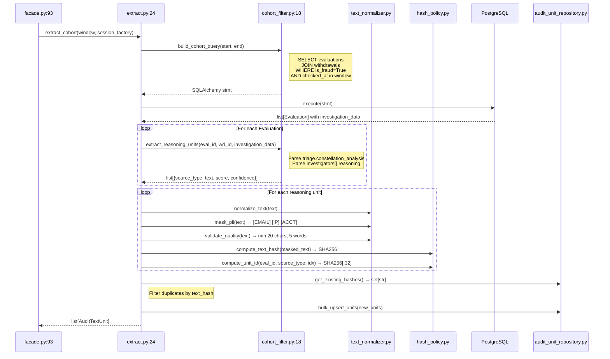

# 02 — Extract Cohort (Phase 1)

Pulls reasoning text from confirmed-fraud evaluations, normalizes it, and deduplicates.

## Component Diagram



## Files Involved

| File | Lines | Key | Line |
|------|-------|-----|------|
| `app/services/background_audit/components/extract.py` | 74 | `extract_cohort()` | 24 |
| `app/core/background_audit/cohort_filter.py` | 81 | `build_cohort_query()` | 18 |
| | | `extract_reasoning_units()` | 35 |
| `app/core/background_audit/text_normalizer.py` | 38 | `normalize_text()` | 15 |
| | | `mask_pii()` | 22 |
| | | `validate_quality()` | 30 |
| `app/core/background_audit/hash_policy.py` | 19 | `compute_text_hash()` | 8 |
| | | `compute_unit_id()` | 13 |
| `app/data/db/repositories/audit_unit_repository.py` | — | `bulk_upsert_units`, `get_existing_hashes` | — |
| `app/data/db/models/audit_text_unit.py` | — | `AuditTextUnit` model | — |

## What Happens

1. `build_cohort_query()` builds a SQLAlchemy select:
   ```
   SELECT evaluations JOIN withdrawals
   WHERE is_fraud = True AND checked_at IN window
   ```
2. For each evaluation, `extract_reasoning_units()` parses `investigation_data` JSONB:
   - `triage.constellation_analysis` → 1 text unit
   - `investigators[].reasoning` → 1 text unit per investigator
3. Each raw text goes through the processing pipeline:
   - `normalize_text()` — collapse whitespace, strip control chars
   - `mask_pii()` — emails→`[EMAIL]`, IPs→`[IP]`, accounts→`[ACCT]`
   - `validate_quality()` — reject if <20 chars, >5000 chars, or <5 words
4. `compute_text_hash()` — SHA256 of masked text (dedup key)
5. `compute_unit_id()` — SHA256 of `eval_id|source_type|index` (deterministic ID)
6. Check existing hashes in DB, bulk-upsert only new units

**Output**: `list[AuditTextUnit]` (deduplicated, PII-masked)

## Sequence Diagram


