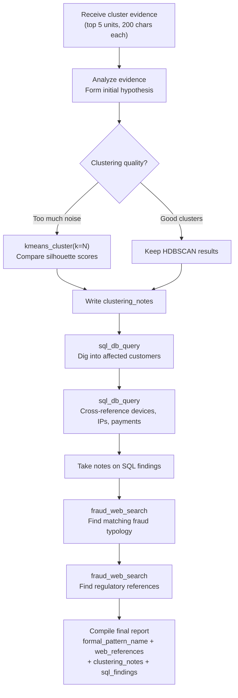

# Next Up — Stage 2: Autonomous Audit Agent

## Current State (Stage 2 — Agent Quality Fixes Applied)

The pipeline works end-to-end as a **linear async facade** with autonomous agent investigation:
1. Extract reasoning from confirmed-fraud evaluations
2. Embed with Gemini, cluster with HDBSCAN
3. Score clusters through quality gate (lowered: events≥5, accounts≥2, confidence≥0.50)
4. Agent investigates with 3 tools (web search, SQL with live schema, KMeans re-clustering)
5. Write artifacts to disk + DB

**Completed in Stage 2**:
- Live DB schema injection into agent prompt (eliminates `UndefinedColumn` SQL errors)
- Lowered quality gate thresholds (1/9 → 5-7/9 clusters pass)
- SSE progress events, Tavily web search, KMeans tool, SQL deep-dives (all wired)

**What's remaining**: LangGraph state machine, dashboard integration, parallel candidate investigation.

---

## Overview: What Changes in Stage 2

Stage 1 treats the agent as a **single-shot summarizer** — it gets 5 snippets, writes a brief, done.

Stage 2 transforms the agent into an **autonomous investigator** with 3 tools:

| Tool | Source | Purpose |
|------|--------|---------|
| `TavilySearch` | `langchain_tavily.TavilySearch` | Web search for fraud typology matching + proof links |
| `sql_db_query` | `app/agentic_system/tools/sql/toolkit.py` | SQL queries against the fraud DB to dig deeper |
| `KMeansClusterTool` | New — `app/agentic_system/tools/kmeans_tool.py` | Alternative clustering for the agent to compare against HDBSCAN |

The agent **decides** which tools to use, **takes notes** on why, and **builds a dossier** of local evidence + web proof.

---

## Addition 1: SSE Progress Events

### Goal

Send real-time events to the frontend so dashboards show what's happening inside each phase.

### Current Problem

- `_run_pipeline` runs as a fire-and-forget `asyncio.create_task`
- Client polls `GET /runs/{run_id}` every 5s — blind until completion
- No visibility into which phase is running or partial results

### SSE Event Schema

```
event: phase_start     data: {"phase": "extract", "started_at": "..."}
event: progress        data: {"phase": "extract", "detail": "Found 42 reasoning units"}
event: phase_complete  data: {"phase": "extract", "duration_s": 1.2, "output_count": 42}
event: cluster_found   data: {"cluster_id": "cluster_0", "size": 18, "method": "hdbscan"}
event: agent_action    data: {"candidate_id": "...", "tool": "tavily_search", "query": "bust-out scheme"}
event: agent_note      data: {"candidate_id": "...", "note": "Chose KMeans (k=3) — tighter clusters than HDBSCAN"}
event: candidate       data: {"candidate_id": "...", "title": "...", "quality": 0.67}
event: complete        data: {"run_id": "...", "total_candidates": 2, "duration_s": 34.5}
event: error           data: {"phase": "embed_cluster", "message": "ChromaDB timeout"}
```

### Implementation Plan

**New endpoint**: `GET /background-audits/runs/{run_id}/stream`

```
app/api/routes/background_audits.py  — add SSE endpoint (:80)
```

**Callback protocol in facade**:

```python
# facade.py — _run_pipeline gains a callback param
async def _run_pipeline(
    self, run_id: str, window: Any, run_mode: str,
    progress: Callable[[str, dict], Awaitable[None]] | None = None,
) -> None:
```

Each component emits events at key points:

| Component | Events Emitted |
|-----------|---------------|
| `extract.py` | `phase_start`, `progress` (units found), `phase_complete` |
| `embed_cluster.py` | `phase_start`, `progress` (embedded N), `cluster_found` per cluster, `phase_complete` |
| `candidate_report.py` | `phase_start`, `agent_action` per tool call, `agent_note`, `candidate` per candidate, `phase_complete` |
| `artifact_writer.py` | `phase_start`, `phase_complete` |

**SSE mechanics**:

```python
# Route creates an asyncio.Queue, passes it as callback, yields from queue
@router.get("/runs/{run_id}/stream")
async def stream_run(run_id: str):
    queue: asyncio.Queue = asyncio.Queue()

    async def emit(event: str, data: dict):
        await queue.put({"event": event, "data": data})

    # Facade stores the callback, pipeline emits into it
    facade.attach_progress(run_id, emit)

    async def event_generator():
        while True:
            item = await queue.get()
            if item["event"] == "complete":
                yield f"event: complete\ndata: {json.dumps(item['data'])}\n\n"
                break
            yield f"event: {item['event']}\ndata: {json.dumps(item['data'])}\n\n"

    return StreamingResponse(event_generator(), media_type="text/event-stream")
```

### Files to Create / Modify

| File | Change |
|------|--------|
| `app/api/routes/background_audits.py` | Add `GET /runs/{run_id}/stream` SSE endpoint |
| `app/services/background_audit/facade.py` | Add `progress` callback to `_run_pipeline`, `attach_progress()` method |
| `app/services/background_audit/components/extract.py` | Emit `phase_start`, `progress`, `phase_complete` |
| `app/services/background_audit/components/embed_cluster.py` | Emit `cluster_found` per cluster |
| `app/services/background_audit/components/candidate_report.py` | Emit `agent_action`, `agent_note`, `candidate` |
| `app/services/background_audit/components/artifact_writer.py` | Emit `phase_start`, `phase_complete` |

---

## Addition 2: Tavily Web Search Tool

### Goal

Replace the `CorroborationTool` stub with a real Tavily web search. The agent uses it to:
1. Find **industry-standard names** for the pattern it discovered (e.g., "bust-out scheme", "account takeover")
2. Find **proof links** — articles, ACFE references, Europol iOCTA classifications, regulatory docs
3. Ground its admin brief in external evidence, not just internal cluster data

### Integration

**Package**: `langchain-tavily` (add to `pyproject.toml`)

**New tool file**: `app/agentic_system/tools/web_search_tool.py`

```python
from langchain_tavily import TavilySearch

class FraudWebSearchTool(TavilySearch):
    """Tavily search scoped to fraud typology research."""

    name: str = "fraud_web_search"
    description: str = (
        "Search the web for fraud typologies, known schemes, "
        "regulatory references, and case studies matching the "
        "discovered pattern. Returns top results with URLs and snippets. "
        "Use this AFTER analyzing local evidence to find external proof."
    )
    max_results: int = 5
    topic: str = "general"
    search_depth: str = "advanced"
    include_answer: bool = False
    include_raw_content: bool = False
```

**Config**: `TAVILY_API_KEY` env var (add to `.env.example`)

**Budget**: Max 3 searches per candidate (cost control). The agent self-manages via its prompt instructions.

### Where It Plugs In

The tool is passed to `BackgroundAuditAgent` alongside the SQL and clustering tools:

```python
# facade.py — replace the stub
from app.agentic_system.tools.web_search_tool import FraudWebSearchTool

web_tool = FraudWebSearchTool()
sql_tools = get_query_tools(create_sql_toolkit(sync_db_uri, llm))
kmeans_tool = KMeansClusterTool()

agent = BackgroundAuditAgent(tools=(web_tool, *sql_tools, kmeans_tool))
```

### Agent Behavior (Prompt-Driven)

The agent decides **when** to search. Typical flow:
1. Read cluster evidence snippets
2. Form a hypothesis ("this looks like deposit-and-run")
3. Call `fraud_web_search("deposit and run fraud scheme typology")`
4. Get back URLs + snippets from ACFE, fraud blogs, regulatory docs
5. Use the results to name the pattern formally and cite sources
6. Include `web_references: [{url, title, snippet}]` in output

### Schema Changes

```python
# app/agentic_system/schemas/background_audit.py
class AgentSynthesisResult(BaseModel):
    plain_language: str
    analyst_notes: str
    limitations: str
    uncertainty: str
    formal_pattern_name: str    # NEW — industry-standard name
    web_references: list[dict]  # NEW — [{url, title, snippet}]
    clustering_notes: str       # NEW — why agent chose this clustering
    sql_findings: list[dict]    # NEW — [{query, result_summary, insight}]
```

---

## Addition 3: Smart Clustering — Agent Chooses the Method

### Goal

Currently HDBSCAN is hardcoded. The agent should be able to **also run KMeans** on the same embeddings, compare the two, and **choose which clustering is better** — then document why.

### Why Both?

| Method | Strength | Weakness |
|--------|----------|----------|
| HDBSCAN | Finds natural clusters, handles noise | Can miss small patterns, unpredictable cluster count |
| KMeans | Consistent cluster count, tighter groups | Needs `k` upfront, no noise detection |

Different fraud data distributions favor different methods. Let the agent decide.

### New Tool: `app/agentic_system/tools/kmeans_tool.py`

```python
class KMeansInput(BaseModel):
    k: int = Field(description="Number of clusters (2-10)")
    embedding_run_id: str = Field(description="Run ID to fetch cached embeddings")

class KMeansClusterTool(BaseTool):
    """Run KMeans clustering on cached embeddings and compare with HDBSCAN."""

    name: str = "kmeans_cluster"
    description: str = (
        "Run KMeans clustering on the current run's embeddings. "
        "Use this to compare against the default HDBSCAN results. "
        "You choose k (number of clusters). Returns cluster assignments, "
        "silhouette score, and inertia so you can compare quality. "
        "Call this if HDBSCAN produced too much noise or too few clusters."
    )
```

**Implementation**:
- Reads cached embeddings from ChromaDB (already stored in Phase 2)
- Runs `sklearn.cluster.KMeans(n_clusters=k)`
- Returns: `{labels, silhouette_score, inertia, cluster_sizes}`
- Agent compares silhouette scores and cluster sizes between HDBSCAN and KMeans

### Pipeline Change

Phase 2 (`embed_cluster.py`) still runs HDBSCAN as the **default**. The agent in Phase 3 can **optionally** re-cluster with KMeans if it thinks HDBSCAN did a poor job.

```
Phase 2: embed → HDBSCAN (default clusters)
Phase 3: agent reviews clusters →
    IF too much noise or too few clusters:
        agent calls kmeans_cluster(k=5) → gets alternative clusters
        agent compares silhouette scores
        agent picks the winner
        agent writes clustering_notes: "Chose KMeans k=5 because..."
    ELSE:
        agent keeps HDBSCAN clusters
        agent writes clustering_notes: "HDBSCAN produced clean clusters, no re-clustering needed"
```

### Agent Decision Notes

The agent's `clustering_notes` field captures its reasoning:
- Which method it chose and why
- Silhouette score comparison
- Noise ratio comparison
- Whether it tried multiple `k` values

These notes become part of the artifact output for admin transparency.

---

## Addition 4: SQL Deep-Dive Tool

### Goal

After clustering, the agent can **query the fraud database directly** to dig deeper into the patterns it found. It uses the existing SQL toolkit from `app/agentic_system/tools/sql/toolkit.py`.

### What the Agent Can Query

The toolkit already exposes these tables (read-only):

```
customers, withdrawals, transactions, trades, payment_methods,
devices, ip_history, withdrawal_decisions, indicator_results,
alerts, threshold_config
```

### How It Plugs In

The existing `get_query_tools()` gives us `sql_db_query` — a single tool that runs SELECT queries. We pass it to the agent alongside Tavily and KMeans:

```python
from app.agentic_system.tools.sql.toolkit import create_sql_toolkit, get_query_tools

toolkit = create_sql_toolkit(sync_db_uri, llm)
sql_tools = get_query_tools(toolkit)  # [sql_db_query]
```

### Agent Behavior (Prompt-Driven)

After reading cluster evidence, the agent digs deeper:

1. **Identify affected customers** from evidence snippets
2. Run SQL: `SELECT * FROM customers WHERE external_id IN ('CUST-011', 'CUST-012')`
3. Run SQL: `SELECT * FROM withdrawals WHERE customer_id IN (...) ORDER BY created_at`
4. Run SQL: `SELECT * FROM devices WHERE customer_id IN (...)`
5. Cross-reference: shared devices? shared IPs? same payment method?
6. Take notes: `sql_findings: [{query, result_summary, insight}]`

### Budget

- Max 5 SQL queries per candidate (prompt-enforced)
- Read-only (`sql_db_query` doesn't allow writes)
- Timeout: 10s per query (toolkit default)

---

## Addition 5: Full Agent Investigation Flow

### Goal

Combine all 3 tools into a coherent investigation workflow. The agent operates **autonomously** — it decides which tools to use based on what it finds.

### Updated Agent Flow



### Updated Prompt

```
app/agentic_system/prompts/background_audit.py — SYNTHESIS_PROMPT
```

```python
SYNTHESIS_PROMPT = """You are an autonomous fraud pattern investigator.

You have been given clustered evidence from confirmed fraud cases. Your job:

1. ANALYZE the evidence snippets to form a hypothesis about the fraud pattern
2. OPTIONALLY RE-CLUSTER using KMeans if the default HDBSCAN clusters look noisy
   - Compare silhouette scores
   - Document which method you chose and why in clustering_notes
3. DIG DEEPER with SQL queries (max 5) to investigate affected customers
   - Look for: shared devices, shared IPs, payment method patterns, timing
   - Document each query's purpose and findings in sql_findings
4. SEARCH THE WEB (max 3 searches) for matching fraud typologies
   - Find the industry-standard name for this pattern
   - Find proof: ACFE categories, Europol iOCTA, regulatory references, case studies
   - Include URLs in web_references
5. COMPILE your findings into a structured report

Rules:
- Write in plain English, under 600 words for plain_language
- Do NOT recommend actions — describe WHAT the pattern is
- Always provide a formal_pattern_name from recognized fraud taxonomy
- Every web_reference must include {url, title, snippet}
- Every sql_finding must include {query, result_summary, insight}
- If you re-cluster, explain why in clustering_notes
- If you keep HDBSCAN, say so in clustering_notes

Output must follow the structured format exactly."""
```

### Updated Agent Constructor

```python
# app/agentic_system/agents/background_audit_agent.py

class BackgroundAuditAgent:
    def __init__(self, tools: tuple = ()) -> None:
        config = AgentConfig(
            prompt=SYNTHESIS_PROMPT,
            model="gemini-3-flash-preview",
            temperature=0.6,
            tools=tools,
            output_schema=AgentSynthesisResult,
            max_iterations=8,     # Allow multi-step tool usage
            max_tokens=2048,      # Larger output for detailed report
            timeout=60.0,         # More time for web + SQL + clustering
        )
        self._agent = BaseAgent(config)
```

### Updated Facade Wiring

```python
# facade.py — _run_pipeline, Phase 3 setup

from app.agentic_system.tools.web_search_tool import FraudWebSearchTool
from app.agentic_system.tools.kmeans_tool import KMeansClusterTool
from app.agentic_system.tools.sql.toolkit import create_sql_toolkit, get_query_tools

settings = get_settings()
sync_uri = settings.POSTGRES_URL.replace("+asyncpg", "")

web_tool = FraudWebSearchTool()
kmeans_tool = KMeansClusterTool()
sql_toolkit = create_sql_toolkit(sync_uri, self._llm)
sql_tools = get_query_tools(sql_toolkit)

agent = BackgroundAuditAgent(
    tools=(web_tool, kmeans_tool, *sql_tools),
)
```

---

## Addition 6: Enhanced Artifacts

### New Output Fields

The artifact writer gains new sections from the agent's richer output:

```
outputs/background_audits/{run_id}/
├── run_summary.json              — unchanged
├── timings.json                  — unchanged
├── clusters.json                 — NOW includes clustering_method chosen
├── candidates.json               — NOW includes sql_findings, web_references
├── audit_report.md               — NOW includes formal pattern names + links
├── agent_observability/
│   ├── admin_brief.md            — richer: includes web proof + SQL findings
│   ├── tool_trace.json           — NEW: full trace of agent tool calls per candidate
│   └── clustering_comparison.json — NEW: HDBSCAN vs KMeans metrics per candidate
└── artifact_manifest.json        — SHA256 checksums
```

### `tool_trace.json` Schema

```json
[{
  "candidate_id": "audit_20260212_..._cluster_0",
  "tool_calls": [
    {"tool": "kmeans_cluster", "args": {"k": 5}, "result_preview": "silhouette=0.42..."},
    {"tool": "sql_db_query", "args": "SELECT...", "result_preview": "3 shared devices..."},
    {"tool": "fraud_web_search", "args": "bust-out scheme", "result_preview": "ACFE: First-party..."}
  ],
  "clustering_notes": "Chose KMeans k=5...",
  "total_tool_calls": 6,
  "duration_s": 18.3
}]
```

---

## Dependencies to Add

```toml
# pyproject.toml
[project.dependencies]
langchain-tavily = ">=0.1.0"
scikit-learn = ">=1.4.0"      # KMeans
```

**Env vars** (`.env.example`):
```
TAVILY_API_KEY=tvly-...
```

---

## Files to Create

| File | Purpose |
|------|---------|
| `app/agentic_system/tools/web_search_tool.py` | Tavily wrapper scoped to fraud research |
| `app/agentic_system/tools/kmeans_tool.py` | KMeans clustering tool for agent comparison |

## Files to Modify

| File | Change |
|------|--------|
| `app/agentic_system/agents/background_audit_agent.py` | `max_iterations=8`, `timeout=60`, `max_tokens=2048` |
| `app/agentic_system/prompts/background_audit.py` | Full rewrite — autonomous investigator prompt |
| `app/agentic_system/schemas/background_audit.py` | Add `formal_pattern_name`, `web_references`, `clustering_notes`, `sql_findings` |
| `app/agentic_system/tools/corroboration_tool.py` | DELETE — replaced by `web_search_tool.py` |
| `app/services/background_audit/facade.py` | Wire 3 tools, add progress callback, `invoke_verbose` for traces |
| `app/services/background_audit/components/candidate_report.py` | Use `invoke_verbose`, capture tool traces, emit SSE events |
| `app/services/background_audit/components/embed_cluster.py` | Cache embeddings for KMeans re-use, emit SSE events |
| `app/services/background_audit/components/artifact_writer.py` | Write `tool_trace.json`, `clustering_comparison.json` |
| `app/api/routes/background_audits.py` | Add SSE stream endpoint |
| `pyproject.toml` | Add `langchain-tavily`, `scikit-learn` |
| `.env.example` | Add `TAVILY_API_KEY` |

---

## Implementation Order

```
1. SSE Progress Events          — visibility first, everything else builds on it
2. Tavily Web Search Tool       — replace stub, agent gets external proof
3. KMeans Cluster Tool          — agent gets clustering choice
4. SQL Deep-Dive Integration    — agent digs into DB (toolkit already exists)
5. Updated Prompt + Schema      — tie all tools together in agent behavior
6. Enhanced Artifacts           — tool traces + clustering comparison output
7. Facade Wiring               — connect everything, emit events
```

Each addition is independently testable via the existing benchmark scripts.
