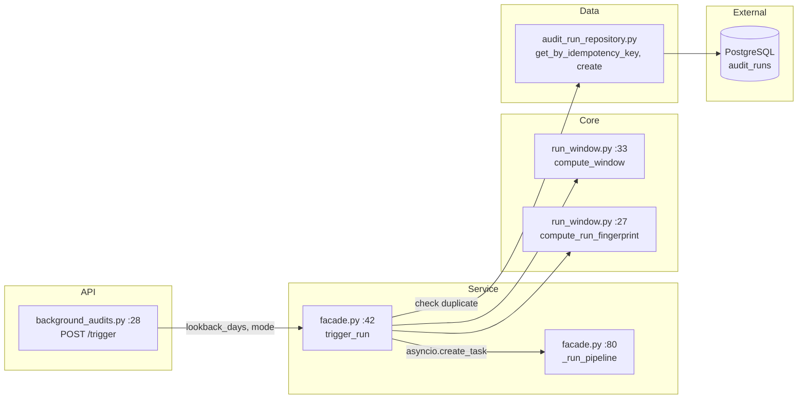
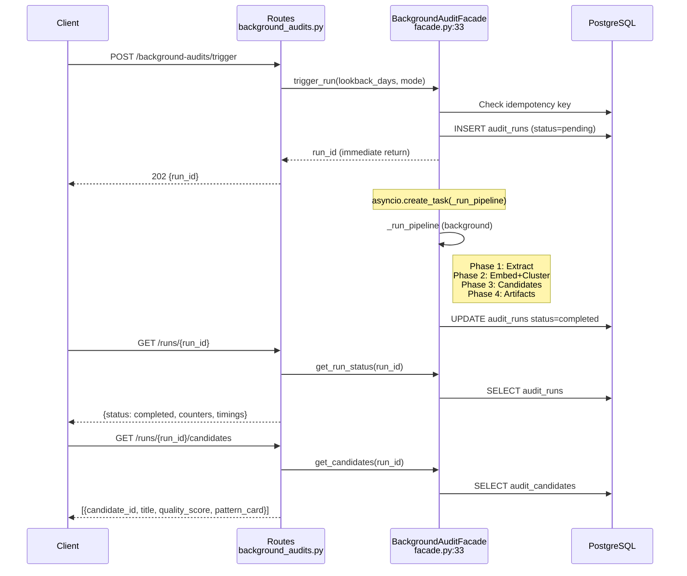

# 01 — Trigger & Facade (Entry Point)

Client hits the API, facade creates an `AuditRun` and spawns the background pipeline.

## Component Diagram

## Files Involved

| File | Lines | Key | Line |
|------|-------|-----|------|
| `app/api/routes/background_audits.py` | 79 | `trigger_run` endpoint | 28 |
| `app/services/background_audit/facade.py` | 231 | `BackgroundAuditFacade` class | 37 |
| | | `trigger_run()` | 65 |
| | | `_run_pipeline()` | 103 |
| | | `_build_agent_tools()` → returns `(tools, schema_docs)` | 205 |
| `app/core/background_audit/run_window.py` | 47 | `RunWindow` dataclass | 12 |
| | | `generate_run_id()` | 20 |
| | | `compute_window()` | 33 |
| | | `compute_run_fingerprint()` | 27 |
| `app/data/db/repositories/audit_run_repository.py` | — | `get_by_idempotency_key`, `update_status` | — |
| `app/data/db/models/audit_run.py` | 62 | `AuditRun` model | 34 |

## What Happens

1. Client sends `POST /trigger {lookback_days: 7}`
2. `trigger_run()` computes a `RunWindow` and idempotency key
3. Checks DB for duplicate — returns existing `run_id` if found
4. Creates `AuditRun` record (status=`"pending"`)
5. Spawns `_run_pipeline()` as background task via `asyncio.create_task`
6. Returns `run_id` immediately (HTTP 202)

`_run_pipeline` then calls 4 components sequentially: extract → embed_cluster → candidates → artifacts.

**Schema injection**: `_build_agent_tools()` builds a live schema description from the DB using `build_schema_description()` + `build_critical_notes()` and returns it alongside the tools. The schema is injected into the agent's `SYNTHESIS_PROMPT` at runtime, replacing the `## Database Schema (exact columns)` marker.

## Sequence Diagram

