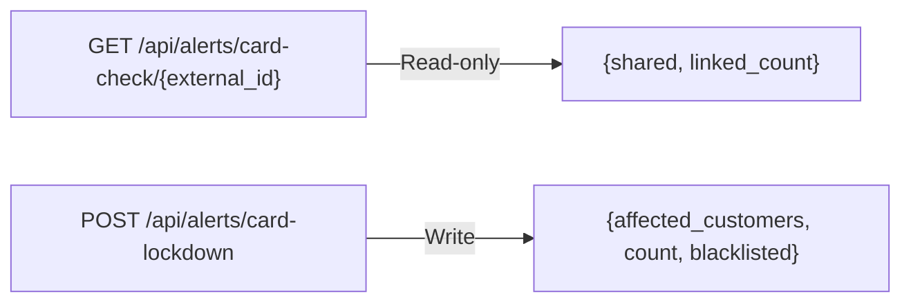

# Card Lockdown — API Contract

Two endpoints on the alerts router.

---

## Endpoints



---

## GET `/api/alerts/card-check/{external_id}`

Check if a customer's card is shared with other accounts.

**Path parameter**: `external_id` (string) — e.g. `"CUST-001"`

**Response** (always 200):
```json
{
  "shared": true,
  "linked_count": 2
}
```

Fallback on any error: `{shared: false, linked_count: 0}`

---

## POST `/api/alerts/card-lockdown`

Execute card lockdown: flag linked customers, blacklist cards, generate alerts.

**Request**:
```json
{
  "customer_id": "CUST-001",
  "risk_score": 0.85
}
```

| Field | Type | Default | Description |
|-------|------|---------|-------------|
| `customer_id` | string | required | External customer ID |
| `risk_score` | float | 0.85 | Risk score attached to generated alerts |

**Response** (success):
```json
{
  "affected_customers": ["CUST-007", "CUST-009"],
  "affected_count": 2,
  "blacklisted_methods": 2
}
```

**Response** (error):
```json
{
  "affected_customers": [],
  "affected_count": 0,
  "blacklisted_methods": 0,
  "error": "Customer not found"
}
```

Always 200 — errors reported in response body, never HTTP error codes.

---

## Frontend Proxies

| Proxy file | Maps to |
|-----------|---------|
| `nexa-fe/server/api/alerts/card-check/[externalId].get.ts` | GET /api/alerts/card-check/{id} |
| `nexa-fe/server/api/alerts/card-lockdown.post.ts` | POST /api/alerts/card-lockdown |
