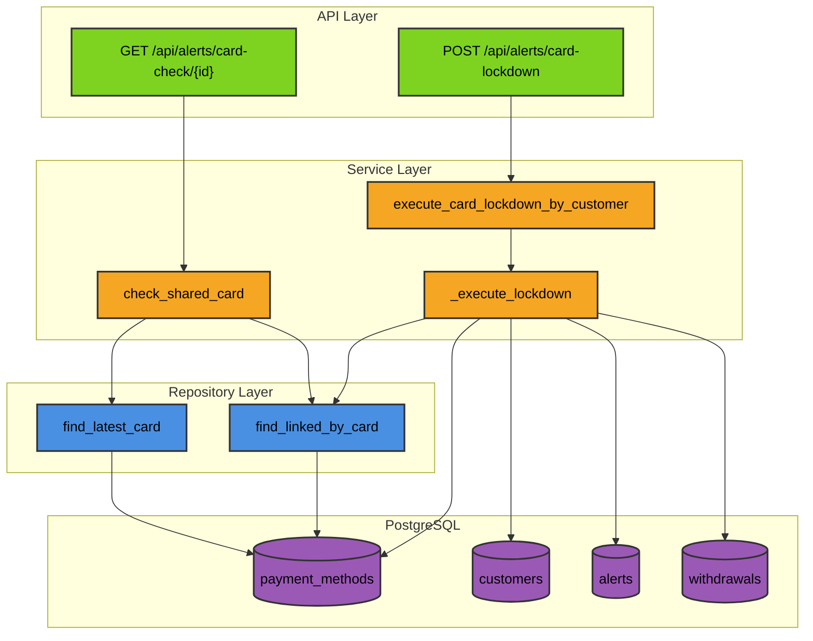
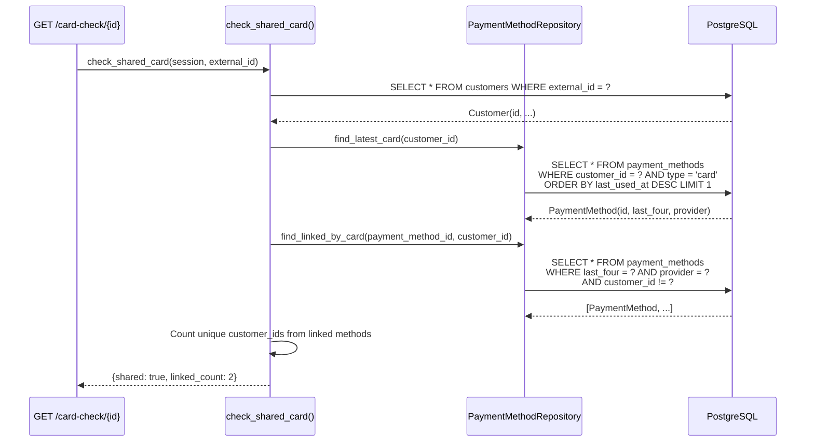
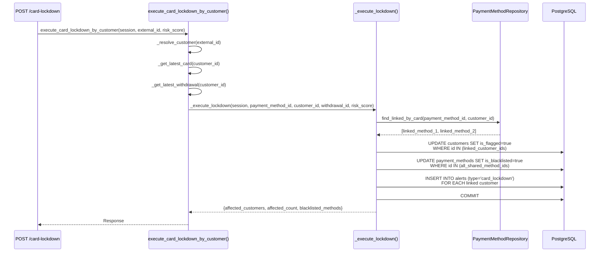
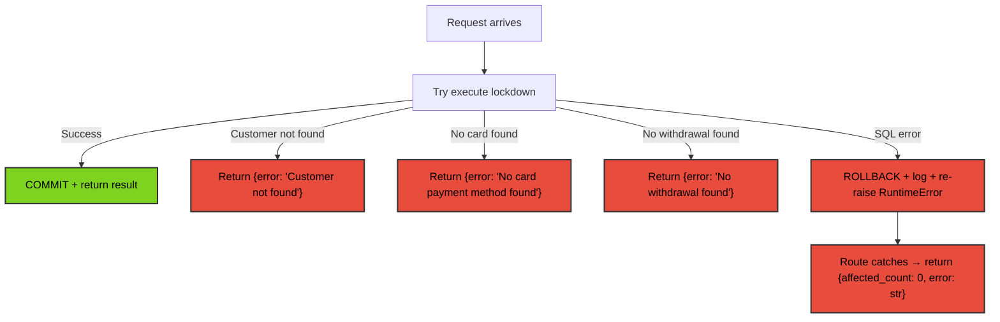

# Card Lockdown — Backend Architecture

Vertical slice: route → service → repository → database.

---

## Layer Diagram



---

## Card Check (Read-Only)



---

## Lockdown Execution (Write Transaction)



---

## Service Functions

| Function | File | Purpose |
|----------|------|---------|
| `check_shared_card()` | `card_lockdown_service.py:22` | Read-only: count linked accounts |
| `execute_card_lockdown_by_customer()` | `card_lockdown_service.py:40` | Entry point: resolve IDs, delegate to lockdown |
| `_resolve_customer()` | `card_lockdown_service.py:67` | Lookup by external_id |
| `_get_latest_card()` | `card_lockdown_service.py` | Most recently used card (type='card', has last_four) |
| `_get_latest_withdrawal()` | `card_lockdown_service.py` | Most recent withdrawal request |
| `_execute_lockdown()` | `card_lockdown_service.py` | Atomic: find linked → flag → blacklist → alert → commit |
| `_flag_customers()` | `card_lockdown_service.py` | UPDATE customers SET is_flagged=true |
| `_blacklist_methods()` | `card_lockdown_service.py` | UPDATE payment_methods SET is_blacklisted=true |
| `_create_alerts()` | `card_lockdown_service.py` | INSERT card_lockdown alerts per linked customer |

## Repository Method

```
find_linked_by_card(payment_method_id, exclude_customer_id) → list[PaymentMethod]
```

| Step | What |
|------|------|
| 1 | Fetch source payment method → extract `last_four` + `provider` |
| 2 | Query all payment methods with matching `last_four` AND `provider` AND different customer |
| 3 | Expunge from session, return detached list |
| 4 | If source has null `last_four` → return empty list (non-card method) |

---

## Error Handling



- All-or-nothing atomicity — no partial commits
- Route layer catches all exceptions, never exposes stack traces
- Error responses use same schema with `error` field added
