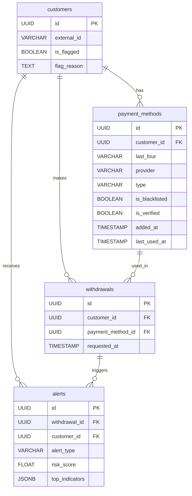
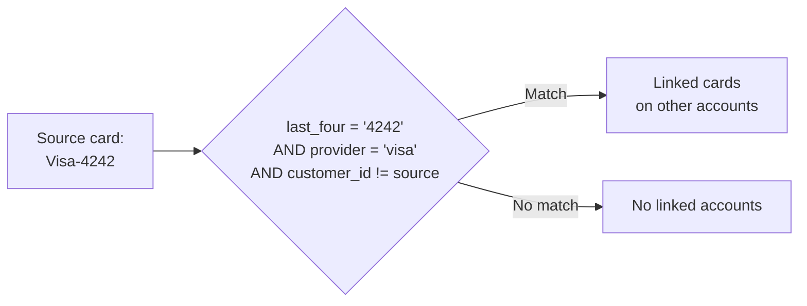
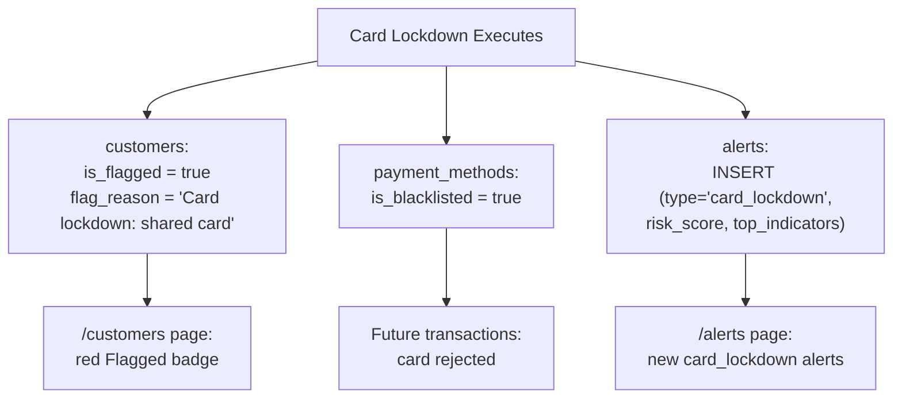

# Card Lockdown — Data Model

Database tables, match criteria, and seed data for the card lockdown feature.

---

## Tables Involved



---

## Card Match Criteria



| Decision | Rationale |
|----------|-----------|
| Match on `last_four` + `provider` | Same card across accounts |
| Not just `last_four` | Different providers can share last 4 digits |
| Not full PAN | PCI compliance — only last 4 stored |
| Exclude source customer | Source is already blocked/escalated |

---

## What Gets Modified



---

## Seed Data: Shared Card Pairs

3 pairs of fraud-tier customers share the same card:

| Pair | Customer A | Customer B | Shared Card | Fraud Type |
|------|-----------|-----------|-------------|------------|
| 1 | CUST-011 (Victor) | CUST-012 (Sophie) | Visa-1111 | Device sharing + card testing |
| 2 | CUST-013 (Ahmed) | CUST-014 (Fatima) | Visa-4444 | Fraud ring (device + IP + recipient + card) |
| 3 | CUST-015 (Carlos) | CUST-016 (Nina) | Visa-6677 | Velocity abuse + impossible travel |

All 6 customers have pending withdrawals with `is_fraud=True`.

### Verify After Seeding

```sql
-- Should show 3 rows with count=2 each
SELECT last_four, provider, COUNT(DISTINCT customer_id) AS customers
FROM payment_methods
WHERE last_four IS NOT NULL
GROUP BY last_four, provider
HAVING COUNT(DISTINCT customer_id) > 1;
```

---

## Audit Trail

| What | Where | Immutable? |
|------|-------|------------|
| Flagged customers | `customers.is_flagged` + `flag_reason` | flag_reason not modified after lockdown |
| Blacklisted cards | `payment_methods.is_blacklisted` | Append-only state change |
| Generated alerts | `alerts` table (type = `card_lockdown`) | Append-only, never deleted |
| Original withdrawal | `alerts.withdrawal_id` FK | Links back to triggering event |

---

## Security

| Concern | Mitigation |
|---------|-----------|
| PCI compliance | Only `last_four` + `provider` stored and matched |
| Partial state | Atomic transaction — all-or-nothing commit |
| Audit immutability | Alerts append-only, flag_reason immutable |
| Authorization | Demo mode (no auth). Production: restrict POST to compliance officers |
