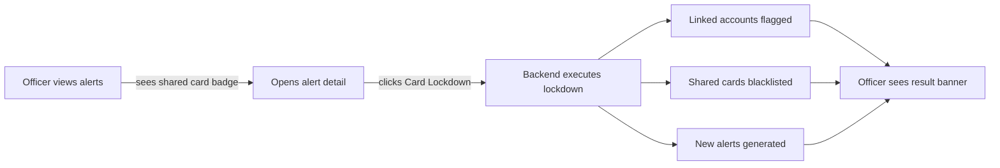
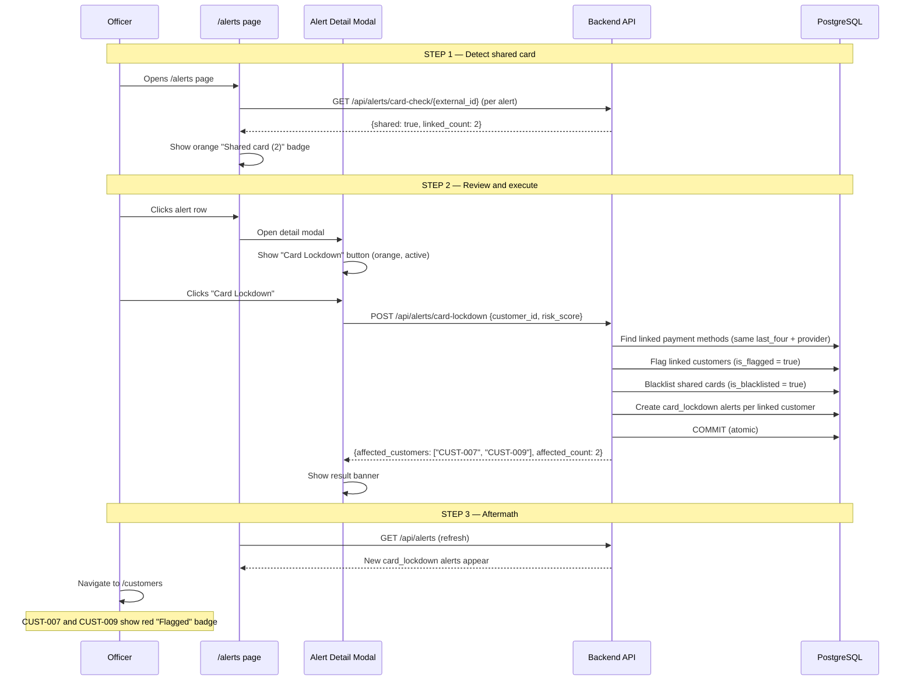
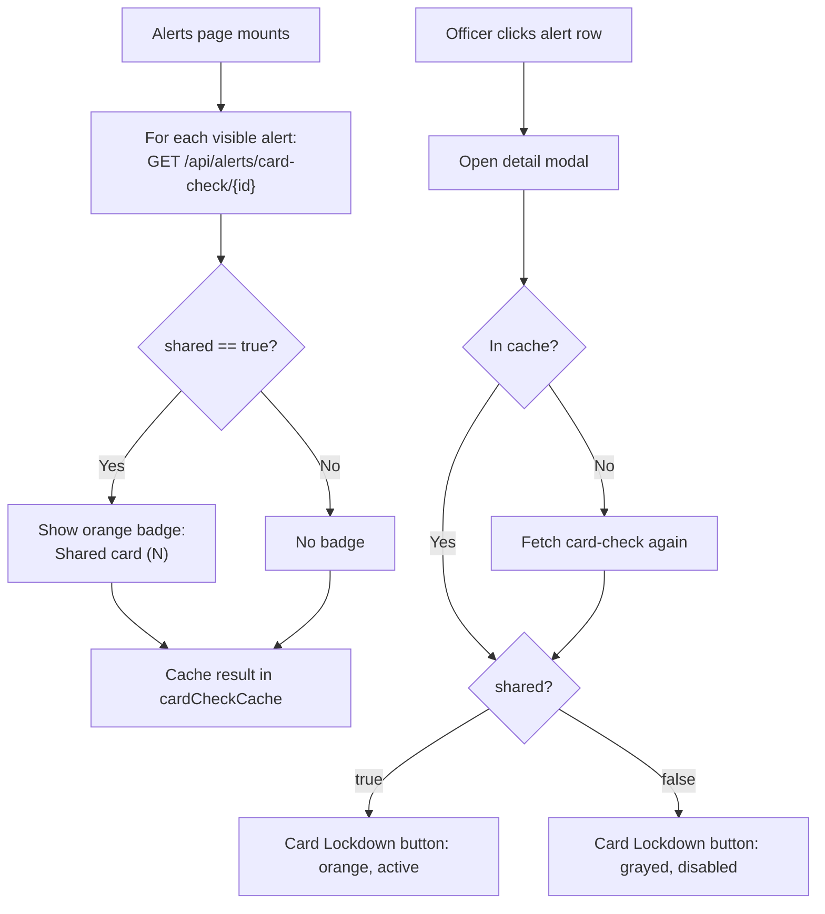
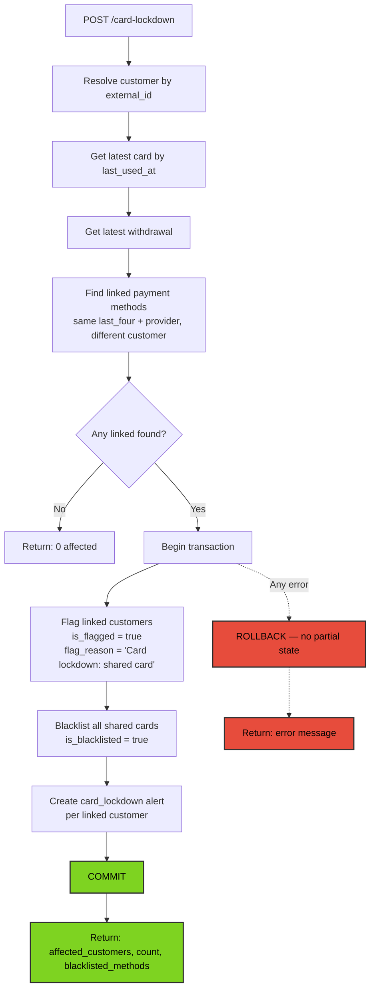
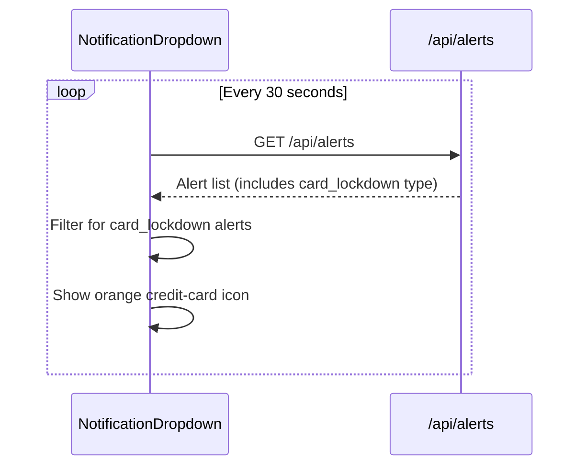
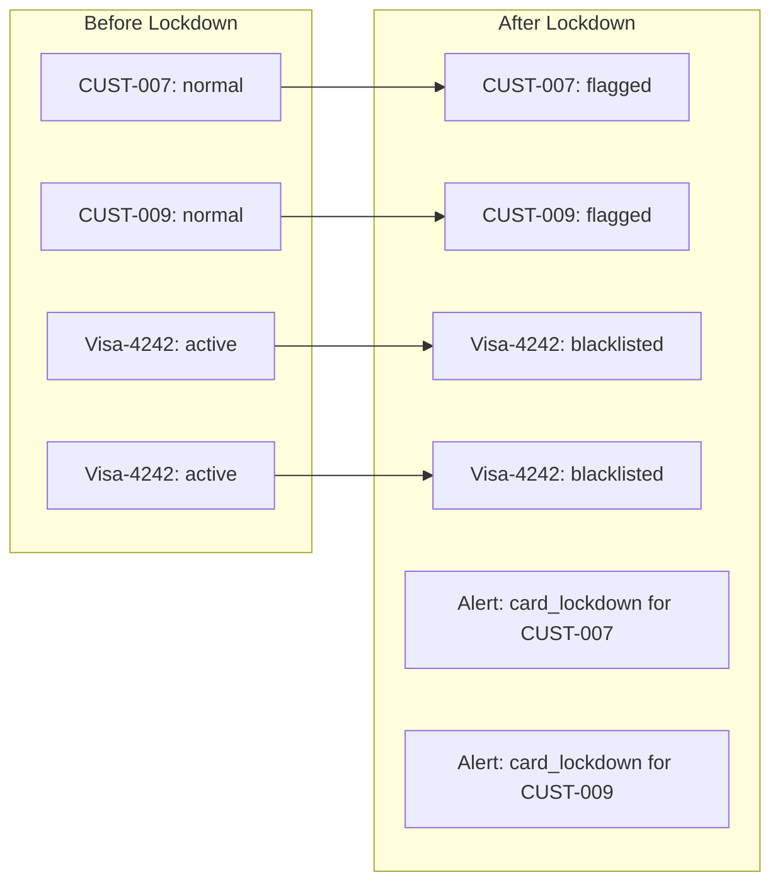

# Card Lockdown — Workflow

How officers detect and lock down shared cards across accounts.

---

## High-Level Flow

---

## Officer Walkthrough

---

## Card Check Flow (Badge Detection)

---

## Lockdown Execution (Atomic Transaction)

---

## Notification Flow

---

## Post-Lockdown State

