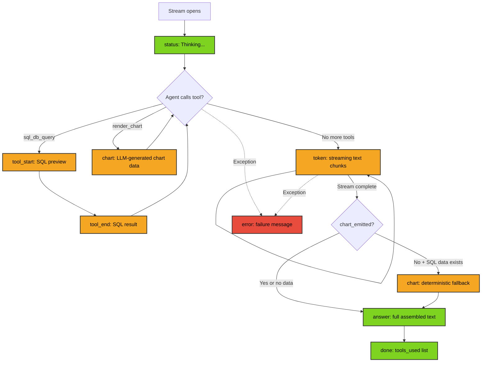
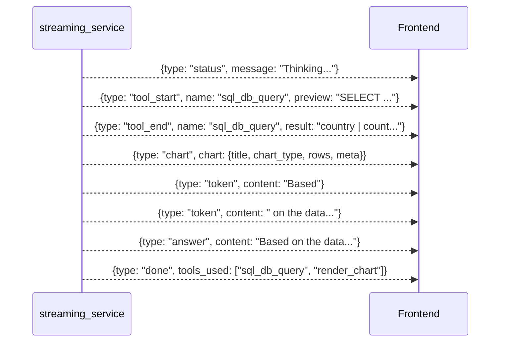
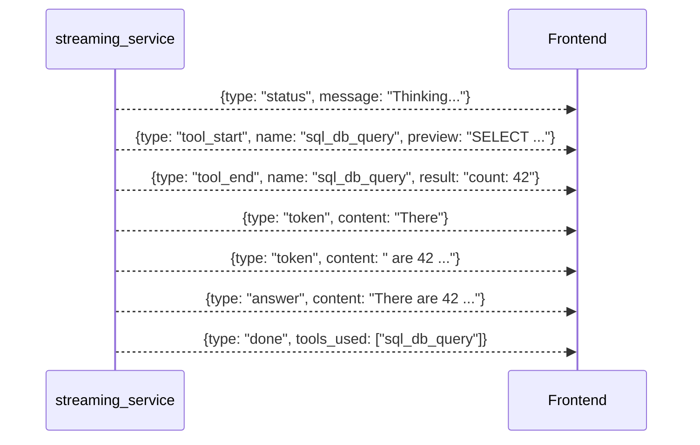
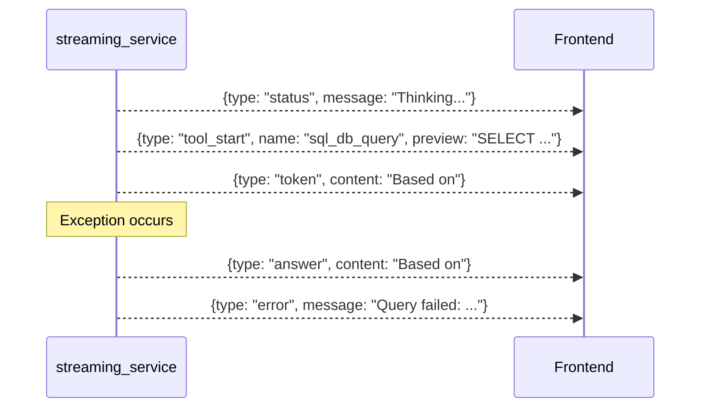
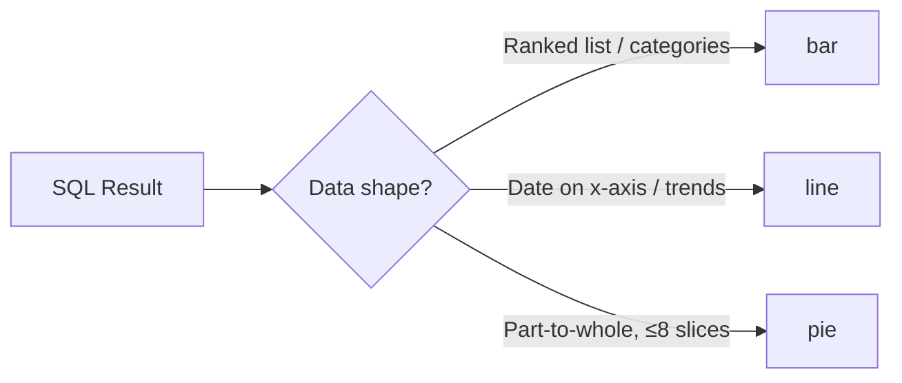
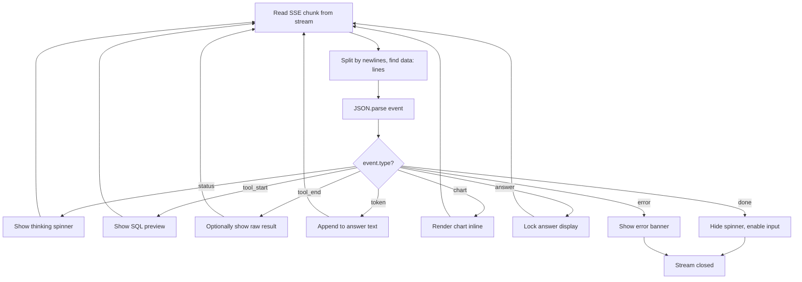

# SSE Event Contract

Server-Sent Events emitted by `POST /api/query/chat`.

**Format**: `data: {"type": "event_type", ...payload...}\n\n`

---

## Event Lifecycle

**Green** = always emitted | **Orange** = conditional | **Red** = error path

---

## Event Sequence (Typical Query with Chart)

---

## Event Sequence (Text-Only, No Chart)

---

## Event Sequence (Error with Partial Answer)

---

## Event Types Reference

### `status`

Emitted immediately on stream open.

| Field | Type | Example |
|-------|------|---------|
| `type` | `"status"` | `"status"` |
| `message` | `string` | `"Thinking..."` |

**Client**: Show thinking spinner, disable input.

### `tool_start`

Agent begins a tool call (SQL query or chart render).

| Field | Type | Example |
|-------|------|---------|
| `type` | `"tool_start"` | `"tool_start"` |
| `name` | `string` | `"sql_db_query"` |
| `preview` | `string` (max 500 chars) | `"SELECT country, COUNT(*)..."` |

**Client**: Show SQL preview / loading indicator.

### `tool_end`

Tool call returns a result.

| Field | Type | Example |
|-------|------|---------|
| `type` | `"tool_end"` | `"tool_end"` |
| `name` | `string` | `"sql_db_query"` |
| `result` | `string` (max 2000 chars) | `"country \| count\nUS \| 45"` |

**Client**: Optionally display raw results, prepare for chart.

### `token`

LLM streams a text chunk (token-by-token).

| Field | Type | Example |
|-------|------|---------|
| `type` | `"token"` | `"token"` |
| `content` | `string` | `"Based"` |

**Client**: Append to answer text in real-time.

### `chart`

Chart data ready for rendering. Two sources:

| Source | `meta.reason` | When |
|--------|--------------|------|
| LLM tool call | `"llm_tool_call"` | Agent explicitly calls `render_chart` |
| Deterministic fallback | `"deterministic"` | Post-stream, SQL data is chartable but LLM didn't chart |

**Payload schema**:

| Field | Type | Description |
|-------|------|-------------|
| `type` | `"chart"` | |
| `chart.title` | `string` (max 60) | Chart title |
| `chart.chart_type` | `"bar" \| "line" \| "pie"` | Visualization type |
| `chart.x_key` | `string` | Row key for x-axis labels |
| `chart.series` | `Array<{key, label}>` | Metrics to plot |
| `chart.rows` | `Array<Record<string, number \| string>>` | 1-100 data points |
| `chart.meta` | `{reason, confidence, source}` | Generation metadata |

**Chart type selection**:

**Client**: Parse config, extract labels from `rows[*][x_key]`, plot each series, render inline.

### `answer`

Full assembled answer text (concatenation of all tokens).

| Field | Type | Example |
|-------|------|---------|
| `type` | `"answer"` | `"answer"` |
| `content` | `string` | `"Based on the data, the US leads..."` |

**Client**: Lock answer display, finalize formatting.

### `done`

Stream complete, no more events.

| Field | Type | Example |
|-------|------|---------|
| `type` | `"done"` | `"done"` |
| `tools_used` | `string[]` | `["sql_db_query", "render_chart"]` |

**Client**: Hide spinner, enable input, log telemetry.

### `error`

Stream failed (may follow partial `answer`).

| Field | Type | Example |
|-------|------|---------|
| `type` | `"error"` | `"error"` |
| `message` | `string` | `"Query failed: Column 'x' does not exist"` |

**Client**: Show error banner, optionally retry with modified question.

---

## Client Receiver Workflow

---

## Performance

| Metric | Value |
|--------|-------|
| Time to first `token` | ~2.9s |
| Time between tokens | 50-100ms |
| Total stream duration | 3-5s |
| Max events per stream | ~50-100 |
