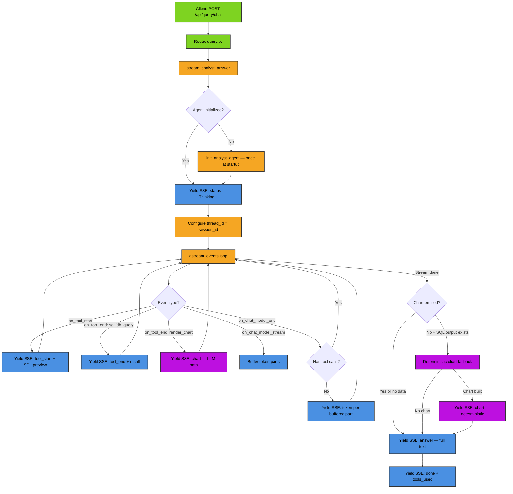
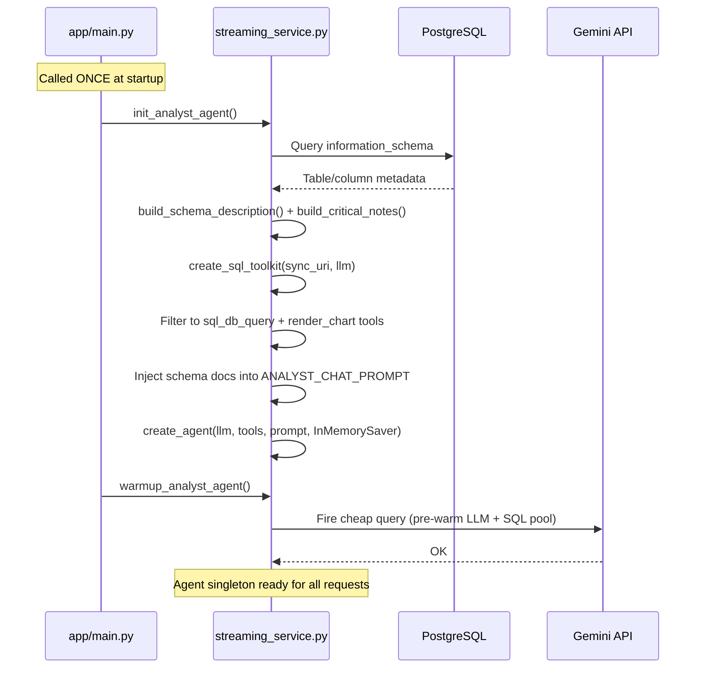
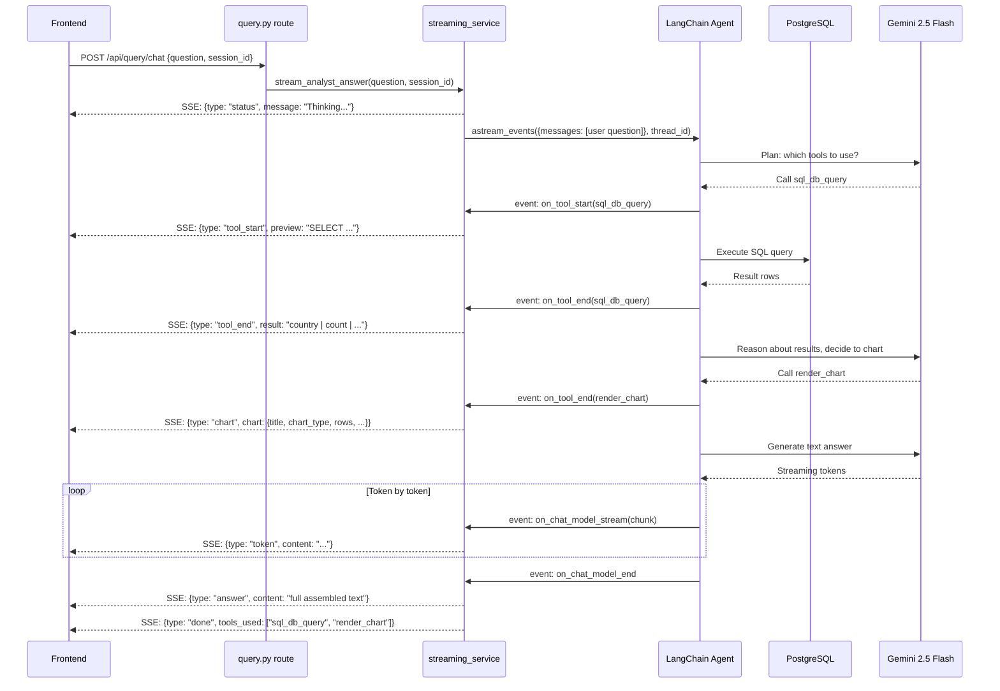
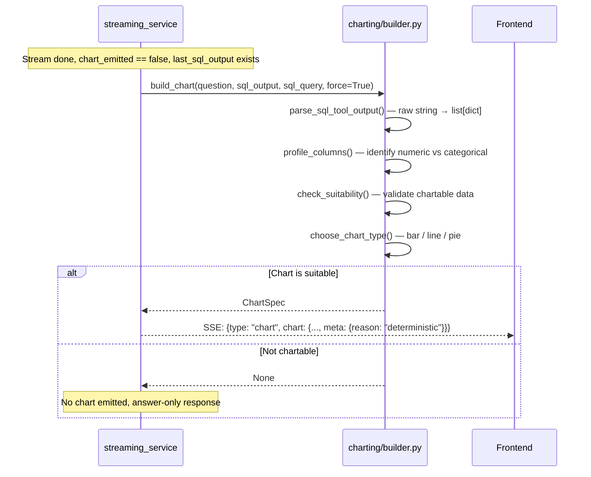
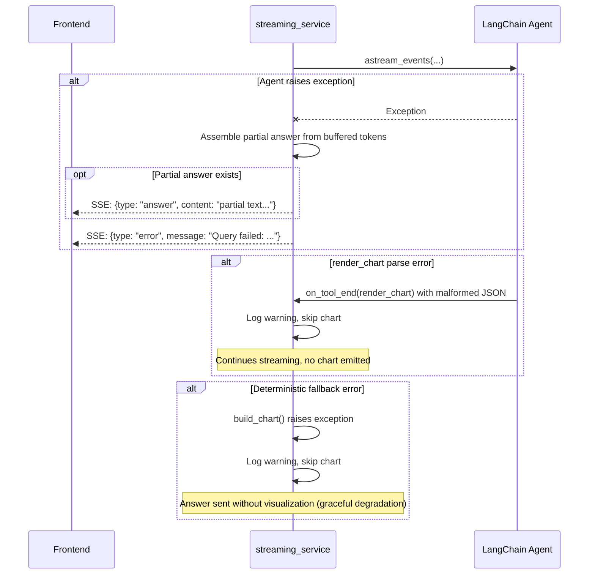
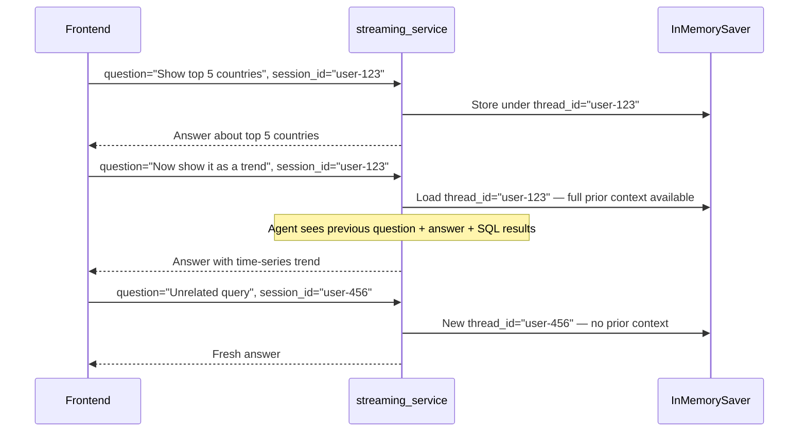

# Analyst Chat: Streaming Flow

Complete client-to-API-to-client flow with chart generation.

## High-Level Workflow

---

## Agent Initialization (Singleton)

**Key decisions**:
- Schema is pre-injected into prompt (saves ~2s per query by avoiding `sql_db_schema` / `sql_db_list_tables` tool calls)
- Only `sql_db_query` + `render_chart` tools exposed
- `InMemorySaver` checkpointer preserves conversation history server-side via `thread_id`

---

## Streaming Request (Happy Path — with Chart)

---

## Deterministic Chart Fallback

---

## Error Handling Flow

---

## History Management

Multi-turn conversations work seamlessly. No client-side history needed.

---

## Key Files

| File | Purpose |
|------|---------|
| `app/api/routes/query.py` | Route handler, returns `StreamingResponse` |
| `app/services/chat/streaming_service.py` | `init_analyst_agent()` singleton + `stream_analyst_answer()` SSE generator |
| `app/agentic_system/prompts/analyst_chat.py` | System prompt template |
| `app/agentic_system/tools/sql/schema_builder.py` | Live schema generation from `information_schema` |
| `app/agentic_system/tools/sql/toolkit.py` | SQL toolkit factory + tool filtering |
| `app/agentic_system/tools/chart_tool.py` | `render_chart` tool for LLM |
| `app/services/chat/charting/builder.py` | Deterministic chart builder fallback |
| `nexa-fe/pages/query.vue` | Frontend SSE receiver + chart renderer |

## Performance (Feb 2026)

| Phase | Duration | % of Total |
|-------|----------|-----------|
| Agent planning + tool selection | 0.2s | 5% |
| SQL execution | 2.4s | 65% |
| LLM reasoning + streaming | 0.8s | 22% |
| Chart generation (if applicable) | 0.3s | 8% |
| **TOTAL** | **3.7s** | **100%** |

**TTFT**: ~2.9s | **Throughput**: 1.1 tokens/sec | **Accuracy**: 100% (12/12 stress tests)
