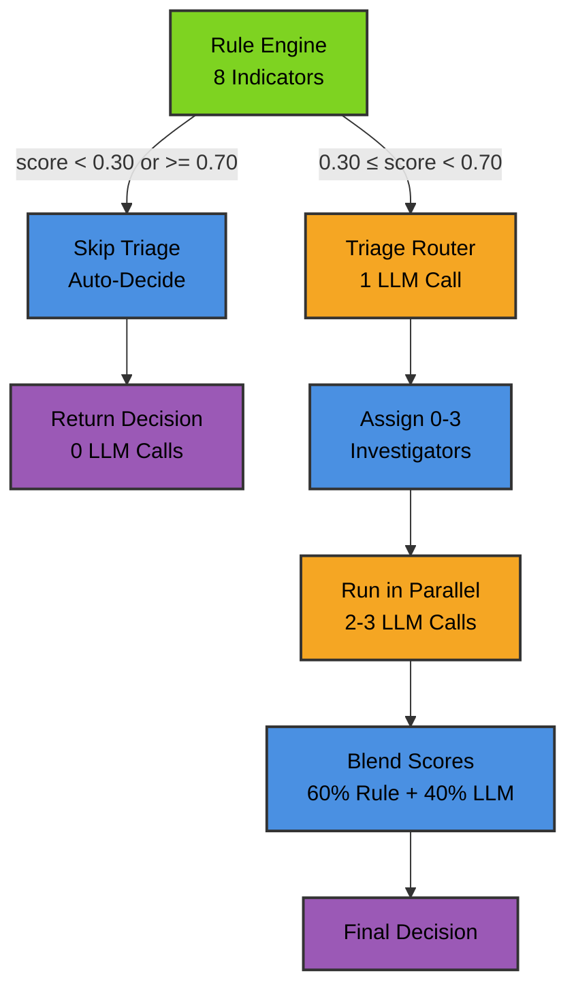
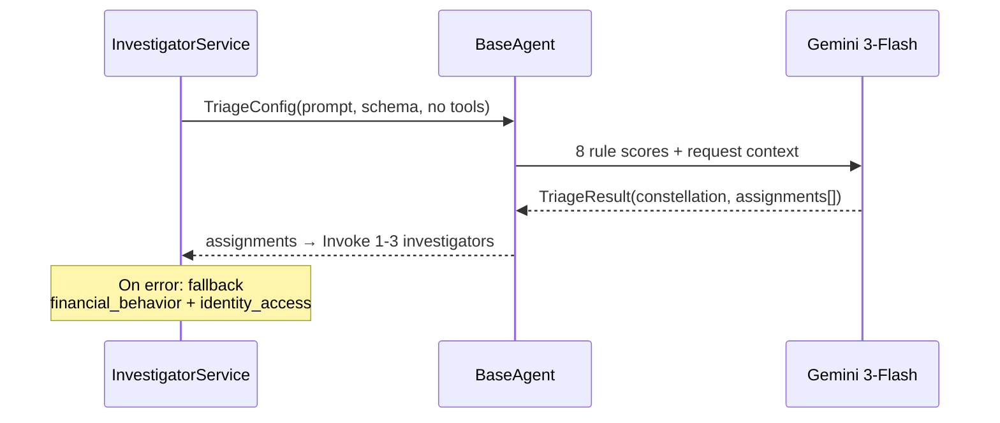
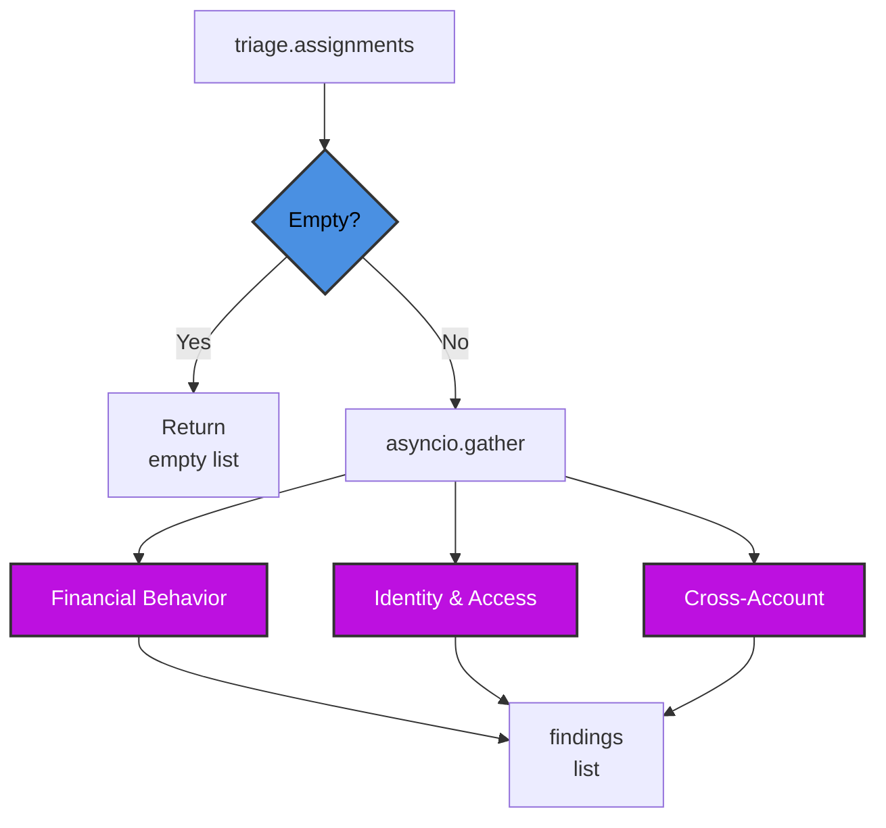

# Agentic System — Triage Router & Investigators

Two-stage LLM pipeline that reads rule engine scores as a "constellation" and dispatches 0-3 targeted investigators to analyze suspicious payout requests.

## Two-Stage Architecture



## Triage Router

Reads 8 rule engine scores as a cross-signal pattern and assigns 0-3 investigators based on suspected fraud type.

### Sequence Diagram



### Configuration

| Parameter | Value |
|-----------|-------|
| Model | `gemini-3-flash-preview` |
| Thinking | `low` |
| Max tokens | 512 |
| Tools | None (read-only) |
| Timeout | 25s |

## Constellation Patterns

Triage router detects these 6 fraud patterns and assigns investigators accordingly:

| Pattern | Rule Signals | Assigns | Fraud Type |
|---------|-------------|---------|------------|
| **All clean** | All scores ≈ 0 | 0 | None (auto-approve) |
| **Isolated anomaly** | 1 elevated, rest clean | 0-1 | Benign spike |
| **New everything** | New account + device + payment + low trading | financial_behavior + cross_account | Money mule |
| **Deposit & Run** | Low trading + high amount + new account | financial_behavior | No-trade withdrawal |
| **Account Takeover** | New device + new IP + established account | identity_access | Hijack |
| **Shared infrastructure** | Shared device/IP signals elevated | cross_account | Fraud ring |

## Investigator Execution

Assigned investigators run in parallel via `asyncio.gather`, each with hypothesis-driven SQL access.

### Dispatch Flowchart



### Per-Investigator Configuration

| Parameter | Triage | Investigators |
|-----------|--------|----------------|
| Model | gemini-3-flash-preview | gemini-3-flash-preview |
| Thinking | low | low |
| Max tokens | 512 | 512 |
| Max iterations | — | 2 |
| Tools | None | sql_db_query only |
| Timeout | 25s | 25s |
| Prompt enrichment | — | constellation + rule scores |

## Investigator Roles

All investigators have **scoped DB access** (11 fraud tables) and output **structured InvestigatorResult**.

### Financial Behavior

**File**: `app/agentic_system/prompts/investigators/financial_behavior.py`

| Aspect | Details |
|--------|---------|
| **Detects** | Deposit & Run, bonus abuse, structuring |
| **Key signals** | `total_deposits ≈ total_withdrawals`, `trade_count = 0 or low`, short deposit-to-withdrawal time |
| **DB tables** | customers, transactions, trades, withdrawals, payment_methods |
| **SQL strategy** | Compare deposit total vs withdrawal vs trade volume; check timing |

### Identity & Access

**File**: `app/agentic_system/prompts/investigators/identity_access.py`

| Aspect | Details |
|--------|---------|
| **Detects** | Account takeover, impossible travel, session hijacking |
| **Key signals** | New device + new IP on established account, VPN mismatches |
| **DB tables** | customers, devices, ip_history, withdrawals |
| **SQL strategy** | Device trust history, IP location jumps, withdrawal device/IP compare to baseline |
| **De-escalation** | Consistent VPN usage over months, trusted device despite IP mismatch = benign |

### Cross-Account

**File**: `app/agentic_system/prompts/investigators/cross_account.py`

| Aspect | Details |
|--------|---------|
| **Detects** | Fraud rings, money mules, coordinated timing |
| **Key signals** | Same device/IP on multiple accounts, withdrawal to same recipient, rapid cycles |
| **DB tables** | customers, devices, ip_history, withdrawals, payment_methods |
| **SQL strategy** | Find other customers sharing device/IP; check recipient patterns; look for coordinated timing |

## Structured Output Schemas

All schemas defined in `app/agentic_system/schemas/triage.py`.

### TriageResult

```
constellation_analysis: str (max_length=500)
assignments: list[InvestigatorAssignment]  # 0-3
```

| Field | Meaning |
|-------|---------|
| `constellation_analysis` | 1-2 sentence cross-signal pattern summary |
| `assignments` | Empty list = all clear, no investigation |

### InvestigatorAssignment

```
investigator: "financial_behavior" | "identity_access" | "cross_account"
priority: "high" | "medium" | "low" (reserved for future)
```

### InvestigatorResult

```
investigator_name: str
score: float (0.0 = safe, 1.0 = high risk)
confidence: float (0.0 = uncertain, 1.0 = highly confident)
reasoning: str (max_length=300, 2-3 sentences)
evidence: dict[str, object]  # Structured query results
```

## Design Principles

- **Scoped DB Access**: 11 fraud tables only (prevents schema overhead, improves query accuracy)
- **Single Tool**: Only `sql_db_query` (no schema/list/checker tools, reduces LLM round-trips by ~50%)
- **Hypothesis-Driven**: Triage constellation enriches each investigator's prompt (targets specific pattern)
- **Concise Output**: Hard length limits on all LLM fields (clarity + token efficiency)
- **0-3 Flexibility**: Triage can assign 0-3 investigators based on pattern; fallback on error = 2 (financial_behavior + identity_access)

## Key Files

| File | Role |
|------|------|
| `app/agentic_system/schemas/triage.py` | TriageResult, InvestigatorAssignment, InvestigatorResult |
| `app/agentic_system/prompts/triage.py` | Triage router constellation prompt |
| `app/agentic_system/prompts/investigators/*.py` | 3 investigator prompts (financial_behavior, identity_access, cross_account) |
| `app/agentic_system/base_agent.py` | BaseAgent class + AgentConfig (LangChain + Gemini wrapper) |
| `app/agentic_system/tools/sql/toolkit.py` | SQL tool factory (scoped to 11 fraud tables) |
| `app/services/fraud/investigator_service.py` | Pipeline orchestrator (lines 76-251) |
| `app/services/fraud/internals/tools.py` | Tool factory for services layer |

## Performance

| Stage | Latency | LLM Calls |
|-------|---------|-----------|
| Rule Engine | ~50ms | 0 |
| Triage (skipped) | 0ms | 0 |
| Triage (run) | ~1.5s | 1 |
| Investigators (avg) | ~8-10s | 1.8 |
| **Clean traffic (56%)** | **~0.14s** | **0** |
| **Suspicious traffic (44%)** | **~12.1s** | **2-3** |
| **Blended (80/20)** | **~2.8s** | — |

See `scripts/CLAUDE.md` for full 16-customer benchmark.
