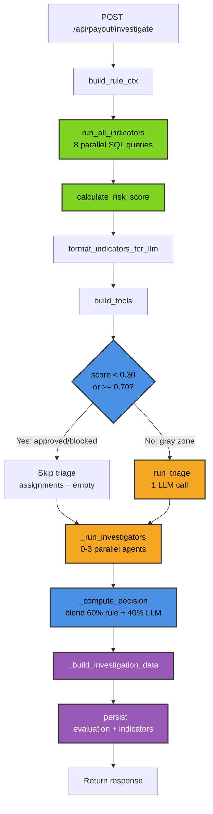
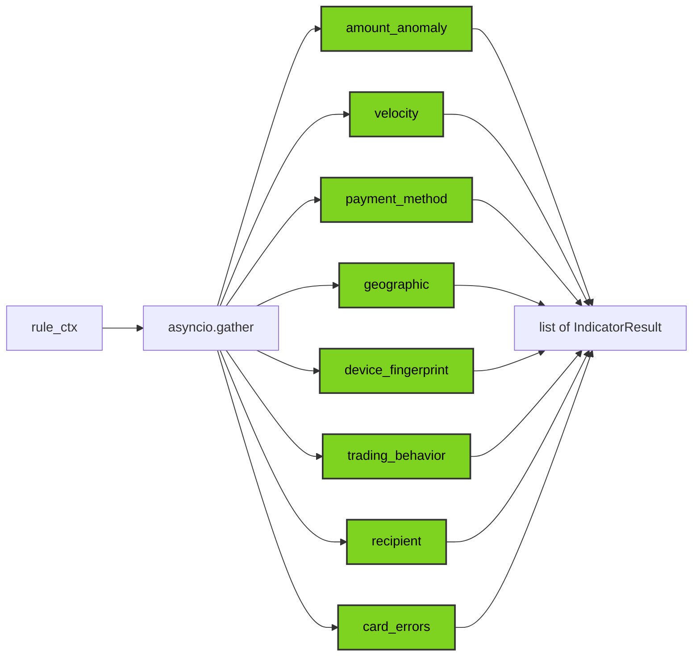
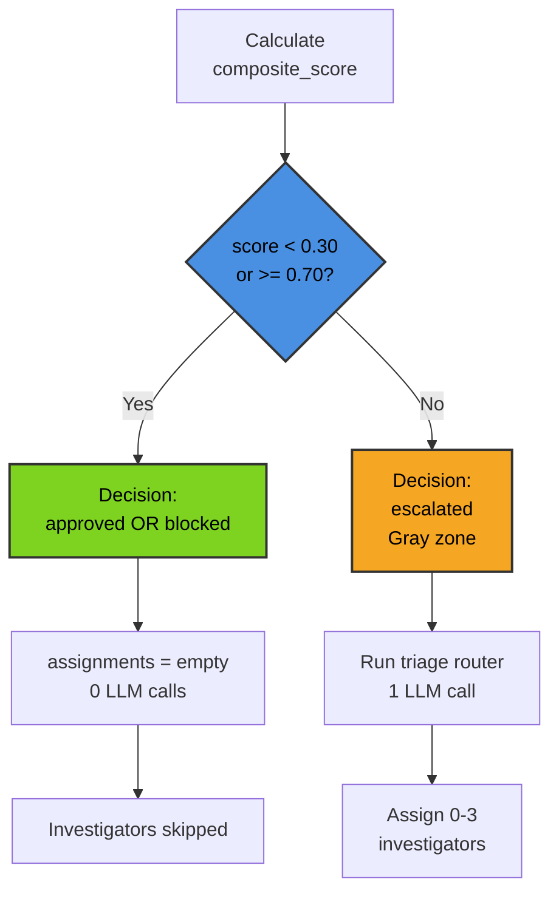
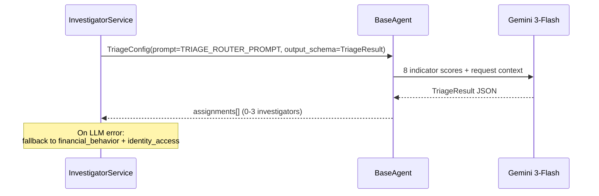
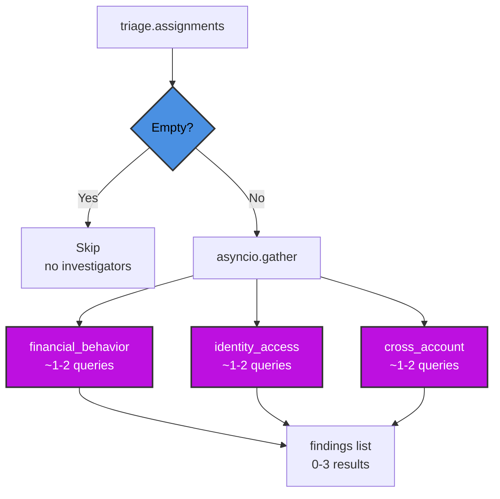
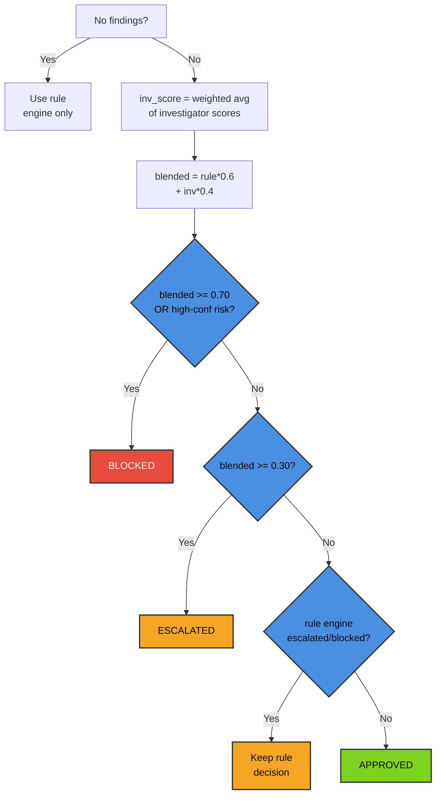
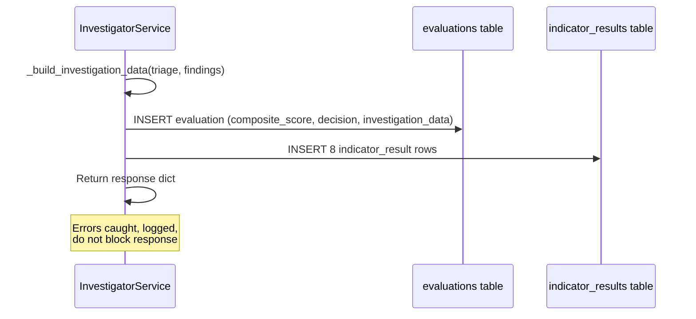

# Investigator Pipeline

End-to-end flow orchestrating rule engine, triage skip gate, optional LLM analysis, and blended scoring.

## End-to-End Pipeline



Entry point: `app/services/fraud/investigator_service.py:76`

## Rule Engine (50ms)

Eight SQL-based indicators run in parallel to compute composite risk score.

### Parallel Indicators



### Indicator Weights

| Indicator | Weight | Why |
|-----------|--------|-----|
| trading_behavior | 1.5 | Deposit & run = #1 fraud pattern |
| device_fingerprint | 1.3 | Cross-account device sharing |
| geographic | 1.2 | Impossible travel, VPN mismatches |
| card_errors | 1.2 | Card testing patterns |
| amount_anomaly | 1.0 | Baseline |
| velocity | 1.0 | Baseline |
| payment_method | 1.0 | Baseline |
| recipient | 1.0 | Baseline |

### Scoring Formula

```
composite = Σ(score × weight) / Σ(weight)
```

**Override rules**:
- Any 1 indicator ≥ 0.7 + confidence ≥ 0.8 → force `escalated`
- 4+ indicators ≥ 0.6 + confidence ≥ 0.8 → force `blocked`

**Performance**: ~50ms for all 8 indicators.

## Triage Skip Gate

The single most impactful optimization: skips all LLM calls for obvious cases.

### Branch Decision



**Impact**: 56% of traffic (clean cases) skips to response in **0.14s** with 0 LLM calls.

## Triage Router (1.5s)

Reads 8 rule engine scores as a "constellation" pattern and assigns 0-3 targeted investigators.

### Sequence Diagram



### Triage Configuration

| Parameter | Value |
|-----------|-------|
| Model | `gemini-3-flash-preview` |
| Thinking | `low` |
| Max tokens | 512 |
| Tools | None |
| Timeout | 25s |

### Constellation Patterns

| Pattern | Rule Signals | Assigns | Type |
|---------|-------------|---------|------|
| **All clean** | All ≈ 0 | 0 | None |
| **Isolated anomaly** | 1 high, rest clean | 0-1 | Benign |
| **New everything** | New account + device + payment + low trading | financial_behavior + cross_account | Mule |
| **Deposit & Run** | Low trading + high amount | financial_behavior | No-trade withdrawal |
| **Account Takeover** | New device + IP + established account | identity_access | Hijack |
| **Shared infrastructure** | Shared device/IP signals | cross_account | Fraud ring |

## Investigator Dispatch (10-12s)

0-3 investigators run in parallel, each with hypothesis-driven SQL access.

### Parallel Execution



### Investigator Configuration

| Parameter | Value |
|-----------|-------|
| Model | `gemini-3-flash-preview` |
| Thinking | `low` |
| Max tokens | 512 |
| Max iterations | 2 |
| Tools | sql_db_query only |
| Timeout | 25s |
| Prompt enrichment | constellation + rule scores |

### Investigator Roles

| Name | Prompt | Detects | Tables |
|------|--------|---------|--------|
| **financial_behavior** | `prompts/investigators/financial_behavior.py` | Deposit & run, bonus abuse, structuring | customers, transactions, trades, withdrawals, payment_methods |
| **identity_access** | `prompts/investigators/identity_access.py` | Account takeover, impossible travel, session hijacking | customers, devices, ip_history, withdrawals |
| **cross_account** | `prompts/investigators/cross_account.py` | Fraud rings, money mules, shared infrastructure | customers, devices, ip_history, withdrawals, payment_methods |

**Performance**: ~8-12s per investigator (run in parallel).

## Blended Scoring

Combines rule engine decision with investigator findings via weighted average.

### Decision Logic



**Key rule**: Never downgrade rule engine decision. If rule engine says `blocked` but blended says `approved`, keep `blocked`.

## Persistence

### Investigation Data Structure

Saved to `evaluations.investigation_data` JSONB:

```json
{
  "triage": {
    "constellation_analysis": "string",
    "assignments": [{"investigator": "string", "priority": "string"}],
    "elapsed_s": 3.2
  },
  "investigators": [
    {
      "name": "financial_behavior",
      "score": 0.88,
      "confidence": 0.95,
      "reasoning": "string (max 300 chars)",
      "elapsed_s": 3.1
    }
  ]
}
```

### Sequence Diagram



## Error Recovery

| Failure | Location | Fallback |
|---------|----------|----------|
| **Triage LLM error** | line 152-173 | Assign financial_behavior + identity_access at medium priority |
| **Investigator error** | line 239-251 | Exclude from blending; others proceed |
| **All investigators fail** | line 314-322 | Use rule engine decision only |
| **Persistence error** | line 304-305 | Log and continue (don't block response) |

## Performance Breakdown

### By Traffic Type

| Type | % | Latency | LLM Calls | Path |
|------|---|---------|-----------|------|
| Clean | 56% | **0.14s** | 0 | Rule → skip gate → return |
| Suspicious | 44% | **12.1s** | 2-3 | Rule → triage → investigators → blend |
| Blended (80/20) | — | **~2.8s** | — | Mixed path |

### Suspicious Case Breakdown

| Stage | Latency | LLM Calls |
|-------|---------|-----------|
| Rule engine (lines 80-83) | ~50ms | 0 |
| Triage (line 95) | ~1.5s | 1 |
| Investigators (line 97) | ~10-12s | 2 |
| Decision + persist (lines 101-111) | ~50ms | 0 |
| **Total** | **~12.1s** | **3** |

See `scripts/CLAUDE.md` for full 16-customer benchmark table.

## Configuration

### Model Parameters

| Parameter | Triage | Investigators |
|-----------|--------|---------------|
| Model | gemini-3-flash-preview | gemini-3-flash-preview |
| Thinking | low | low |
| Max tokens | 512 | 512 |
| Max iterations | — | 2 |
| Tools | None | sql_db_query |
| Timeout | 25s | 25s |

### Thresholds

| Threshold | Value | Effect |
|-----------|-------|--------|
| APPROVE | score < 0.30 | Auto-approve, skip triage |
| ESCALATE | 0.30 ≤ score < 0.70 | Gray zone, run triage |
| BLOCK | score ≥ 0.70 | Auto-block, skip triage |
| Blending | 60/40 | Rule engine / investigators |

**File**: `app/core/scoring.py` and `app/services/fraud/investigator_service.py:29-32`

## Key Files

| Layer | File | Role |
|-------|------|------|
| Service | `app/services/fraud/investigator_service.py` | Pipeline orchestrator |
| Indicators | `app/core/indicators/__init__.py` | Rule engine runner (asyncio.gather) |
| Scoring | `app/core/scoring.py` | Risk score calculation |
| Triage | `app/agentic_system/prompts/triage.py` | Constellation analysis prompt |
| Investigators | `app/agentic_system/prompts/investigators/*.py` | 3 investigator prompts |
| Agent | `app/agentic_system/base_agent.py` | LangChain + Gemini wrapper |
| Schemas | `app/agentic_system/schemas/triage.py` | TriageResult, InvestigatorResult |
| Tools | `app/services/fraud/internals/tools.py` | SQL tool factory |
| Persistence | `app/services/fraud/internals/persistence.py` | Build DB models for save |
