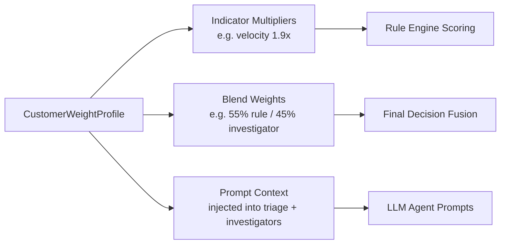
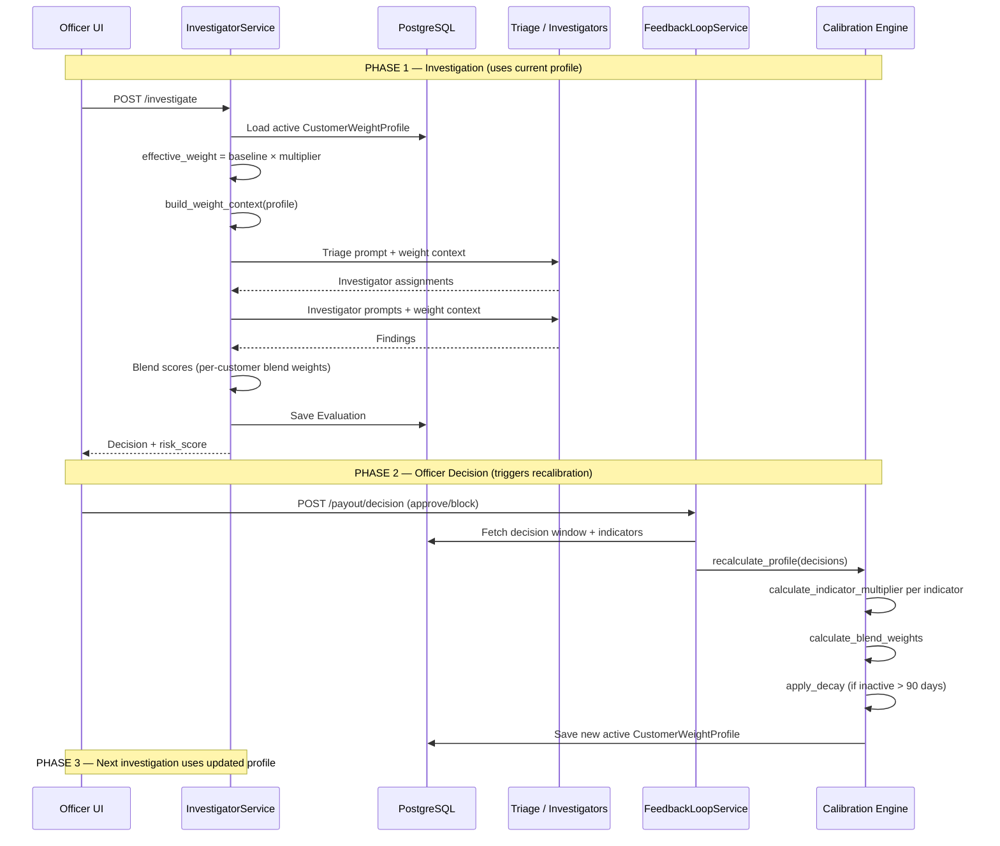
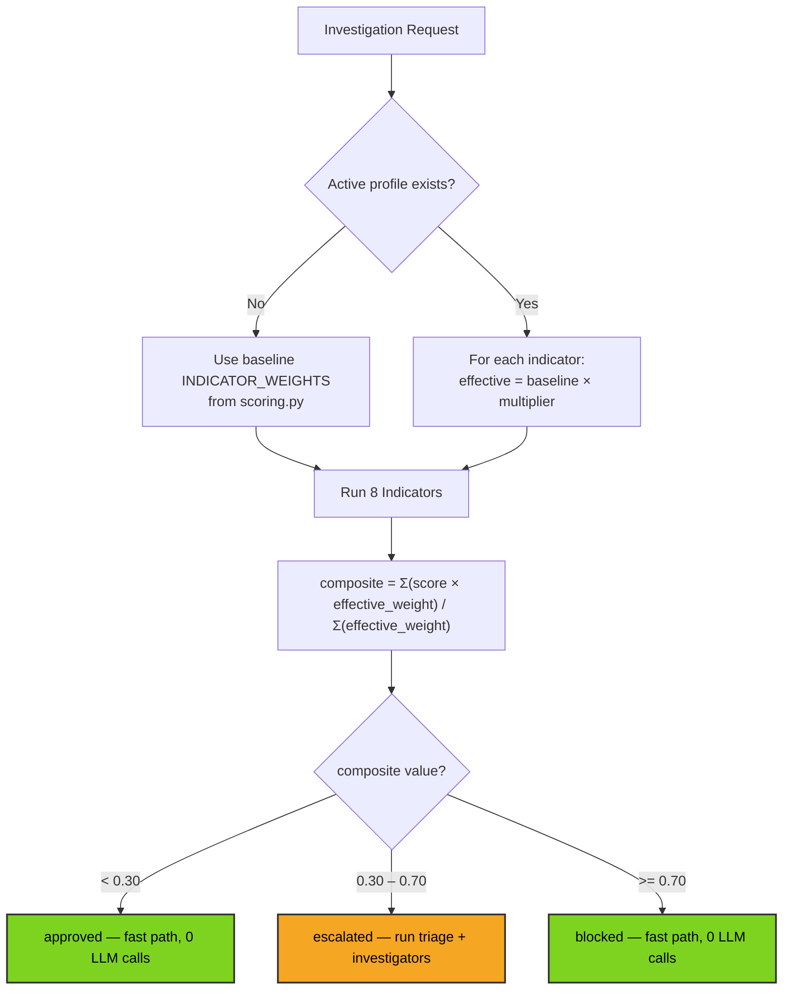
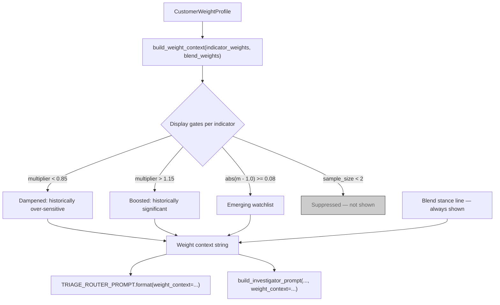
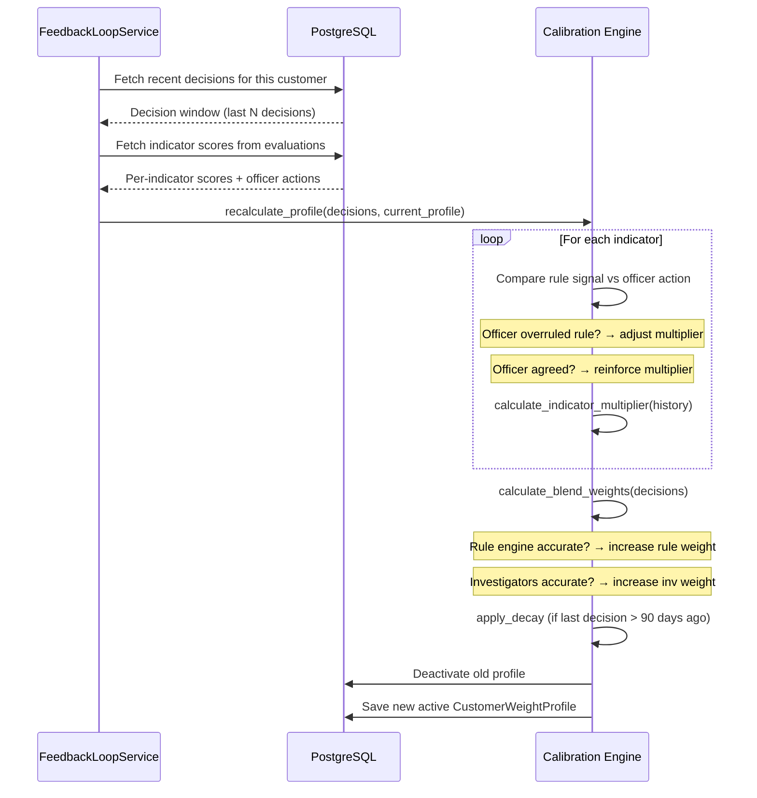
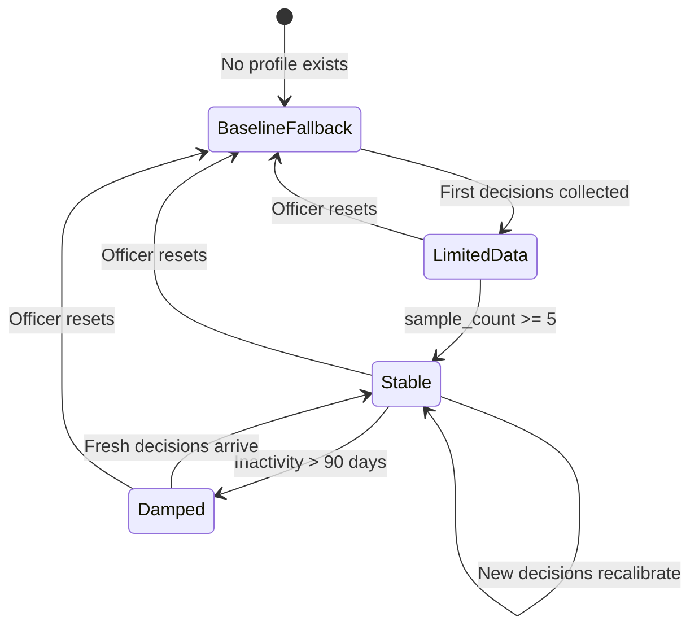
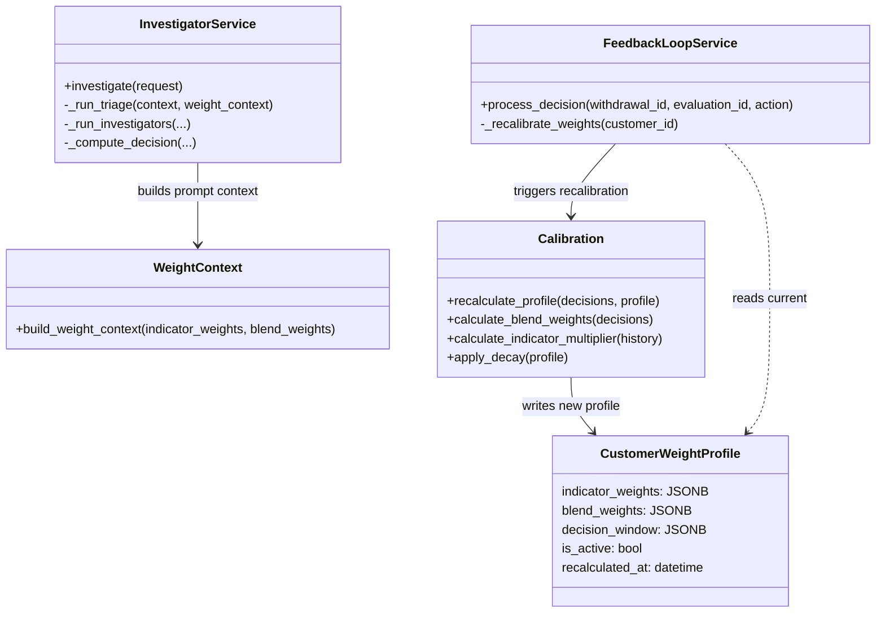

# Design Module — Weighting System

How customer-specific weights affect scoring, LLM prompts, and blend ratios across one full calibration cycle.

---

## What Gets Adapted (3 Things)



---

## Full Calibration Cycle



---

## How Effective Weights Are Built



---

## How Weight Context Reaches LLM Prompts



| Gate | Condition | What the LLM sees |
|------|-----------|-------------------|
| Dampened | multiplier < 0.85 | "This indicator is historically over-sensitive for this customer" |
| Boosted | multiplier > 1.15 | "This indicator is historically significant for this customer" |
| Emerging | abs(m - 1.0) >= 0.08 | Flagged, not yet dampened/boosted |
| Blend stance | Always shown | "leans rule-engine", "leans investigator", or "balanced" |
| Suppressed | sample_size < 2 | Not included in context |

---

## How Blend Weights Work in Final Decision

```mermaid
flowchart TD
    RULE_SCORE[Rule Engine Composite Score] --> BLEND
    INV_SCORE[Investigator Weighted Average] --> BLEND

    BLEND["blended = rule_score × rule_w + inv_score × inv_w"]

    PROFILE_BW[Profile blend_weights<br/>e.g. {rule: 0.55, investigator: 0.45}] --> BLEND
    DEFAULT["Default: 0.60 / 0.40<br/>(if no profile)"] -.-> BLEND

    BLEND --> FINAL{blended value?}
    FINAL -->|">= 0.70 OR any investigator >= 0.7"| BLOCKED[blocked]
    FINAL -->|">= 0.30"| ESCALATED[escalated]
    FINAL -->|"< 0.30"| APPROVED[approved]

    GUARD["Safeguard: rule engine escalation<br/>can never be downgraded"] -.-> FINAL
```

---

## How Calibration Recalculates Weights



---

## Profile Lifecycle



| State | Scoring | Prompt context | Blend |
|-------|---------|---------------|-------|
| BaselineFallback | Default weights | None injected | 60/40 default |
| LimitedData | Multipliers applied (cautious) | Shown with "limited data" caveat | Slightly adapted |
| Stable | Multipliers fully applied | Full context (dampened/boosted tags) | Fully adapted |
| Damped | Multipliers decayed toward 1.0 | Reduced confidence context | Decayed toward default |

---

## Class Diagram



---

## Key Files

| File | Purpose |
|------|---------|
| `app/core/scoring.py` | `INDICATOR_WEIGHTS` baseline + `calculate_risk_score()` |
| `app/core/weight_context.py` | `build_weight_context()` — profile → prompt string |
| `app/core/calibration.py` | `recalculate_profile()`, `calculate_blend_weights()`, `apply_decay()` |
| `app/services/fraud/investigator_service.py` | Loads profile, applies effective weights, injects context |
| `app/services/feedback/feedback_loop_service.py` | `process_decision()` → triggers calibration |
| `app/data/db/models/customer_weight_profile.py` | `CustomerWeightProfile` ORM model |

## Benchmark Artifacts

Live sweep outputs with per-step prompt snapshots:
- `outputs/blend_feedback_benchmark/sweep_20260211_101330/blend_feedback_sweep_summary.json`
- `outputs/blend_feedback_benchmark/sweep_20260211_101330/prompt_context_evolution_sweep.csv`
