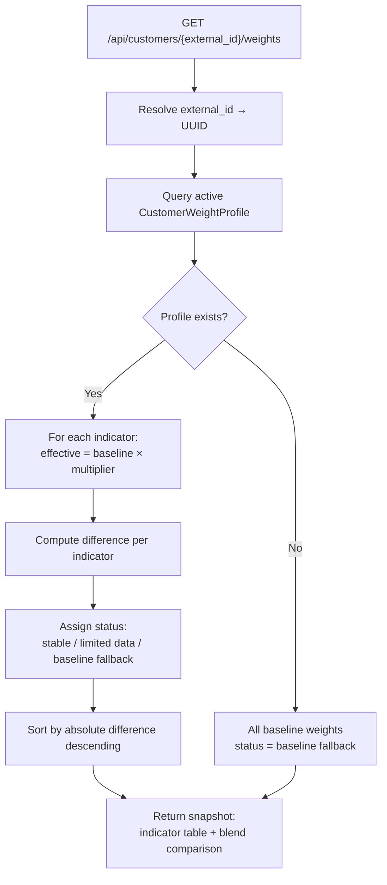
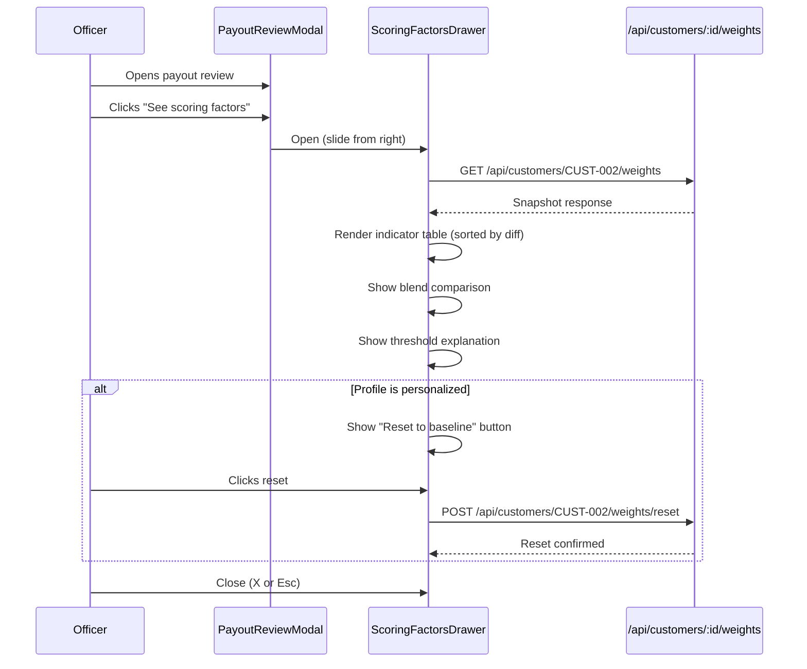

# UI Weights Implementation — Status & Guide

## Status: IMPLEMENTED

---

## What Was Built

### Backend (3 new files)

| File | Purpose |
|------|---------|
| `app/api/schemas/customer_weights.py` | `WeightSnapshotResponse`, `WeightHistoryResponse`, `WeightResetRequest/Response` |
| `app/services/control/customer_weight_explain_service.py` | `get_snapshot()`, `get_history()`, `reset_to_baseline()` |
| `app/api/routes/customer_weights.py` | 3 endpoints under `/api/customers/{external_id}/weights` |

### Frontend (3 new files)

| File | Purpose |
|------|---------|
| `nexa-fe/components/ScoringFactorsDrawer.vue` | Right-slide drawer: indicator table, blend comparison, reset button |
| `nexa-fe/server/api/customers/[externalId]/weights.get.ts` | Proxy to backend GET snapshot |
| `nexa-fe/server/api/customers/[externalId]/weights/reset.post.ts` | Proxy to backend POST reset |

### Modified files

| File | Change |
|------|--------|
| `app/api/routes/__init__.py` | Registered `customer_weights` router |
| `app/api/routes/transactions.py` | Added `external_id` to customer object |
| `nexa-fe/composables/useTransactions.ts` | Added `external_id` to `Transaction.customer` type |
| `nexa-fe/components/PayoutReviewModal.vue` | Added "See scoring factors" button + wired drawer |
| `scripts/seed_data.py` | Added `_seed_weight_profiles()` — 16 profiles |

---

## API Endpoints

| Method | Path | What it does |
|--------|------|-------------|
| `GET` | `/api/customers/{external_id}/weights` | Baseline vs customer weight snapshot |
| `GET` | `/api/customers/{external_id}/weights/history?limit=20` | Profile change audit trail |
| `POST` | `/api/customers/{external_id}/weights/reset` | Deactivate profile, restore baseline |

---

## Snapshot Service Flow

---

## Drawer UX Flow

---

## Key Design Decisions

| Decision | Rationale |
|----------|-----------|
| Table, no charts | Plain language, per spec |
| Sorted by absolute difference | Most impactful indicators at top |
| Status tags: `stable` (green), `limited data` (yellow), `baseline fallback` (gray) | Quick visual confidence signal |
| Threshold explanation | One sentence: "Escalated because score 0.46 is above 0.30 and below 0.70" |
| Reset is soft | Deactivates profile, doesn't delete. History preserved |
| Drawer not modal | Slides from right, doesn't block the review modal |

---

## Seeded Profiles (16 customers)

### Stable (sample >= 5) — 10 customers

| Customer | Key adjustment | Reason |
|----------|---------------|--------|
| CUST-001 (Sarah) | amount_anomaly 0.92x | Consistent range, slightly over-flagged |
| CUST-002 (James) | amount_anomaly 0.65x | VIP $10k-15k is normal |
| CUST-003 (Aisha) | payment_method 0.88x | Skrill e-wallet consistently clean |
| CUST-004 (Kenji) | payment_method 0.85x | Same BTC wallet every time |
| CUST-005 (Emma) | velocity 0.8x | Infrequent withdrawals are her pattern |
| CUST-006 (Raj) | geographic 0.75x | Indian IP ranges noisy but legit |
| CUST-007 (David) | geographic 0.6x | VPN traveler, officers always approved |
| CUST-010 (Yuki) | device_fingerprint 1.4x | New device after dormancy is key signal |
| CUST-011 (Victor) | trading_behavior 1.7x | No-trade fraud, heavily reinforced |
| CUST-015 (Carlos) | velocity 1.9x | 5 withdrawals/hour is THE signal |

### Limited data (sample < 5) — 6 customers

| Customer | Key adjustment | Reason |
|----------|---------------|--------|
| CUST-008 (Maria) | amount_anomaly 1.35x | First withdrawal was 5x average |
| CUST-009 (Tom) | payment_method 1.4x | Card to crypto switch |
| CUST-012 (Sophie) | card_errors 1.55x | 3 failed cards before success |
| CUST-013 (Ahmed) | recipient 1.45x | Shared third-party recipient (ring) |
| CUST-014 (Fatima) | trading_behavior 1.6x | Zero trades, deposit-and-withdraw |
| CUST-016 (Nina) | geographic 1.45x | Impossible travel is THE signal |
