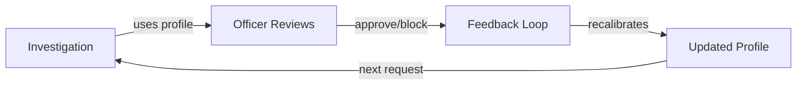
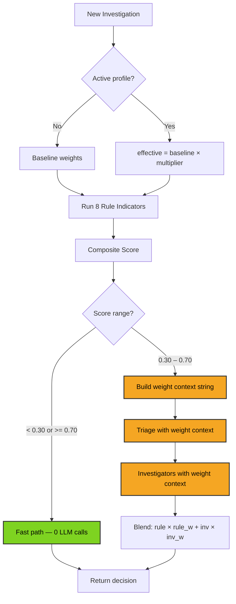
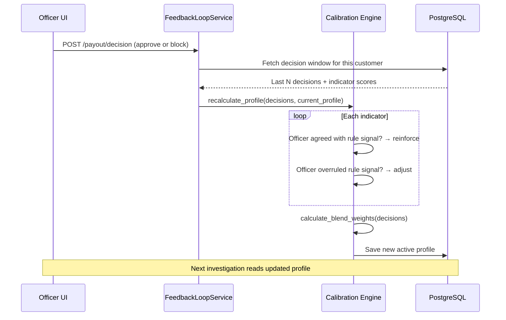
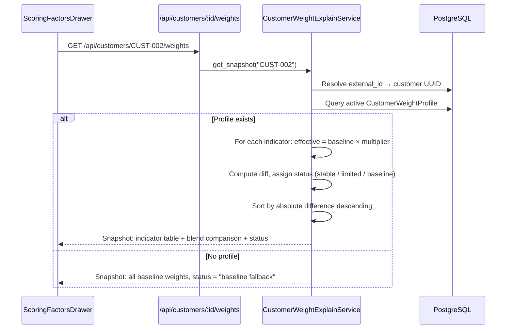
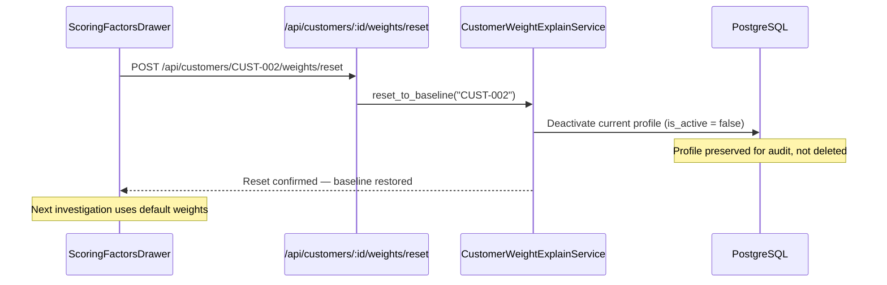

# Adaptive Weighting System — Overview

Customer-specific weights that learn from officer decisions. Three things adapt per customer: indicator multipliers, LLM prompt context, and rule/investigator blend ratio.

---

## The Loop

---

## Investigation: How Weights Are Used

---

## Feedback: How Weights Are Updated

---

## Snapshot API: How Officers See Weights

---

## Reset Flow

---

## Key Files

| File | Purpose |
|------|---------|
| `app/api/routes/customer_weights.py` | 3 endpoints: snapshot, history, reset |
| `app/api/schemas/customer_weights.py` | `WeightSnapshotResponse`, `WeightHistoryResponse`, `WeightResetRequest` |
| `app/services/control/customer_weight_explain_service.py` | `get_snapshot()`, `get_history()`, `reset_to_baseline()` |
| `app/core/weight_context.py` | `build_weight_context()` — profile → prompt string |
| `app/core/calibration.py` | `recalculate_profile()`, `calculate_blend_weights()`, `apply_decay()` |
| `app/services/feedback/feedback_loop_service.py` | `process_decision()` — triggers calibration |
| `app/data/db/models/customer_weight_profile.py` | `CustomerWeightProfile` ORM model |

## See Also

- Detailed design: `design_module.md`
- Benchmark outputs: `outputs/blend_feedback_benchmark/sweep_20260211_101330/`
