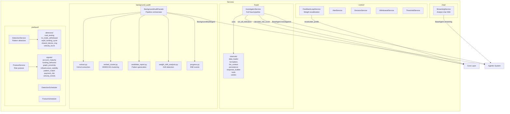
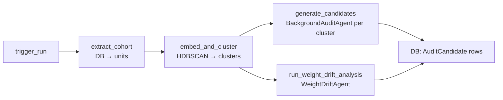

# Services Layer

Orchestrates business workflows using Core logic and Data repositories. Services are the only layer that touches both.

---

## Component Diagram



---

## fraud/

### `InvestigatorService`

**File**: `services/fraud/investigator_service.py:59`

Full fraud evaluation pipeline. Entry point for all withdrawal investigations.

**Pipeline steps** (all parallel where possible):

```
1. run_all_indicators(rule_ctx)          ← 8 rule-based scores
2. load_customer_profile(customer_id)    ← weight profile + posture
3. get_active_thresholds()               ← approve/block thresholds
4. calculate_risk_score(results)         ← composite + decision
5. [if not auto-approved]
   a. _run_investigators (parallel x3)  ← financial, identity, cross_account
   b. _run_triage_verdict               ← final LLM synthesis
6. apply_verdict()                       ← combine rule + triage
7. persist_investigation()               ← DB write
```

### `internals/`

| Module | Purpose |
|--------|---------|
| `data_loader.py` | Async loads: customer profile, posture, pattern matches |
| `formatters.py` | Format indicators + investigators for LLM context strings |
| `llm_context.py` | `build_rule_ctx()` — map `FraudCheckRequest` to indicator context |
| `persistence.py` | Save evaluation, indicator results, withdrawal decision |
| `response_builder.py` | `build_response()` — assemble `FraudCheckResponse` |
| `tools.py` | `build_tools()` — create SQL tools for investigators |
| `verdict.py` | `apply_verdict()` — combine rule scoring + triage + posture uplift |

---

## background_audit/

### `BackgroundAuditFacade`

**File**: `services/background_audit/facade.py:38`

Single entry point for background audit. Inherits `BackgroundAuditQueries` for read operations.

**Pipeline**: `extract → embed/cluster → investigate (parallel: patterns + drift)`



**SSE progress events** emitted at each phase:
- `phase_start` — beginning of extract / embed_cluster / investigate
- `progress` — incremental updates within a phase
- `complete` — pipeline finished
- `error` — pipeline failed

### Components

| File | Purpose |
|------|---------|
| `extract.py` | Fetch escalated/blocked withdrawal evaluations within window |
| `embed_cluster.py` | Embed evidence texts → HDBSCAN clustering → merge similar clusters |
| `candidate_report.py` | Per-cluster: quality gate → BackgroundAuditAgent synthesis → dedupe → store |
| `weight_drift_analysis.py` | Fetch weight profiles → build DriftSummary → WeightDriftAgent synthesis |
| `progress.py` | `SSEEvent` model + `build_event()` factory |
| `queries.py` | `BackgroundAuditQueries` — run status, candidate list, config CRUD |

---

## prefraud/

### Pattern Detectors

**File**: `services/prefraud/detectors/`

Each detector extends `BaseDetector` and fires when a behavioral rule matches.

| Detector | Signal |
|----------|--------|
| `card_testing.py` | Multiple failed transactions in short window |
| `no_trade_withdrawal.py` | Withdrawal with zero or near-zero trading activity |
| `rapid_funding_cycle.py` | Deposit → immediate withdrawal cycle |
| `shared_device_ring.py` | Device fingerprint shared across 3+ accounts |
| `velocity_burst.py` | Withdrawal frequency spike vs. customer baseline |

### Risk Posture Signals

**File**: `services/prefraud/signals/`

Signals compute a `[0, 1]` score that contributes to the customer's overall risk posture.

| Signal | What It Measures |
|--------|-----------------|
| `account_maturity.py` | Account age and verification status |
| `funding_behavior.py` | Deposit/withdrawal ratio, funding velocity |
| `graph_proximity.py` | Social graph distance to known fraud accounts |
| `infrastructure_stability.py` | Device/IP consistency over time |
| `pattern_match.py` | Active matches against known fraud patterns |
| `payment_risk.py` | Payment method risk factors |
| `velocity_trends.py` | Transaction velocity trend |

**Posture uplift**: If `POSTURE_INFLUENCE_ENABLED=true` and posture ≠ `normal`, a `posture_uplift` is added to the rule composite score before triage routing. Max uplift is capped at `MAX_POSTURE_UPLIFT`.

---

## control/

| Service | File | Purpose |
|---------|------|---------|
| `FeedbackLoopService` | `feedback_loop_service.py` | On officer decision: recalculate weight profile, update blend weights |
| `AlertService` | `alert_service.py` | Create fraud alerts for blocked/escalated withdrawals |
| `DecisionService` | `decision_service.py` | Record officer approve/block decisions |
| `WithdrawalService` | `withdrawal_service.py` | Ensure withdrawal exists, update status |
| `ThresholdService` | `threshold_service.py` | Load active approve/block thresholds from DB |
| `CustomerWeightExplainService` | `customer_weight_explain_service.py` | Human-readable explanation of per-customer weight profile |
| `CardLockdownService` | `card_lockdown_service.py` | Flag payment methods for lockdown |
| `EvidenceService` | `evidence_service.py` | Build evidence context for officer review |

---

## chat/

### `StreamingService`

**File**: `services/chat/streaming_service.py`

Analyst chat with persistent server-side conversation history and SSE streaming.

**Initialization** (runs once at startup):
```python
def init_analyst_agent() -> Any:
    # Builds LangChain create_agent with:
    # - ChatGoogleGenerativeAI (gemini-3-flash-preview)
    # - sql_db_query tool + render_chart tool
    # - InMemorySaver checkpointer  ← server-side conversation history per session_id
    # - read_only_sql middleware
    # - Live schema injected into ANALYST_CHAT_PROMPT at startup
```

**SSE event types** emitted during streaming:

| Event | Payload | When |
|-------|---------|------|
| `status` | `"thinking..."` | Before first token |
| `tool_start` | `{tool, args_preview}` | Agent calls a tool |
| `tool_end` | `{tool, result_preview}` | Tool returns result |
| `chart` | `{chart spec JSON}` | Agent calls `render_chart` |
| `token` | `"text chunk"` | LLM streaming token |
| `answer` | full response text | Stream complete |
| `done` | `""` | Stream closed |
| `error` | error message | Exception during stream |

**Design decision**: `InMemorySaver` checkpointer keyed by `session_id` gives the analyst a stateful conversation without client-side history management. The schema is injected once at startup via `build_schema_description()`, not per-request.

---

## Design Decisions

| Decision | Rationale |
|----------|-----------|
| **`BackgroundAuditFacade` extends `BackgroundAuditQueries`** | Facade pattern: callers use one object for both triggering runs and querying results. Queries are separated into a mixin to keep the file under 150 lines each. |
| **Pattern generation + drift analysis in parallel** | `asyncio.gather(generate_candidates, run_weight_drift_analysis)` halves the total audit time. They share tools but use independent agents. |
| **Quality gate before agent synthesis** | Clusters below `min_events` or `min_accounts` are skipped. This prevents the agent from synthesizing patterns from noise (1–2 data points). |
| **Idempotent `trigger_run()`** | If a run with the same `idempotency_key` already exists and is `running/completed`, the existing `run_id` is returned. Prevents double-runs from UI retries. |
| **`FeedbackLoopService` on officer action** | Weight recalibration happens synchronously on the decision endpoint. This keeps the profile fresh for the next withdrawal of the same customer. |
