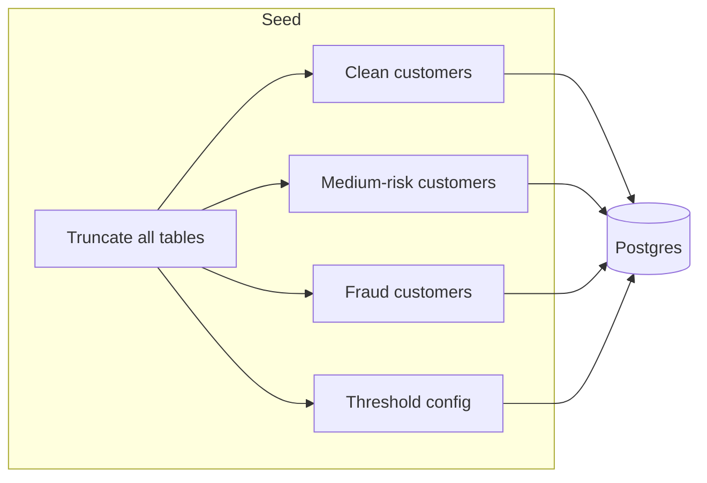

# Scripts

Database seeding and API smoke-testing utilities for the fraud detection system.

---

## File Reference

| File | Lines | Purpose | Run Command |
|------|-------|---------|-------------|
| `seed_data.py:1-1320` | 1320 | Seed 15 customers with fraud patterns into Postgres | `python -m scripts.seed_data` |
| `seed_patterns.py:1-15` | 15 | Seed fraud pattern definitions into ChromaDB (stub) | `python -m scripts.seed_patterns` |
| `test_evaluate.py:1-101` | 101 | Hit `/api/payout/evaluate` for 3 test scenarios | `python -m scripts.test_evaluate` |

---

## seed_data.py — Test Customer Seeder

Seeds ~15 customers across 3 risk tiers, each with full supporting data (payment methods, devices, IP history, transactions, trades, and a pending withdrawal).

### Test Scenarios

| ID | Customer | Archetype | Expected | Key Triggers |
|----|----------|-----------|----------|-------------- |
| CUST-001 | Sarah Chen | Reliable Regular | Approve | 18mo account, consistent IP/device, 80 trades |
| CUST-002 | James Wilson | VIP Whale | Approve | 3yr account, $15k normal range, 150 trades |
| CUST-003 | Aisha Mohammed | E-Wallet Loyalist | Approve | 8mo, Skrill verified, Dubai-only |
| CUST-004 | Kenji Sato | Crypto Consistent | Approve | 1yr, BTC wallet reused 6 times |
| CUST-005 | Emma Davies | Low-Volume Veteran | Approve | 2yr, small $150 withdrawal |
| CUST-006 | Raj Patel | Premium Trader | Approve | 1yr, 120+ trades, $3k normal |
| CUST-007 | David Park | Business Traveler | Escalate | VPN, 3 countries in 30d |
| CUST-008 | Maria Santos | New High-Roller | Escalate | 3-week account, first withdrawal $5k |
| CUST-009 | Tom Brown | Method Switcher | Escalate | 1yr account, new crypto method 1d ago |
| CUST-010 | Yuki Tanaka | Dormant Returner | Escalate | 6mo gap, new device, 3 trades since return |
| CUST-011 | Victor Petrov | No-Trade Fraudster | Block | 5d account, 1 token trade, $2990/$3000 withdrawal |
| CUST-012 | Sophie Laurent | Card Tester | Block | 3 failed cards, shared device with Victor |
| CUST-013/14 | Ahmed & Fatima | Fraud Ring | Block | Shared device + IP + recipient, zero trades |
| CUST-015 | Carlos Mendez | Velocity Abuser | Block | 5 withdrawals in 1hr, 3 devices, VPN |
| CUST-016 | Nina Volkov | Geo Impossible | Block | Kyiv → São Paulo in 30min, new device |

### Shared Fraud Signals

- **`FP_SHARED_FRAUD`** (`seed_data.py:174`): Device fingerprint shared by Victor (CUST-011) and Sophie (CUST-012)
- **`FP_FRAUD_RING`** (`seed_data.py:175`): Device fingerprint shared by Ahmed (CUST-013) and Fatima (CUST-014)
- **`IP_FRAUD_RING`** (`seed_data.py:176`): IP address shared by Ahmed and Fatima

### Threshold Config

Seeded at `seed_data.py:1235-1254` with default weights matching `app/core/scoring.py`.

---

## seed_patterns.py — ChromaDB Pattern Seeder (Stub)

Defines 6 known fraud pattern categories for vector search. Currently a docstring-only stub.

| Pattern | Description |
|---------|-------------|
| Deposit and run | Deposit then immediate full withdrawal, no trades |
| Device carousel | Multiple devices in rapid succession |
| Velocity burst | Many small withdrawals in short window |
| Geographic impossible | Logins from distant locations within hours |
| Method hopping | Frequent payment method changes before withdrawal |
| Recipient ring | Same recipient across unrelated accounts |

---

## test_evaluate.py — API Smoke Test

Sends 3 requests to the live API (`seed_data.py:8`) covering each decision tier.

| Scenario | Customer | Expected Decision |
|----------|----------|-------------------|
| Clean | Sarah Chen (CUST-001) | Approve |
| Gray zone | David Park (CUST-007) | Escalate |
| Fraud | Victor Petrov (CUST-011) | Block |

Prints decision, risk score, summary, gray-zone detail (if any), and per-indicator breakdown.

**Requires**: Running API at `https://nexa-api.sawangtech.com`

---

## Prerequisites

- **seed_data.py**: Running Postgres (`docker-compose up db`)
- **seed_patterns.py**: Running ChromaDB (`docker-compose up chromadb`)
- **test_evaluate.py**: Running API server
